[Applying a new Icon set](#apply_icon)  
[Applying a new Mouse theme](#mouse_theme)  
[Applying a new Theme](#apply_theme)  
[Customizing Linux Lite](#custll)  
[Customize your Panel Bar](#panel)  
[Desktop Settings basics](#desktop)  
[Lite Desktop Widget](#litewidget)  
[Themes & Icon sets](#themes)  
[Window Manager Tweaks](#tweaks)  
[Workspace Settings](#workspaces)

## Customizing Linux Lite

Linux Lite uses the XFCE desktop environment because it strikes a good balance between resource usage, functionality and customization for the user. It's relatively light on resources which makes it suitable for installation on older computers, giving them a new lease on life, as well as on newer systems.

Navigating the applications menu and the file system is straightforward, intuitive and is similar to what many people coming from a Windows environment are used to. At the same time, XFCE offers a variety of ways for people to customize the look and feel of their desktop work environment to suit their own tastes if that is what they want to do.

That is what this section of the manual is all about. If you get bored with the default setup, you can change it to your liking in a variety of ways. Linux Lite comes with a few themes and icon sets pre-installed already and switching to one of those is quick and easy. You can also download and apply other themes, icons and mouse pointers to your system if you'd like. The panel along the bottom of your screen that holds the Menu launcher and various indicator icons can be customized in a variety of ways too.

In this section, we'll start off with the more basic ways to customize your desktop. (Over time, we may add examples to this page of additional programs that can be added to your system to spice things up a bit more.)

## Desktop Settings basics

Some of the most basic changes people like to make are changing the desktop background (wallpaper), deciding whether or not to have certain icons show on the desktop and sometimes they may want to change something about the menu shown when right or middle clicking on the desktop. **Desktop Settings** is where to look for making those types of changes.

There are two ways to access the **Desktop Settings** menu. One way is to simply right click on the desktop and choose **Desktop Settings**.

Another way is to choose **Desktop** from the main **Settings Manager** window, which can be accessed by going to **Menu, Settings, Settings Manager**.

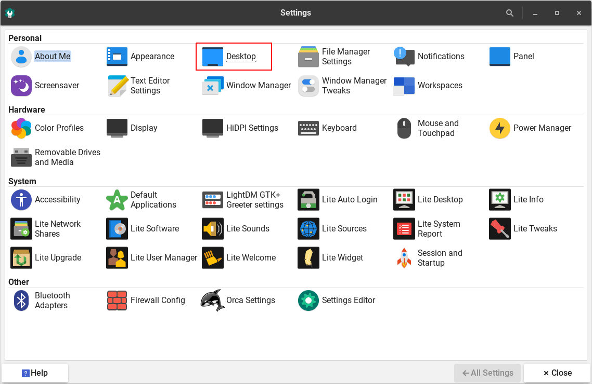

First, we will look at the **Background** tab under **Desktop Settings**.

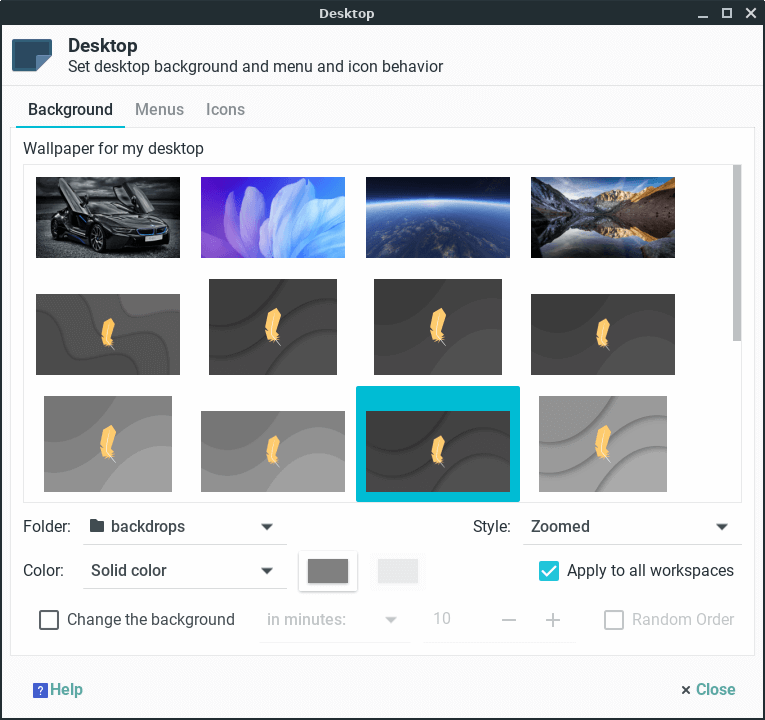

By default, backgrounds are stored in the file system under the **/usr/share/xfce4/backdrops** folder. Images in that folder are shown as choices in the **Background** tab. Just click on the image you want and it will instantly switch to that for your background. If you want to add some of your own pictures to the choices, open your file manager **As Administrator**, enter your password, then navigate to that folder and paste your image into it.

(**HINT:** You can just right click your desktop, choose **Open as Administrator**, enter your password and it will open the Thunar file manager at your Desktop folder. From there, just navigate to where your picture is stored, copy it, then navigate to **/usr/share/xfce4/backdrops** and paste it in.)

If you prefer, you can change the folder location that the **Background** tab defaults to for choices. For example, if you have a folder called "Wallpapers" under your Home folder, you can tell the system to look there instead. Click the drop-down box next to the word **Folder:** and pick **Other** to navigate your way to **/home/yourname/Wallpapers**. Some people prefer doing this because it eliminates the need to be **Administrator** when adding new backgrounds.

There are a few other options associated with the background images. You can choose from different styles to display them in, choose a background color if they do not cover the entire screen, have the backgrounds change after a certain amount of time and whether or not you want to have the same background on each workspace. If you decide to have a different background for each workspace, uncheck the **Apply to all workspaces** box, pick a wallpaper for the workspace you are on, then drag the window to another workspace and select a new wallpaper for it there.

Now let's take a look at the **Menu** tab under **Desktop Settings**.

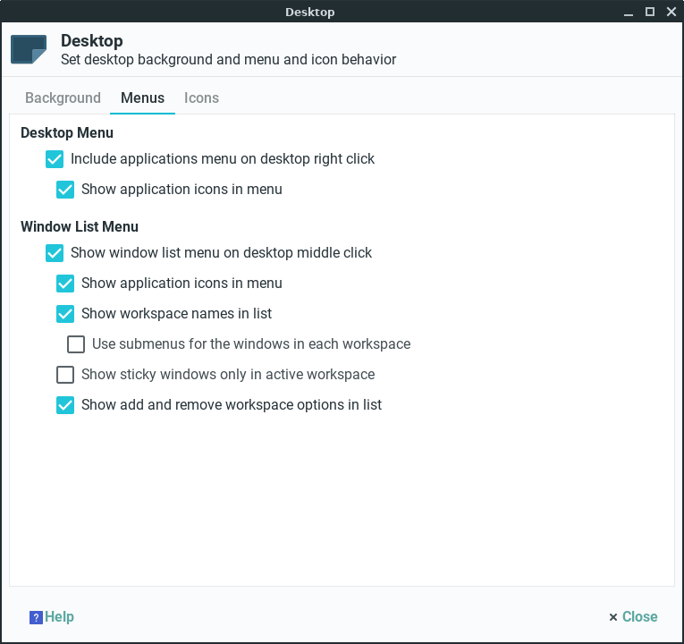

Under **Desktop Menu**, it is asking if you want an applications menu to show up as a choice when you right click on the desktop and whether you want that menu to show the icons for the applications listed, or just their names.

Lastly, under the **Icons** tab you can change various settings regarding the icons on the desktop - their size, whether to activate them with a single, or double click, etc. Under **Default Icons** you can choose whether or not to show certain default icons on the desktop.

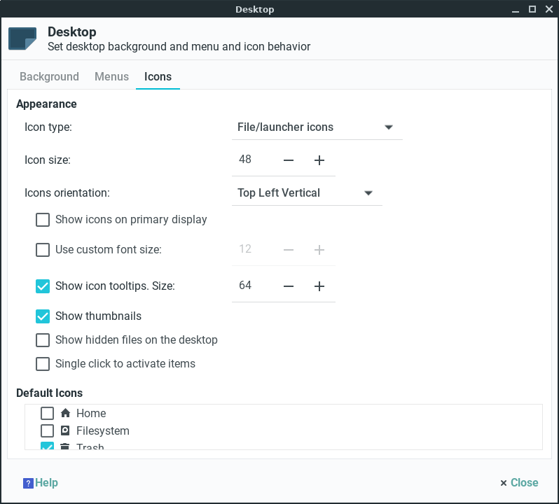

## Workspace Settings

If you are new to Linux, the concept of **workspaces** may be unfamiliar. Basically workspaces are virtual desktops that you can use to spread your work over. Linux Lite has two workspaces activated by default, but you can change that to any number you like. If you look to the right side of your lower panel you will notice two rectangles. Those are representations of your available workspaces as shown by the **Workspaces plugin** on the panel.

Workspaces are particularly useful if you tend to have multiple programs open at the same time. For example, if you have two programs running in one workspace and want to open a few more, switching to another workspace gives you a fresh, clean desktop to put them on. This cuts down on desktop clutter and many find it easier to just switch workspaces rather than fumbling through multiple windows on the same desktop to find the one they want. Here are four screenshots that show the difference.

**First** - three program windows opened on same workspace.

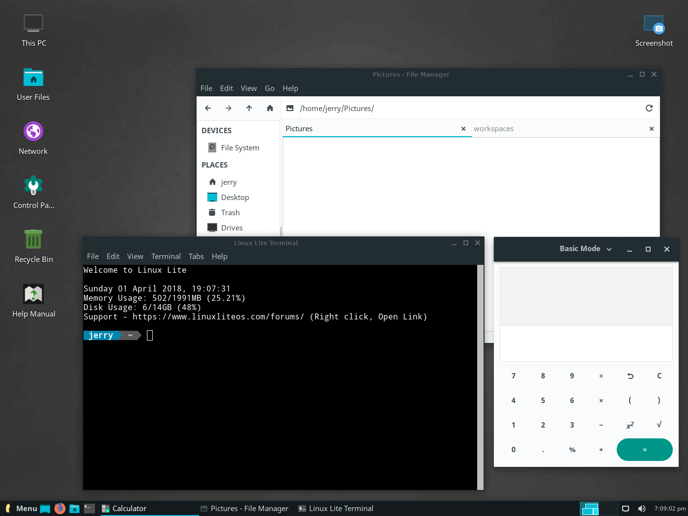

**Next** - what you see when you switch to a new workspace.

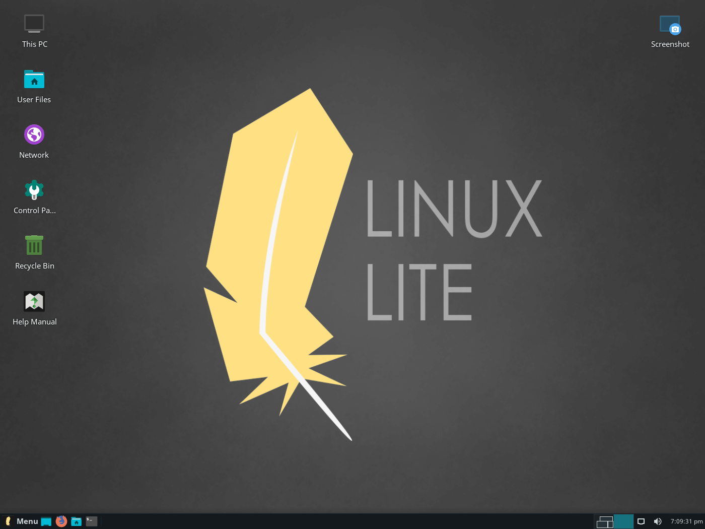

**Last** - Workspace 1 with only two programs kept on it.

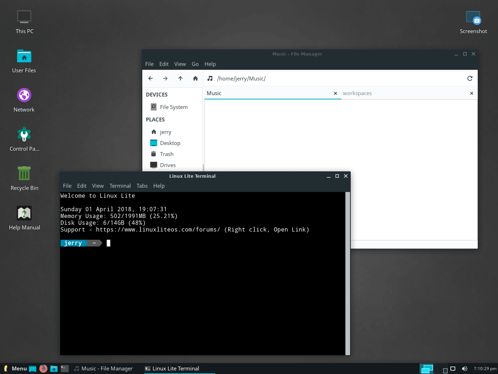

**And** - Workspace 2 with one program moved over to it.

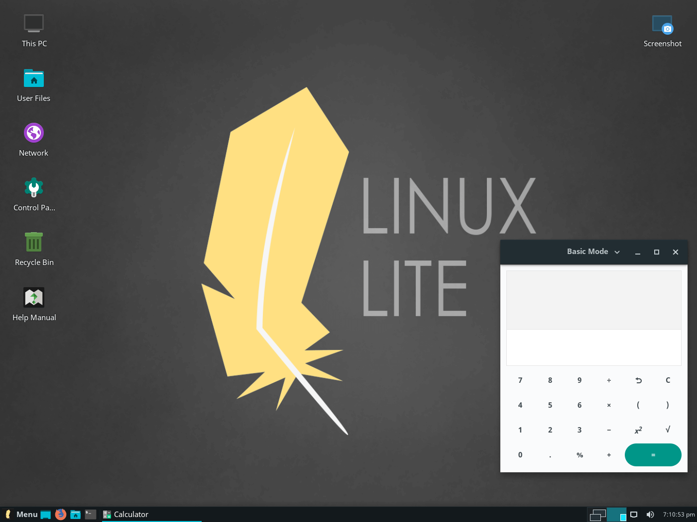

With your work spread out over more than one workspace everything is easier to see. Depending on your settings, switching between workspaces is typically done by either clicking one of the rectangles in the panel, using your mouse wheel while hovering over the rectangles, or using your mouse wheel on an empty spot of the desktop to scroll back and forth between workspaces. (Keyboard shortcuts can be used to switch workspaces also. These may vary depending on your keyboard layout, but a typical U.S. keyboard has **Ctrl+Alt+** the **Arrow Keys** set to move between the workspaces.)

There are three areas where workspace settings can be changed. You can right click the **Workspaces plugin** on the panel and choose **Properties**. That brings up the **Workspace Switcher** window. Some setting are found there and others appear when you subsequently click on **Workspace Settings...**. In the example below, we will set up four workspaces and have the Workspaces plugin display them in two rows instead of one on the panel.

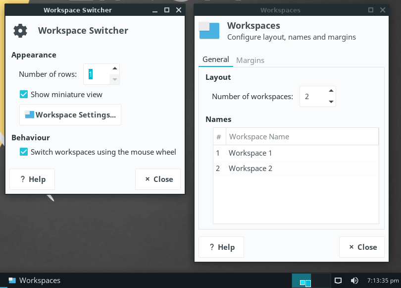

You can also go to the main **Settings Manager**, choose **Workspaces** there and that will allow you to change the number of workspaces, their names and margins (if desired).

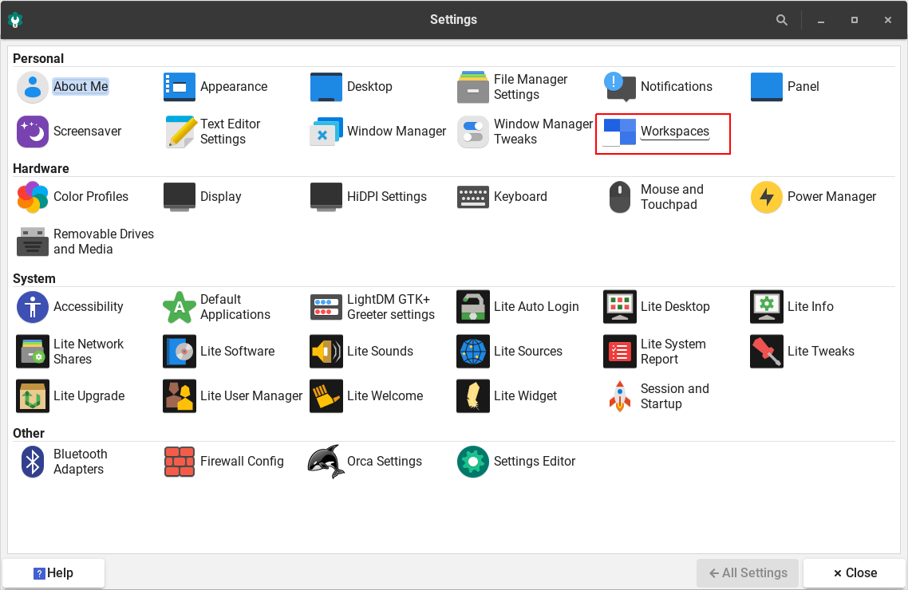

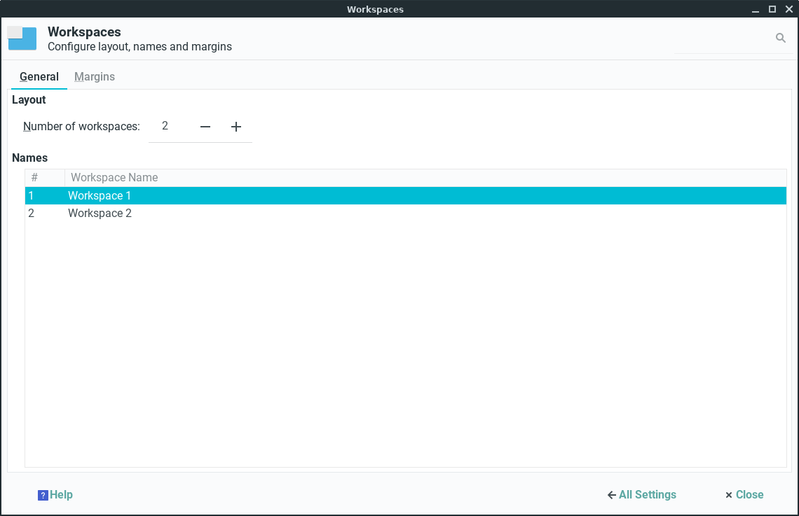

Lastly, there are some more workspace settings within the [Window Manager Tweaks](#tweaks) section.

## Lite Desktop Widget

The Lite Desktop Widget is available in Linux Lite 3.2 and above. It's purpose is to give people a basic overview of their system running including:

*   Linux Lite Version
*   Date
*   CPU usage - average cpu usage across all cores
*   Memory Total - total memory installed
*   Memory Usage - total memory currently in use
*   User currently logged in
*   Battery Status (laptops only)
*   Firewall Status
*   Updates Status

  

The Lite Desktop Widget is disabled by default. Some people like this kind of information on their Desktop, some don't.

To enable Lite Widget via the **Settings Manage**r:

Go to **Menu, Settings, Settings Manager**. Click on **Lite Widget**.

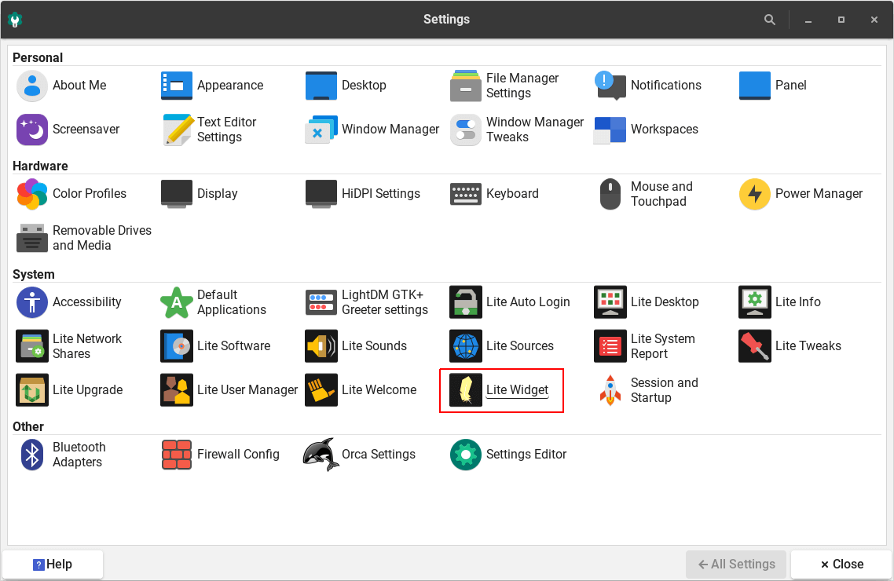

Click on **Enable Lite Widget**.

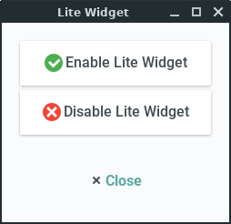

You'll get a confirmation pop-up and you will see **Lite Widget** appear in the bottom right hand corner of your screen (position may differ on multiple screens). **Lite Widget** will now start when your computer starts.

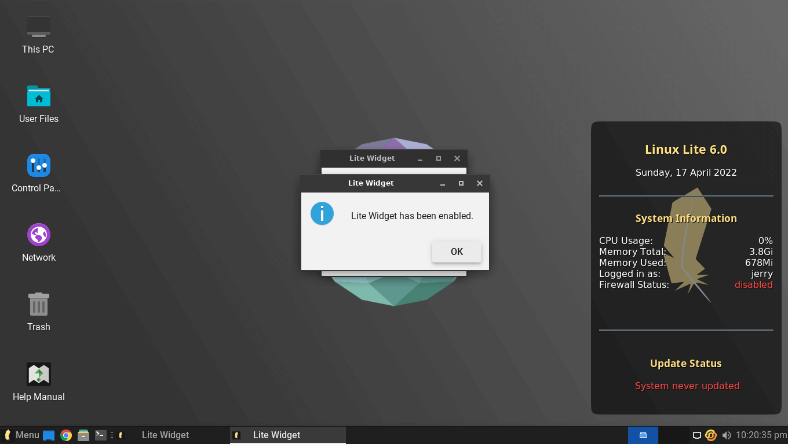

To disable **Lite Widget**, just click on **Disable Lite Widget**.

To enable Lite Widget via **Session and Startup**:

Go to **Menu, Settings, Session and Startup, Application Autostart** and place a tick in **Lite Widget**. Logout then Login and the Widget will appear at the bottom right hand corner of your screen shortly after your Desktop has loaded. To disable the widget, untick **Lite Widget**. Logout then Login and the Widget will no longer appear.

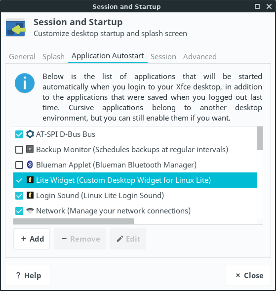

**Updates Status - a reminder to Update your system**

There are 4 states of **Updates Status**. The **Updates Status** is refreshed once every 5 minutes, so once you have installed updates, it will take 5 minutes to display the new status in the widget. The widget does not display updates when they are available, it only shows when you last installed updates. For the **Updates Status** to accurately display available updates, this would require root access and each user would have to be added to the sudoers file, this is a huge security risk and will not be enabled.

The first state appears when you complete a fresh install Linux Lite, it will read **System never updated**. It's at this time that you need to update your system. Go to **Menu, Favorites, Install Updates** to update your system.

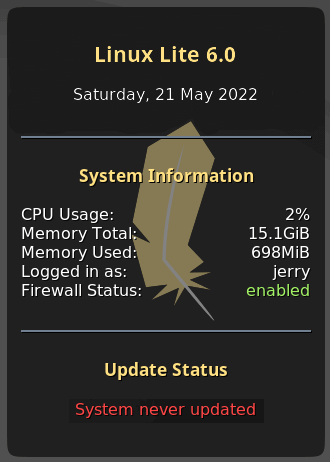

Once you have updated for the first time, after 5 minutes the **Updates Status** will change to **Your system was recently updated**. This message will also appear within the first hour, each time you update your system.

The Lite Desktop Widget will then start displaying your **Update Status** every **hour** after the last update, as shown in the image below.

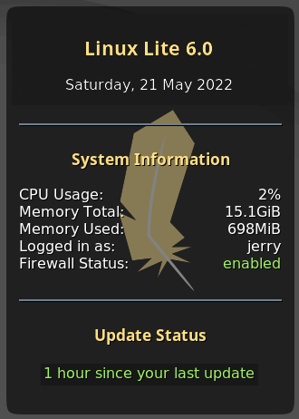

The Lite Desktop Widget will then start displaying your **Update Status** every **day** after the last update, as shown in the image below.

After the **3rd day**, the Lite Desktop Widget will then start displaying your **Update Status** in **yellow** to remind you that it's time to update your system.

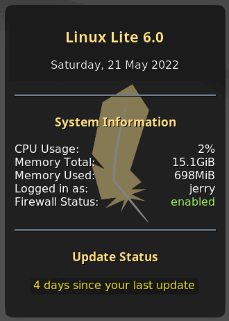

After the **7th day**, the Lite Desktop Widget will then start displaying your **Update Status** in **red** to remind you that it's time to update your system, **urgently**.

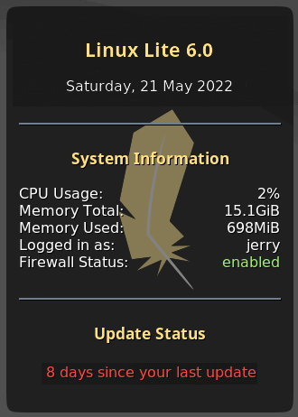

Example of Firewall **disabled** status.

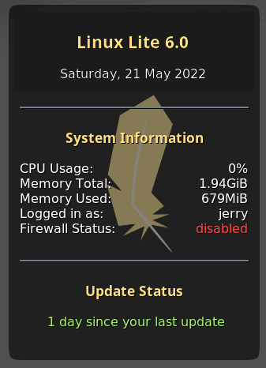

## Themes & Icon sets

The default theme for Linux Lite is **Adapta**. The default icon set is **Papirus-Adapta**. There are some additional Theme and Icon sets in Linux Lite. Go to **Menu, Settings, Settings Manager**. There are 2 main areas in the Settings Manager that take care of these settings - **Appearance** and **Window Manager**.

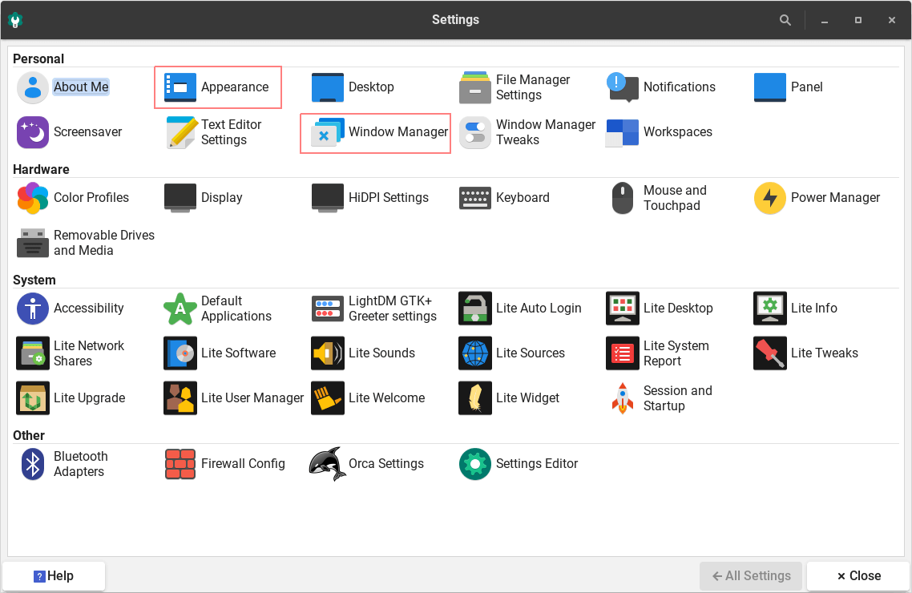

Click on **Appearance**. Here you will see the **Style** and **Icons** tab.

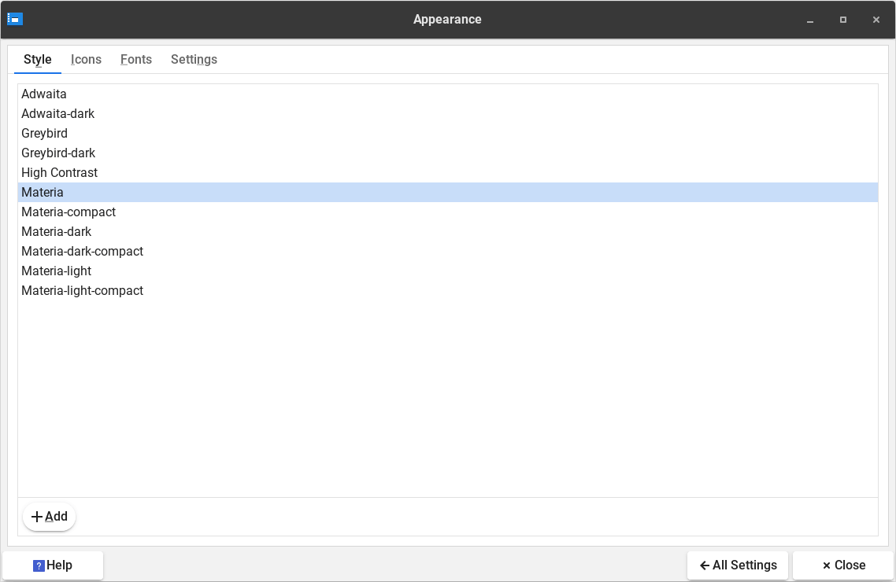

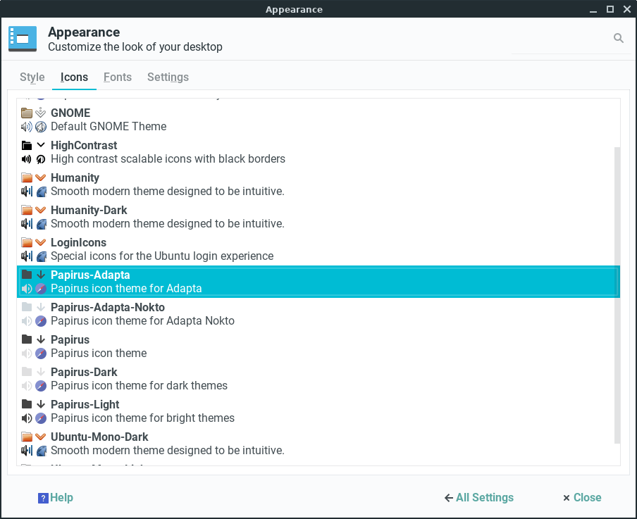

As you click through the various themes and icon sets you will notice visual changes on your computer.

Click **All Settings** to get back to the main **Settings Manager** window; then select **Window Manager**. The **Style** tab will display available themes that tweak the look of open window frames and the minimize/maximize/close buttons in the windows.

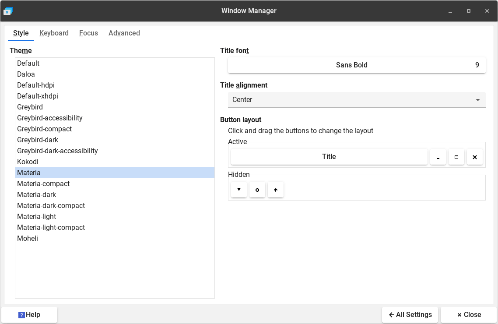

Click through some of the choices to see how things change. Go back to the **Appearance** settings, pick a new theme, then come back to the **Window Manager** settings and go through choices again. You may notice that the **Window Manager** settings look slightly different depending on which **Appearance** theme you choose. Experiment with different combinations to find one you like.

Close **Settings Manager** before moving onto the next part of this tutorial.

This next section will show you how to apply new themes and icons.

## Applying a new Theme

Head over to the [XFCE Look](http://xfce-look.org/) website and choose theme of your liking.

**NOTE: Not all themes from there will work as you would expect. Please read all of the documentation before attempting to apply a new theme. Some make installation easy via a PPA, which is a preferable method to the one shown here. Click [here](software.html#ppa) for more information on how to install a new PPA. Whichever theme you choose, make sure that it mentions XFCE compatibility.**

The first thing we need to do is open up our home folder. Click on **View, Show Hidden Files**. Right click somewhere in your home folder, **Create Folder**, make a folder called **.themes** (you will only need to do this once). This is where we will copy the new theme to.

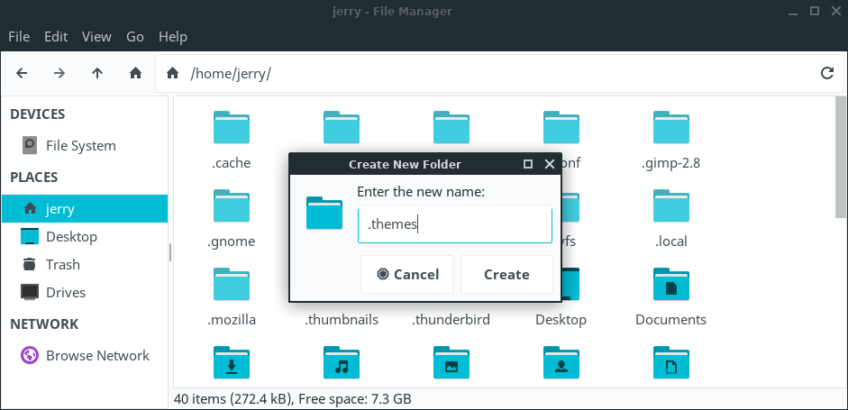

Download a theme of your choosing. In this example we will choose the [Axiom](https://www.xfce-look.org/p/1016679/) theme.

**NOTE: Each theme may come with a specific set of install instructions. If they do, please follow those instructions.**

Next, extract the theme you just downloaded (right click, **Extract Here**).

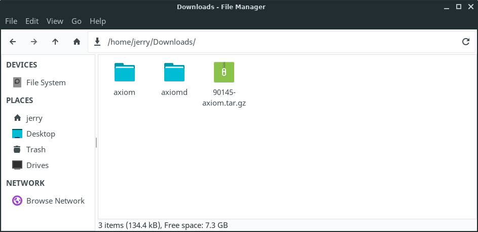

Copy the Axiom themes folder to the **.themes** folders in your home folder.

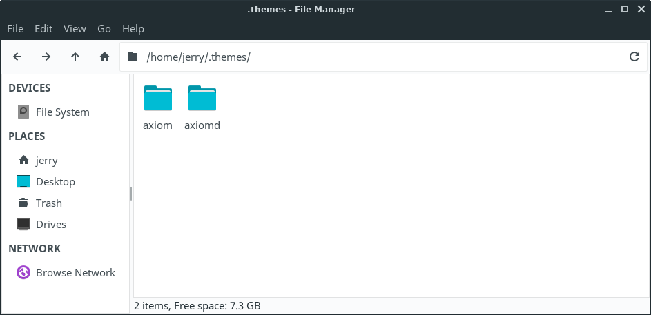

Now go to **Menu, Settings, Settings Manager**. There are 2 places we need to apply the new theme: **Appearance** and **Window Manager**.

First, we'll click into **Appearance**. Select **Axiom** from the list.

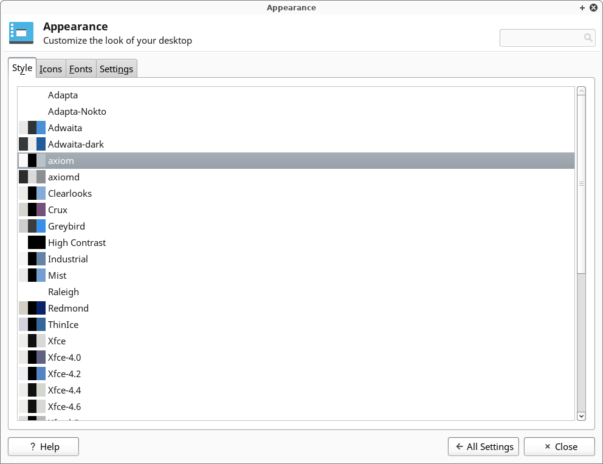

Click on **All Settings** in the bottom right to go back to the **Settings Manager**.

Now click into **Window Manager** and select **Axiom**. The new theme may not display properly until you log out and back in again, so do that now. Click **Menu, Log Out**. Then log in again.

**After** logging back in again, the theme is correctly applied.

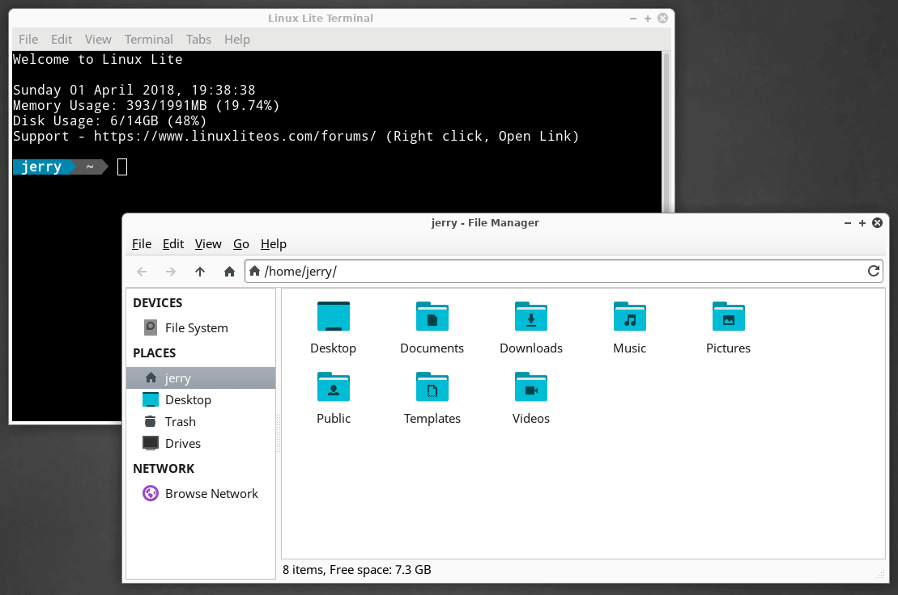

## Applying a new Icon set

Head over to the [XFCE Look](https://xfce-look.org/) website and choose an [Icon set](https://www.gnome-look.org/browse/cat/132/) of your liking.

**NOTE: Not all icon sets from there will work as you would expect. Please read all of the documentation before attempting to apply a new icon set. Some may make installation easy via a PPA, which is a preferable method to the one shown here. Click [here](software.html#ppa) for more information on how to install a new PPA.**

The first thing we need to do is open up our home folder. Click on **View, Show Hidden Files**. Right click somewhere in your home folder, **Create Folder**, make a folder called **.icons** (you will only need to do this once). This is where we will copy the new Icon set to.

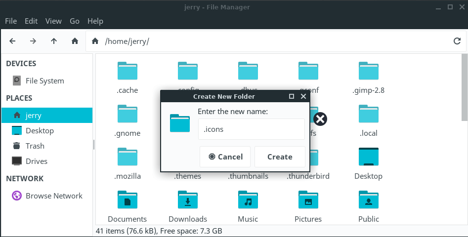

Download an icon set of your choosing. In this example we will choose the [Zafiro Icon Set](https://www.xfce-look.org/p/1209330/).

**NOTE: Each icon set may come with a specific set of install instructions. If they do, please follow those instructions.**

Next, extract the icon set you just downloaded (right click, **Extract here**).

Copy the icon set folder to the **.icons** folder in your home folder.

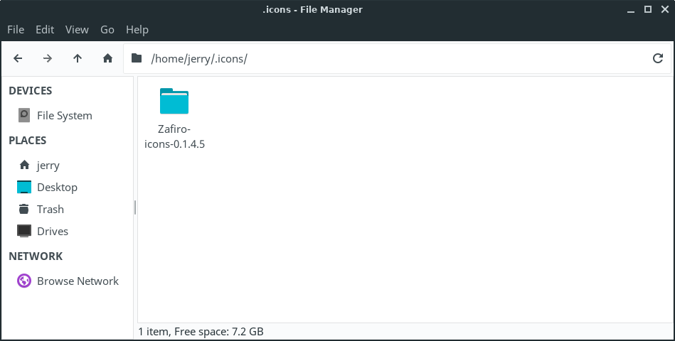

Open **Settings Manager** click into **Appearance, Icons**. Select **Zafiro-icons** from the list.

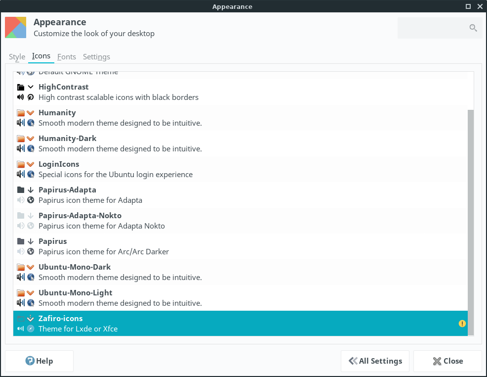

Log out and then log in again to see your new icon theme.

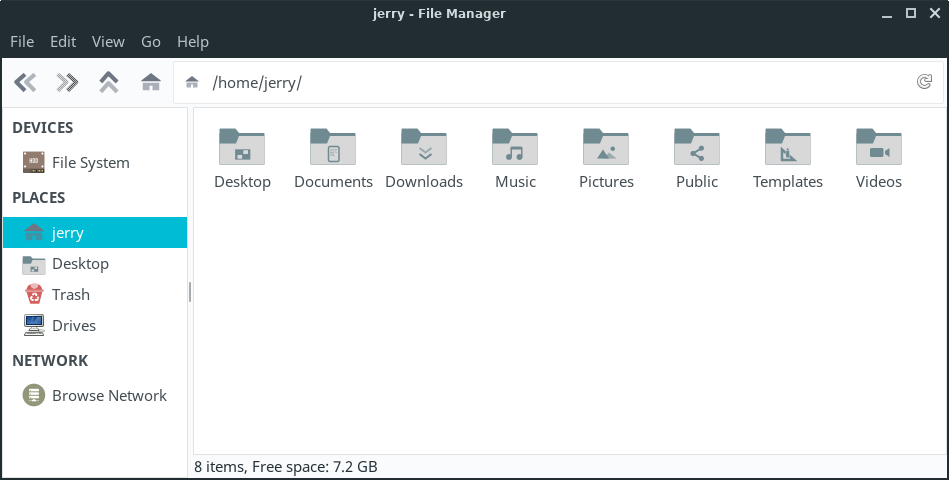

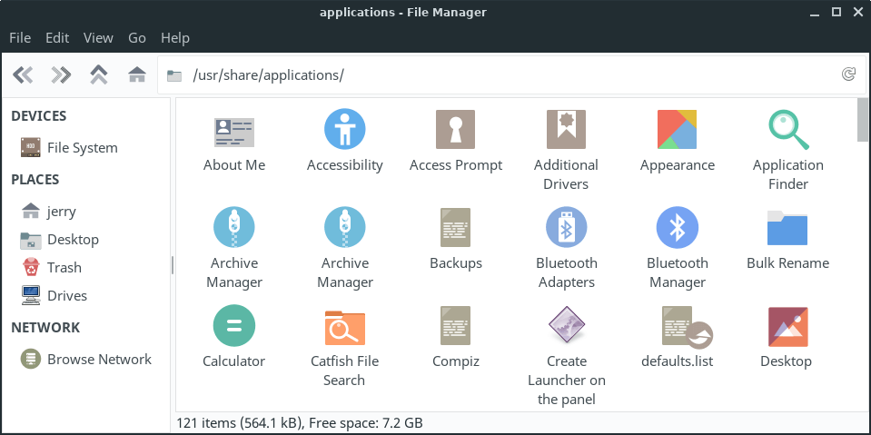

## Applying a new Mouse (Cursors) theme

Head over to the [XFCE Look](https://www.xfce-look.org/browse/cat/107/ord/latest/) website and choose a **Cursors** theme of your liking.

**NOTE: Not all themes from there will work as you would expect. Please read all of the documentation before attempting to apply a new theme. Some make installation easy via a PPA, which is a preferable method to the one shown here. Click [here](software.html#ppa) for more information on how to install a new PPA. Whichever theme you choose, make sure that it mentions XFCE compatibility.**

The first thing we need to do is open up our home folder. Click on **View, Show Hidden Files**. Right click somewhere in your home folder, **Create Folder**, make a folder called **.icons** if it does not already exist. (You will only need to do this once). This is where we will copy the new theme to.

Download a mouse theme of your choosing. In this example we will choose the [Ecliz mouse theme](http://xfce-look.org/content/show.php/Ecliz?content=110340).

**NOTE: Each icon set may come with a specific set of install instructions. If they do, please follow those instructions.**

Next, extract the icon set you just downloaded (right click, **Extract here**).

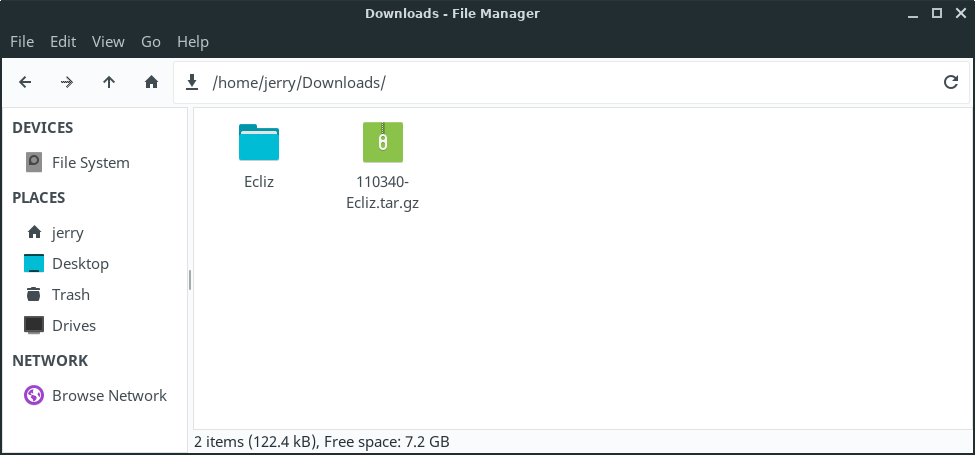

Copy the extracted mouse theme folder to the **.icons** folder in your home folder. Then open the **Settings Manager** and open the **Mouse and Touchpad** settings. Click the **Theme** tab and you will find your new theme there. Click to select it and your mouse will immediately change.

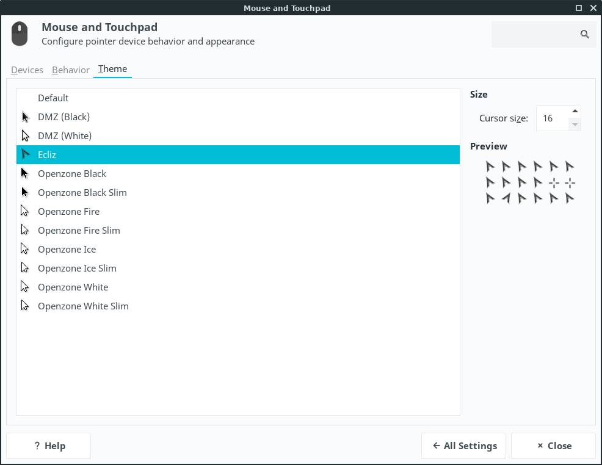

## Customize your Panel Bar

The panel bar along the bottom of your screen, (with your Menu and various indicator icons on it), can be customized in a variety of ways. Its position and size can be changed. Launchers and plugins can be added to it. You can even have multiple panels if you want to position certain items on different parts of the screen. To get started, right click on an empty area of the panel and select **Panel, Panel Preferences**.

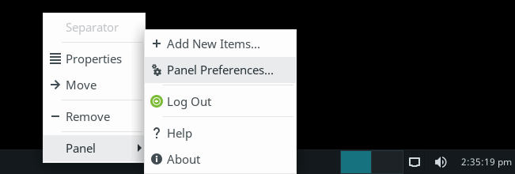

A **Panel** window will pop up where you can make your changes. The **Display** tab lets you choose to have the panel displayed horizontally, vertically, or as a deskbar on the screen. You can choose to auto-hide the panel or not, change its length and width and move it to the top, bottom, or either side of the screen.

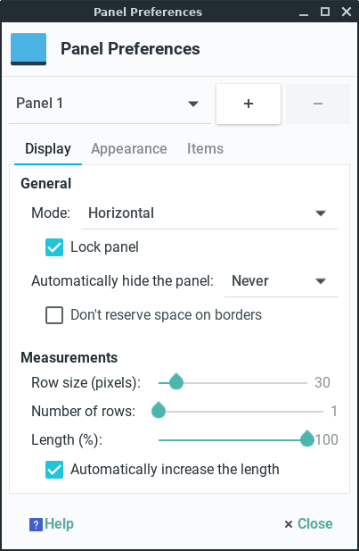

To move the panel you need to first unlock it, then you will see handles appear on either end of the panel that you can grab with your mouse to move it. Here is a close-up showing what the handles look like:

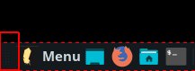

The **Appearance** tab lets you choose a style for the panel, adjust the transparency (alpha) of the panel, or adjust the opacity of the panel depending on whether your mouse is pointing at it or not. ("Compositing" needs to be enabled in order to change transparency and opacity settings. See the [Window Manager Tweaks](#tweaks) section for how to do that.)

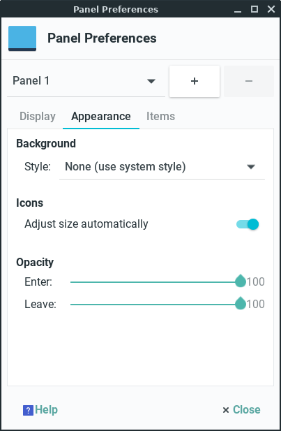

The **Items** tab is where you go to add things like launchers, plugins and separators to the panel. Items on the panel are listed on the left and the buttons on the right allow you to change their position on the panel (up/down arrows), add (+) or delete (-) items, and edit details for them if necessary. As you do that, you can see the changes take immediate effect on the panel.

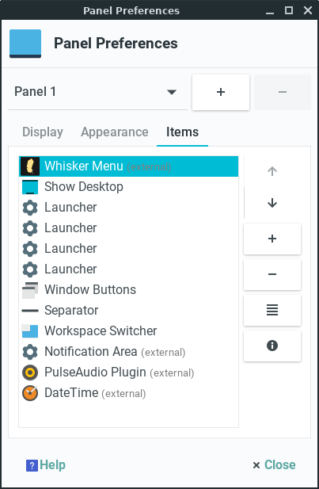

Notice above that I created several launchers by using the **+** button, which opens an **Add New Items** window. That window is where you can choose to add launchers, separators, and plugins that are available for the panel.

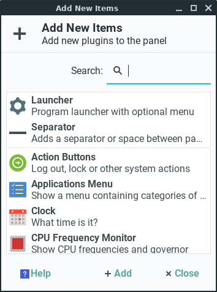

When you are done adding things, close the **Add New Items** window to get back to the **Items** tab of the **Panel** window. To assign a program to a launcher, highlight the launcher item and click the button for "Edit the currently selected item".

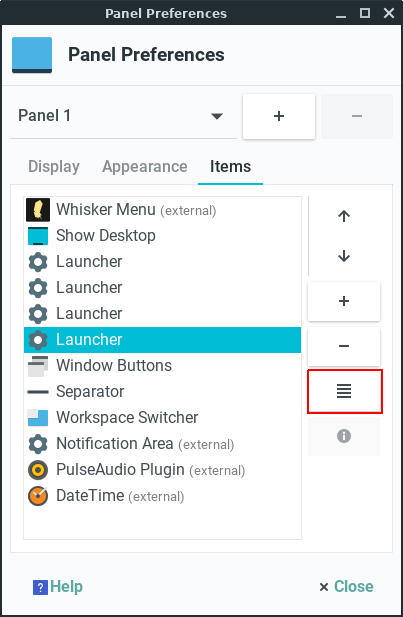

That will bring up the **Launcher** window.

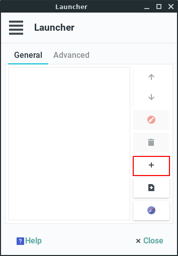

Hit the **+** button to bring up a list of programs to choose from.

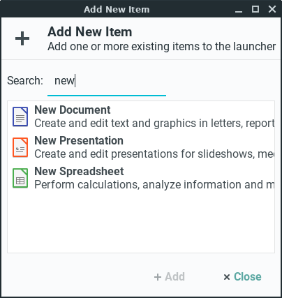

As an example, below is a panel with the **New Document** launcher added.

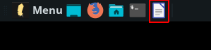

**Creating a multi-level launcher,** (giving you a choice to start more than one program from a single launcher), is done in the same manner as just described. The only difference is that you add more than one item to the same launcher. One might prefer to make a launcher menu instead of separate launchers to save space on the panel and/or to group similar types of programs.

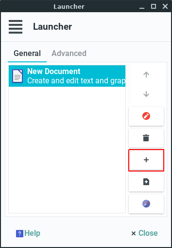

In our example, the **New Document** has a small arrow to the right of its icon. We'll add a **New Spreadsheet** launcher using the **+** button. Here is what the **Launcher** window looks like after adding the **New Spreadsheet** launcher.

If you need a more detailed description of the procedure to create a multi-level launcher, please see [this tutorial](https://www.linuxliteos.com/forums/index.php?topic=1294.0) on our forum. The tutorial also describes some advanced tips like changing the position of the arrow on the launcher.

**Creating additional panels** is easy to do. From the **Panel Preferences** window, click the **+** sign along the top next to the **Panel 1** box.

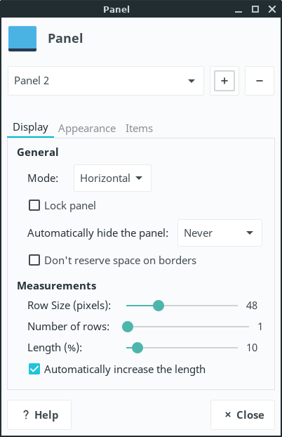

Now you will have a new (empty) panel showing on the desktop and the **Panel Preferences** window will show **Panel 2** along the top. With **Panel 2** showing, you can now go about setting your preferences for the new panel under the **Display, Appearance** and **Items** tabs. It is unlocked from the start so you can drag and place it where you like on the screen.

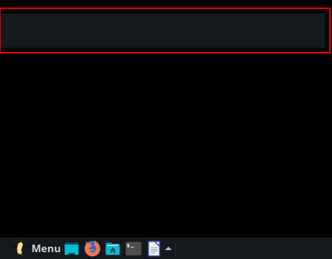

There are many more panel plugins available for installation than those pre-installed with Linux Lite. Have a look on [this XFCE site](http://goodies.xfce.org/projects/panel-plugins/start) for a comprehensive list of panel plugins that are available in the repositories. They are listed with their real package names, so you can easily use the search function in the **Synaptic Package Manager** (found at **Menu, System, Install/Remove Software**) to find and install any that interest you.

## Window Manager Tweaks

Select **Window Manager Tweaks** in the main **Settings Manager** window.

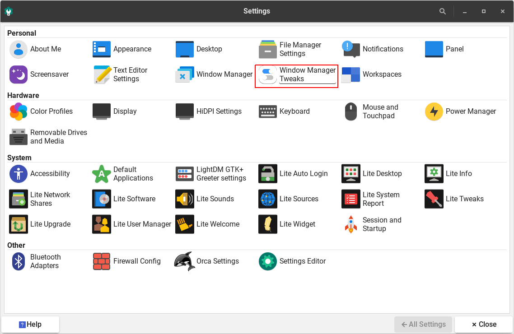

**Window Manager Tweaks** are an assortment of other settings you can change that effect window behavior. They are organized under the tabs: Cycling, Focus, Accessibility, Workspaces, Placement and Compositor. We will just touch on a few of these settings here. The rest you can browse through at your leisure.

The **Compositor** tab is of particular importance. It is here that you need to enable compositing if you plan to add transparency or opacity effects to your windows and/or panel(s).

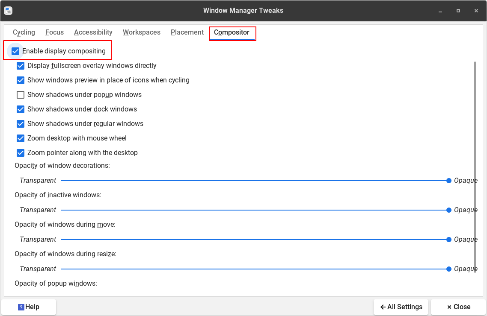

Check the box to **Enable display compositing**. Now you can access various transparency settings for windows as well as enable some shadow effects. Here is an example showing the opacity of inactive windows changed. Notice that the window in the background is now slightly faded.

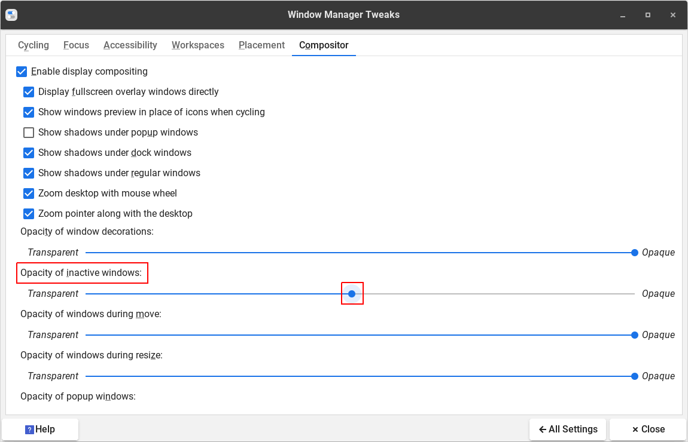

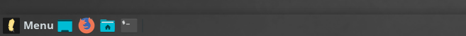

Back on **Window Manager Tweaks**, click on the **Workspaces** tab. Here you have a few more settings that control interacting with your workspaces.

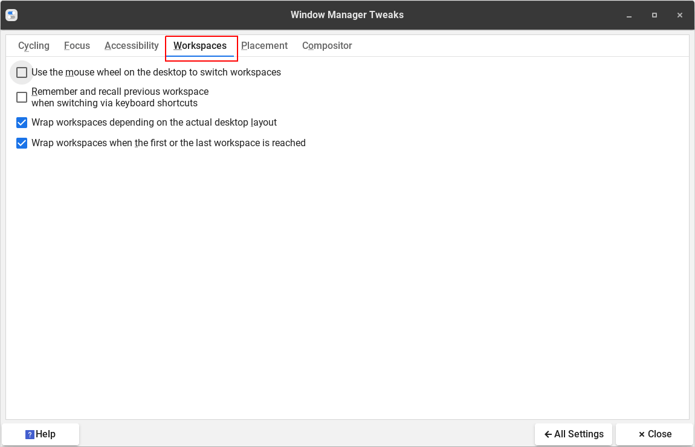

The options are pretty self explanatory. The last two options allow you to use your mouse to drag a window off one of the screen edges on to another workspace.
