## Welcome to Linux Lite - simple, fast, free.

Thank you for choosing the Linux Lite Operating System.

**Version:** 7.4 | Date published: 1st April, 2025

**What's New:** Updated information for 7.4 release.

**Authors:** Jerry Bezencon, Jethro Shearer, Ralphy, Bill Hahnen, Ralphy, Milos Pavlovic, Adam Grubbs, John Jenkins

## Operating System

|     |     |
| --- | --- |
| **Current Release Name** | Linux Lite 7.4 |
| **Architecture** | 64bit |
| **Supported BIOS** | Legacy, UEFI & Secure Boot |
| **Software Base** | Ubuntu 24.04.2 LTS |
| **Desktop Environment** | XFCE 4.18 |
| **Media Type** | DVD, 4GB or larger USB device |

  

## Recommended Computer Requirements:

*   1.5 Ghz Dual Core Processor or greater
*   2GB ram
*   40GB HDD/SSD/NVME
*   VGA, DVI, DP or HDMI screen capable of 1366x768 resolution
*   DVD drive or USB port for the ISO image
*   Disable Secure Boot

## Social Media:

*   https://www.facebook.com/linuxliteos
*   https://twitter.com/linuxlite
*   https://www.reddit.com/r/LinuxLite/
*   https://discord.com/channels/1042646000193503243/1042646001179168820

## Keyboard Shortcuts

| Shortcut                                      | Function                                  |
|----------------------------------------------|-------------------------------------------|
| <kbd>Ctrl</kbd> + <kbd>Alt</kbd> + <kbd>T</kbd>         | Opens a terminal                          |
| <kbd>Ctrl</kbd> + <kbd>Alt</kbd> + <kbd>Del</kbd>       | Opens the logout dialogue                 |
| <kbd>Ctrl</kbd> + <kbd>Shift</kbd> + <kbd>Esc</kbd>     | Opens the System Monitor                  |
| <kbd>Windows</kbd>                                      | Opens the Menu                            |
| <kbd>Windows</kbd> + <kbd>H</kbd>                       | Opens your home folder                    |
| <kbd>Windows</kbd> + <kbd>L</kbd>                       | Locks the screen                          |
| <kbd>Alt</kbd> + <kbd>F2</kbd>                          | Opens the Application Finder dialogue box |
| <kbd>Print Screen</kbd>                                | Opens the screenshot program              |
| <kbd>Left Alt</kbd> + Mouse wheel scroll               | Magnify your screen                       |
| <kbd>Insert</kbd> + <kbd>S</kbd>                        | Toggles screen reader On and Off          |
| <kbd>Ctrl</kbd> + <kbd>Alt</kbd> + <kbd>O</kbd>         | Opens the onscreen keyboard               |
 

## Included Software

Chrome Web Browser, Thunderbird Email, LibreOffice Writer (Word), LibreOffice Calc (Excel), LibreOffice Impress (Powerpoint), LibreOffice Base (Access DB), VLC Media Player, Gimp Image Editor, Text Editor, PDF Viewer, CD/DVD Burner, USB Burner, Image Scanner, Image Viewer, Firewall, Backups, Bluetooth Manager, Partition Drives, System Monitoring Center, Install Drivers, Timeshift, Whisker Menu, Lite Auto Login, Lite Desktop, Lite Info, Lite Network Shares, Lite Software, Lite Sounds, Lite Sources, Lite System Report, Lite Theme Manager, Lite Tweaks, Lite Updates Notify, Lite Upgrade, Lite User Manager, Lite Welcome, Lite Widget, Screen Reader, Onscreen Keyboard and Magnifier, Help Manual.

## Post Installation

The first thing you should do after a new install is click on **Menu, Favorites, Install Updates**. Next if you have any wireless, wired, graphics card devices or other hardware devices, click on **Menu, Settings, Install Drivers**. Please read the information provided very carefully before choosing a suitable driver. It is usually best to choose the recommended driver. You can look through how to connect to the internet by clicking [here](network.html). More information on drivers can be found [here](hardware.html).

## UEFI

According to [How-To-Geek](https://www.howtogeek.com/56958/htg-explains-how-uefi-will-replace-the-bios/), "The BIOS will soon be dead: Intel has announced plans to completely replace it with UEFI on all their chipsets by 2020. The traditional BIOS still has serious limitations. It can only boot from drives of 2.1 TB or less. 3 TB drives are now common, and a computer with a BIOS can’t boot from them. That limitation is due to the way the BIOS’s Master Boot Record system works. UEFI replaces the traditional BIOS on PCs. There’s no way to switch from BIOS to UEFI on an existing PC."

## How do I know if my computer has UEFI?

In **Windows Search**, type **msinfo** or **msinfo32** and launch the desktop app named **System Information**. Look for the **BIOS Mode** item, and if the value for it is **UEFI**, then you have the **UEFI** firmware. If it says **BIOS Mode Legacy**, then that’s the firmware you’re running. Also, in general, UEFI-enabled machines have faster startup and shutdown times as compared to BIOS-Legacy machines. If you bought the computer/motherboard after 2010, chances are you have a UEFI system. If you are still unsure, download the UEFI version as it will also detect and run on a BIOS-Legacy computer. If you have an older, legacy type BIOS computer don't worry, Linux Lite will still detect this and install on your computer.

  

## Secure Boot

Linux Lite recommends that you disable Secure Boot in your BIOS. This will save you potentially a lot of headaches during the use of your system. Linux Lite will run with Secure Boot enabled, but we highly recommend that you don't. You should be aware that Secure Boot is considered a security feature and was implemented to make it harder for things like ransomware to take hold of your pc.

## Disable Secure Boot in Windows

See the following link for generic instructions on how to disable Secure Boot in Windows (configuration will differ slightly depending on the manufacturer)

(Internet connection required to view video)

## Disabling Secure Boot - Tips

There are many ways to do this. One of these should work for your system:

\- In Windows - Hold down Shift, Click on the Power icon in your Menu, click Restart, keep holding down Shift the whole time. Release Shift key once you reach the Recovery options. Go to Troubleshoot, Advanced Options, UEFI Firmware Settings, Restart. You'll then be in your BIOS, Look for Security, or Advanced or Boot Options and find Secure Boot, disable it. Exit your BIOS by saving settings.  
  
\- Turn on your PC and access your BIOS menu. You can do this by pressing a key during the bootup sequence, eg. F1, F2, F12, or Esc. Look for the Secure Boot setting, set it to Disabled. Secure Boot is usually in either the Security tab, the Boot tab, or the Authentication tab. Save changes and exit your BIOS.  
  
\- In Windows - Clicking the gear icon on the Start menu will take you to Settings. In Settings, choose Update & Security. Select Recovery from the left menu and you can see Advanced startup at the right side. Click Restart Now under the Advanced startup option. The comptuer will reboot to the Recovery menu. Select Troubleshoot, Advanced options, UEFI Firmware Settings. Restart.  

## Keyboard Function

On some laptops you may have to enable **Numlock** as it is disabled by default. You could also try **FN + Numlock** to use your keys, or **FN +** one of the **F** keys across the top of your keyboard. This varies from computer to computer. Some examples follow:

<kbd>Fn</kbd> + <kbd>F11</kbd> (Acer, Toshiba, Samsung)  
<kbd>Shift</kbd> + <kbd>Num Lock</kbd>  
<kbd>Fn</kbd> + <kbd>Num Lock</kbd> (Sony, Gateway)  
<kbd>Fn</kbd> + <kbd>F11</kbd> + <kbd>Scroll Lock</kbd>  
<kbd>Fn</kbd> + <kbd>F8</kbd> (HP)  
<kbd>Ctrl</kbd> + <kbd>F11</kbd>  
<kbd>Fn</kbd> + <kbd>Shift</kbd> + <kbd>Num Lock</kbd>  
<kbd>Fn</kbd> + <kbd>F4</kbd> (Dell)  
<kbd>Fn</kbd> + <kbd>Nmlk</kbd> (Lenovo, ASUS)

## Lite System Report

Linux Lite comes with the **Lite System Report** tool found under **Menu, Settings**. This tool helps our Support team more accurately identify any problems you may be having, thus providing you with better service. Click [here](hardware.html#sysreport) to learn more about this.

## Lite info

The purpose of the Linux Lite Hardware Database, is to give people an idea of different computer configurations from within a Linux Lite Series. The Linux Lite Hardware Database displays **Make and Model, CPU, Graphics, Audio, Network and Storage** technical specifications. This provides a snapshot of the kind of computers people are able to use with Linux Lite. No personal or security related information is gathered or displayed. Click on **Menu, Settings, Lite Info** to share your hardware and help others. Click [here](https://www.linuxliteos.com/hardware.php) to go to the Linux Lite Hardware Database.

## Support

If you cannot find the answer to your question in this Manual, please choose from the following:

## Forums

Click [here](https://www.linuxliteos.com/forums/) to get support for Linux Lite on the [Linux Lite Forums](https://www.linuxliteos.com/forums/). Please search the Forums before posting your question, chances are the question you have, has previously been answered. When posting for support, make your title descriptive as possible. Within the post, specify details of the problem, describe the procedure you followed that led to it, steps you tried in order to resolve the issue, and any error messages you may have encountered at various stages in the process. Also include information on your computer - model number, approximate age, CPU, RAM, etc. (The [Lite System Report](hardware.html#sysreport) tool is good for that.) The more info you provide the easier it will be for people to evaluate the situation and offer appropriate guidance.

**NOTE: Please read the [Forum Posting Guidelines](https://www.linuxliteos.com/forums/introductions/forum-posting-guidelines/) before creating your first post**.

## General Software Support

If you are using a program for example **Chrome**, the first port of call should always be the developer and or creator/s directly. Most programs have a **Help** menu somewhere on their program. The **Help** menu will then have a link to their support area. This is where the experts are and you should receive excellent support. If after trying this you are still getting nowhere, feel free to use one of our above services. Because Linux Lite is based on the popular Ubuntu Operating System, many questions can also be answered by simply entering the issue you are having into your favorite search engine.

## Social Networks

**Facebook:** [https://www.facebook.com/linuxliteos](https://www.facebook.com/linuxliteos)  
**Twitter:** [https://twitter.com/LinuxLite](https://twitter.com/LinuxLite)  
**Instagram:** [https://www.instagram.com/linuxliteos/](https://www.instagram.com/linuxliteos/)  
**YouTube:** [http://www.youtube.com/c/linuxliteos](http://www.youtube.com/c/linuxliteos)  
**Discord:** [https://discord.gg/bQSFaFAUkm](https://discord.gg/bQSFaFAUkm)  
**LinkedIn:** [http://www.linkedin.com/in/jerrybezencon](http://www.linkedin.com/in/jerrybezencon)

[Top of page](#top)

## Tour

Here, we will give you a brief introduction to the Linux Lite Desktop. Let's start the Tour.

**The Desktop layout**

**1 - 10** - Taskbar. This area consists of the Menu, quick launch application icons, workspaces and the system tray.

**1** - Menu. This is where all of your applications are accessed. In Linux Lite, Menu items are categorized. See [here](start.html#menucats) for more information.  
**2** - Show Desktop. Clicking on this icon minimizes all currently open windows to the taskbar.  
**3** - Web Browser. Here is where you can launch the web browser Chrome from to allow you to browse your favorite websites on the Internet.  
**4** - Home Folder. This is where all your **Documents, Downloads, Music, Pictures and Videos** will be stored.  
**5** - XFCE Terminal. Otherwise known as the 'command line'. Here, you can run commands just lke you can in Windows (Command Prompt).  
**6** - Workspaces. These are like virtual desktops. They allow you to run your applications on 2 or more Desktops, increasing your workspace.  
**7** - Network Icon (system tray). Configure and connect to wired, wireless and VPN networks here.  
**8** - Install Updates (system tray). Click here to configure and install system updates.  
**9** - Volume Icon (system tray). You can adjust the main volume level, or if you have several applications running sound, you can adjust each level individually.  
**10** - Date, Time & Calendar (system tray). Here you can view the date and time, and also view the current months calendar by clicking on the time.  
**11** - Desktop Icons. Quick and easy access to frequently visited places in your computer (English installations only).

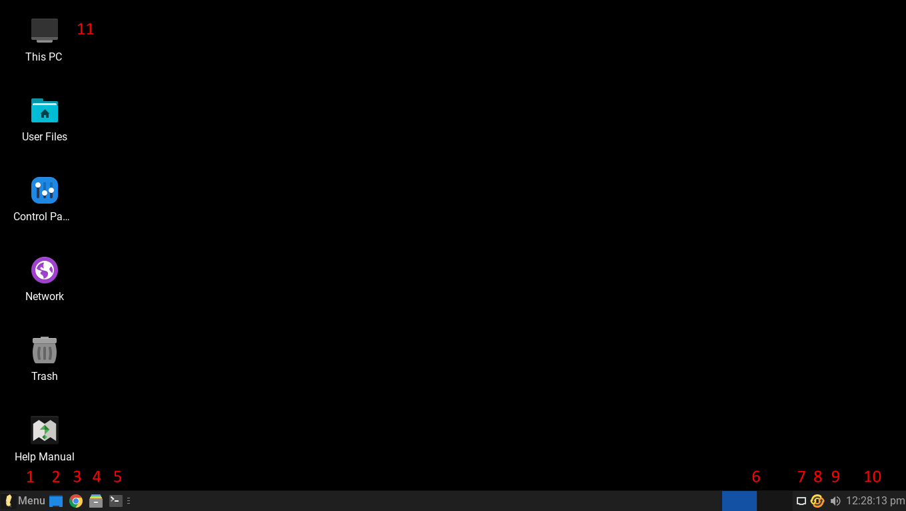  

**Menu Icons**

**1** - Search Bar. Here you can start typing the name of an application and the Menu will show that application to you in the list.  
**2** - All Settings. This is the Settings Manager, similar to the Control Panel in Windows. This is where you can adjust things like your Display resolution and Power settings.  
**3** - Lock Screen. Clicking on this icon will lock your screen. A handy feature to have when you are away from your computer for a short time and want it secured. Enter your password to unlock your screen when you return.  
**4** - Switch Users. Just like in Windows, if you have more than one user set up and you are both working on the same computer, here you can switch users without needing to login and logout each time.  
**5** - Logout. Clicking on this icon will bring up a new dialogue window giving you the option to, **Log Out, Restart, Shut Down, Suspend or Hibernate** your computer.  
**6** - Login Name. The name of the currently logged in user.  
**7** - Install Updates. Click here to install the latest updates that help keep your computer safe and secure. See [here](software.html#updates) for more information.  
**8** - Help Manual. A shortcut to the Linux Lite Help Manual, an excellent resource for learning how to use and configure Linux Lite.

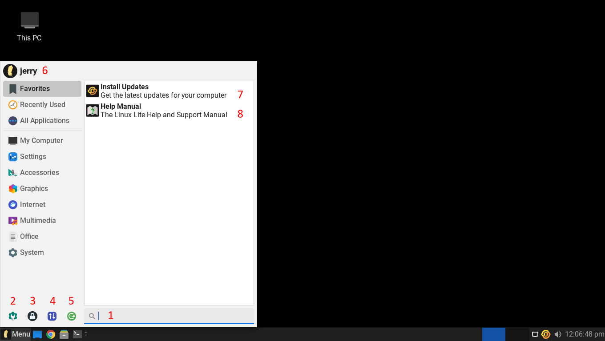  

**Menu Categories**

In Linux Lite, when you click on the **Menu** button, applications are stored in the **Menu** by category. For example, when you navigate to the **Office** category, you will see all of the **Office** like applications.

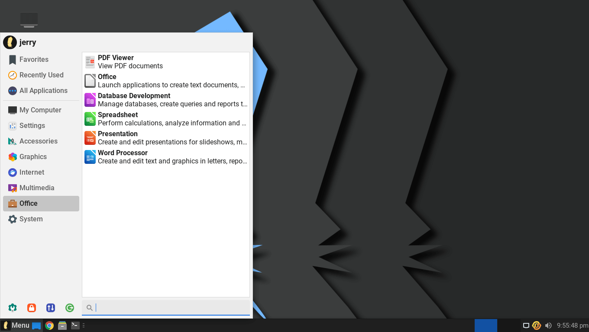  

**Desktop Settings - Changing the Wallpaper**

When you right click on a clear space on the Desktop, you will get a menu of utilities to select from. To change the Wallpaper, select **Desktop Settings** from the menu.

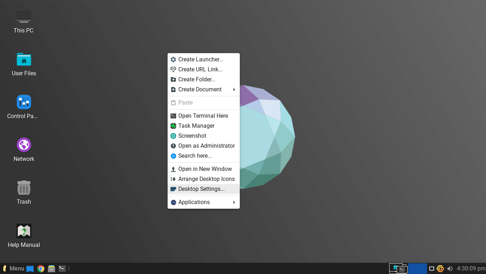  

In the window that appears, left click on any of the wallpapers to set a new Desktop wallpaper. More information on this can be found [here](customize.html).

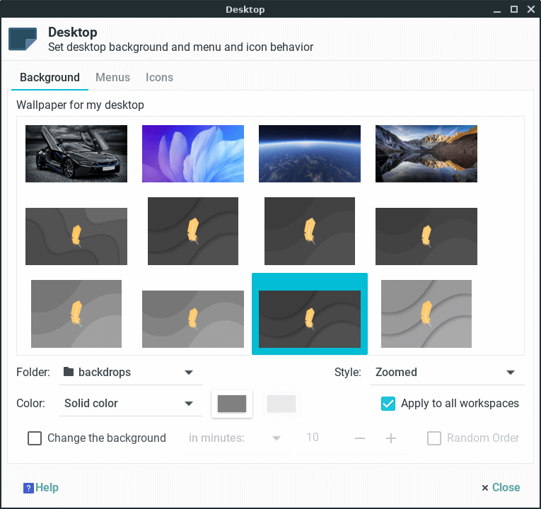  

**Home Folder**

The equivalent of Explorer in Windows, is called the **Home** folder in Linux Lite. This is where all your files get stored. For example, when you download a file from the Internet, that file gets stored in the **Downloads** folder. The rest of the folders are set up for your convenience in which you can organize your files according to their category. Your music would go into the **Music** folder, your photos would go into the **Pictures** folder, and so on. You can store your files directly into your **Home** folder if you choose to, but keeping files stored in separate folders sure does keep things tidy and easier to find.

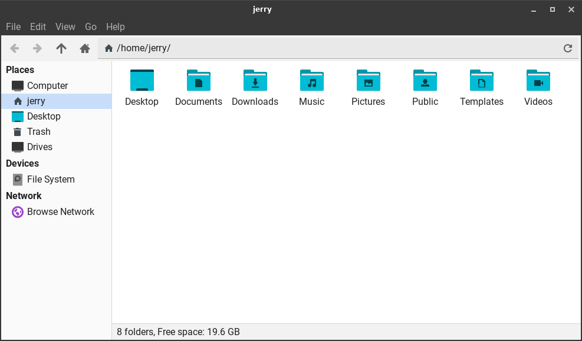  

**Settings Manager**

In Linux Lite, the **Settings Manager** is like the Control Panel in Windows. This is a central place where you can configure all of your Linux Lite settings. You can access the **Settings Manager** by going to **Menu, Settings, Settings Manager**.

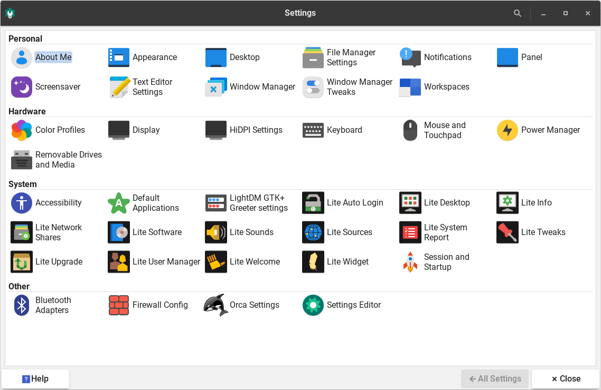  

## Menus

The menu system on Linux Lite has been greatly simplified to make navigation intuitive.

## System Menu

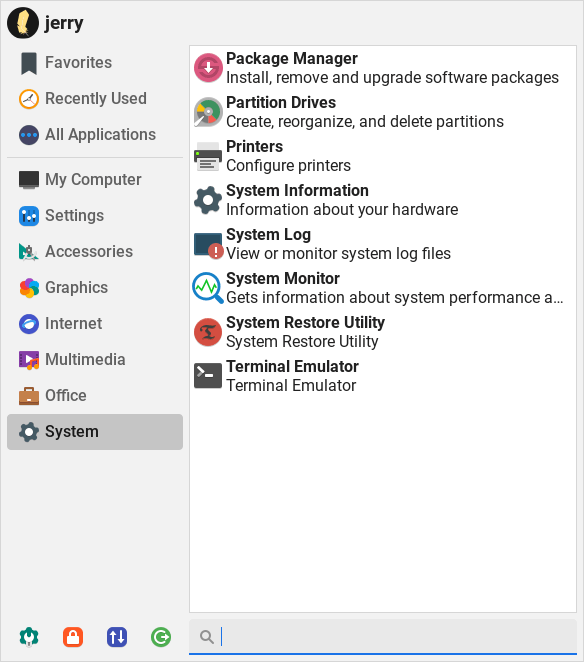  

**Package Manager** - Install and Remove software with the [Synaptic Package Manager](software.html#software).  
**Partition Drives** - View and edit your hard drive partitions with [GParted](http://gparted.sourceforge.net/) program.  
**Printers** - Install and set up printers.  
**Process Viewer** - Shows you how much cpu and memory your computer is using. Also displays system processes.  
**System Information** - View hardware like your cpu, memory, graphics card etc in detailed information.  
**System Log** - View system your logs, helps with troubleshooting.  
**System Monitor** - A Task Manager, Process viewer and killer and services manager all in one.  
**System Restore Utility** - System restore tool for Linux. Supports scheduled snapshots, multiple backup levels, and exclude filters. (like System Restore in Windows)  
**Terminal Emulator** - A command line utility like the command prompt in Windows.

  

## Office Menu

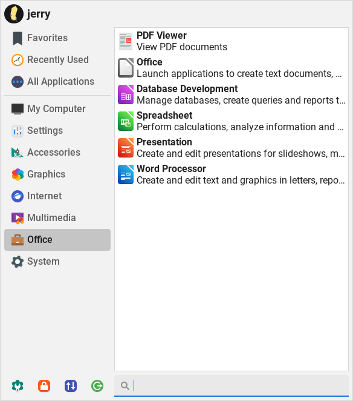

**PDF Viewer** - View PDF documents with this application.  
**Office (LibreOffice Launcher)** - Start any LibreOffice application from here.  
[Database Development](http://www.libreoffice.org/discover/base/) - Opens LibreOffice Base, an application similar to Microsoft Access.  
[Spreadsheet](http://www.libreoffice.org/discover/calc/) - Opens LibreOffice Calc, an application similar to Microsoft Excel.  
[Presentation](http://www.libreoffice.org/discover/impress/) - Opens LibreOffice Impress, an application similar to Microsoft PowerPoint.  
[Word Processor](http://www.libreoffice.org/discover/writer/) - Opens LibreOffice Writer, an application similar to Microsoft Word.

## Multimedia Menu

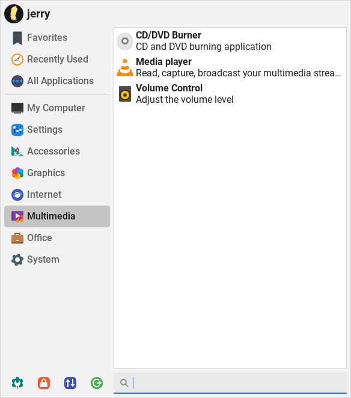

[CD/DVD Burner](https://docs.xfce.org/apps/xfburn/start?s[]=xfburn) - A fully featured CD & DVD burning program - XFBurn.  
[Media Player](http://www.videolan.org/vlc/index.html) - VLC, a fantastic all around media player, play mp3's, avi's, mkv's etc. Plays all your media files.  
**Volume Control** - Individually set volume levels for each program that is running and configure your sound devices.

## Internet Menu

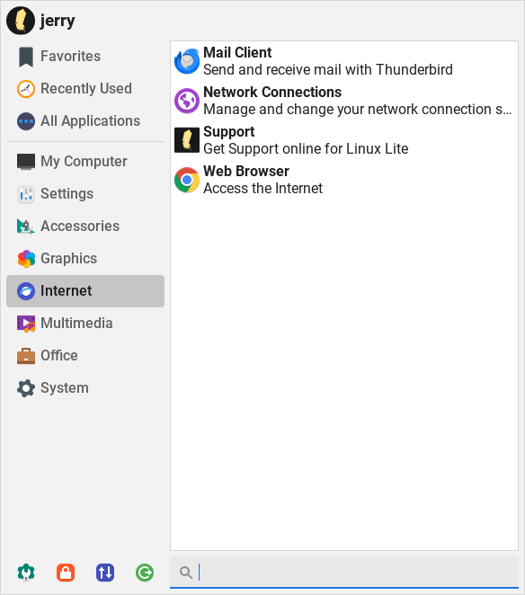

[Mail Client](http://www.mozilla.org/en-US/thunderbird/) - The Thunderbird email program, send and receive email.  
**Network Connections** - Manage and connect to wired, wireless, 3g and VPN networks.  
**Support** - Get Support at the Linux Lite [Forums](https://www.linuxliteos.com/forums/).  
[Web Browser](https://www.google.com/chrome/) - Browse the internet with Chrome.

## Graphics Menu

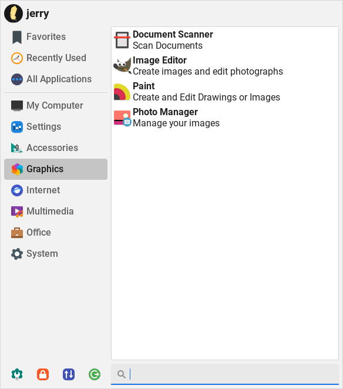

**Document Scanner** - Scan your documents and pictures.  
[Image Editor](http://www.gimp.org/) - GIMP is a powerful, and fully featured image manipulation program with features similar to Photoshop.  
[Paint](https://launchpad.net/gnome-paint) - Gnome Paint is a simple to use Paint application.  
[Photo Manager](https://wiki.gnome.org/Apps/Shotwell) - Preview your pictures and apply basic editing changes to them with the Shotwell image viewer.

## Accessories Menu

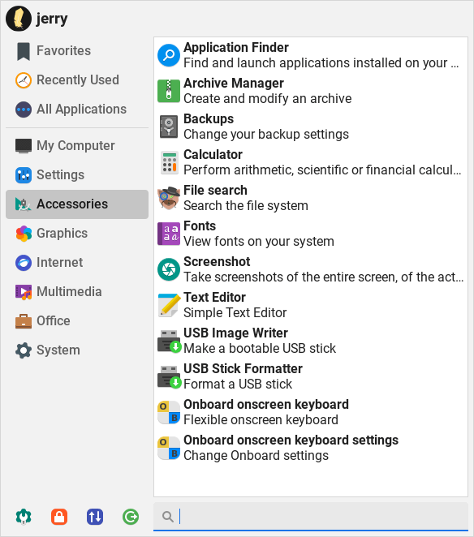

**Application Finder** - A handy pop up menu to all your programs, by category and in alphabetical order.  
**Archive Manager** - A utility to compress and uncompress zip files etc.  
**Backups** - A simple to use backup solution for your computer.  
**Calculator** - A basic calculator also capable of scientific functions.  
**File Search** - Locate files and folders on your computer.  
**Fonts** - A simple font viewer and installer.  
**Screenshot** - Take a screenshot of a window, and selected area, or the entire desktop.  
**Text Editor** - A basic text editor, a program to type text into. Can also be used to create and/or edit configuration files.  
**USB Image Writer** - Burn an image to a USB device.  
**USB Stick Formatter** - Format a USB device.  
**Onboard onscreen keyboard** - An onscreen keyboard offered as an accessibility option.  
**Onboard onscreen keyboard settings** - Configure Onboard settings.

## My Computer Menu

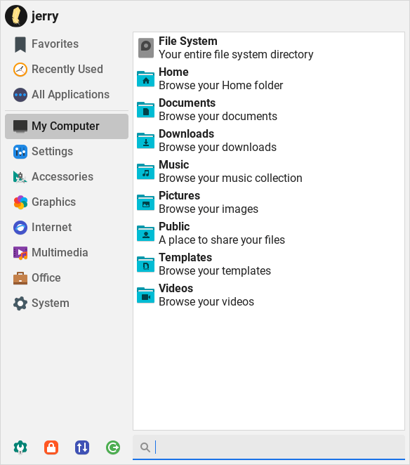

Conveniently placed shortcuts to your file system and all the folders within your home directory (English installations only).  

## Application Finder

Clicking on this, you can run any program that is installed on the computer by its name.

## Install Updates

Checks for updates for Linux Lite. Click [here](software.html#updates) to learn more about installing updates.

## Help Manual

A link to this Help manual.

## Accessibility - Assistive Technologies

Assistive technology (AT) is any item, piece of equipment, software program, or product system that is used to increase, maintain, or improve the functional capabilities of persons with disabilities.

AT can be low-tech: communication boards made of cardboard or fuzzy felt.  
AT can be high-tech: special-purpose computers.  
AT can be hardware: prosthetics, mounting systems, and positioning devices.  
AT can be computer hardware: special switches, keyboards, and pointing devices.  
AT can be computer software: screen readers and communication programs.  
AT can be inclusive or specialized learning materials and curriculum aids.  
AT can be specialized curricular software.  
AT can be much more—electronic devices, wheelchairs, walkers, braces, educational software, power lifts, pencil holders, eye-gaze and head trackers, and much more.

Assistive technology helps people who have difficulty speaking, typing, writing, remembering, pointing, seeing, hearing, learning, walking, and many other things. Different disabilities require different assistive technologies.

**Source** - [https://www.atia.org/home/at-resources/what-is-at/#what-is-assistive-technology](https://www.atia.org/home/at-resources/what-is-at/#what-is-assistive-technology)

In Linux Lite, we provide a screen reader, a screen magnifier and an onscreen keyboard. The screen reader and the onscreen keyboard can be used on the Login page as shown below.

**Keyboard Shortcuts:**

**F3** - On Screen Keyboard  
**F4** - Screen Reader

## Screen Reader - Orca

Orca is a free and open-source, flexible, extensible screen reader from the Gnome project for individuals who are blind or visually impaired. Using various combinations of speech synthesis and braille, Orca helps provide access to applications.

To start Orca when you Login to your Desktop, click on **Menu, Settings, Session and Startup**. Then click on the **Application Autostart** tab, locate **Orca Screen Reader** and put a tick in the box. Logout, then Login again.

To configure Orca to your liking, click on **Menu, Settings, Settings Manager**. Click on the **Orca Settings** icon as shown below.

Here you can set up your screen reader to your own requirements. Orca is highly configurable so you should have no trouble setting it up to your personal requirements.

The key combo of **Insert+S** will also toggle speech on and off.

## Orca Keyboard Shortcuts and Resources

See here - [http://manpages.ubuntu.com/manpages/jammy/en/man1/orca.1.html](http://manpages.ubuntu.com/manpages/jammy/en/man1/orca.1.html).

## Screen Magnifier

Fairly self explanatory. Zoom in on any part of the desktop with the **Left Alt + Mouse Scroll-wheel** key combo.

The magnifier doesn't need to be started at Login as it is always available.

 Your browser does not support the video tag.

## Onscreen Keyboard

The onscreen keyboard application is Onboard. An onscreen virtual keyboard is an alternative input method that can replace a real hardware keyboard. Virtual keyboard may be a necessity in various cases. For example, your hardware keyboard is just broken; you do not have enough keyboards for extra machines; your hardware does not have an available port left to connect a keyboard; you experience difficulty in typing on a real keyboard; or you are building a touchscreen-based web kiosk.

To access the onscreen keyboard, click on **Menu, Accessories, Onboard onscreen keyboard**, or use the key combo of **Ctrl + Alt + O**.

The onscreen keyboard is highly configurable. Click on **Menu, Accessories, Onboard onscreen keyboard settings** to set it up the way you like it.

To start the onscreen keyboard when you Login to your Desktop, click on **Menu, Settings, Session and Startup**. Then click on the **Application Autostart** tab, locate **Onboard** and put a tick in the box. Logout, then Login again.

