## Connecting to the Internet - Wired
[Changing Desktop Environments](#deskenv)  
[Change Repository Location](#literepos)  
[Creating and Extracting compressed files](#archive)  
[File Encryption](#encrypt)  
[Getting Software](#software)  
[Installing Software](#instsoftware)  
[Installing Software - From a Deb Package](#debpkg)  
[Installing Software - From a Terminal using APT](#aptterm)  
[Installing Software - From Source Code](#instsource)  
[Linux Equivalents of Windows Programs](#winprogs)  
[Lite Software - Install Software](#installsoftware)  
[Lite Software - Remove Software](#removesoftware)  
[Lite Sources](#litesources)  
[Lite Tweaks](#tweaks)  
 [- Bootup Fix](#tweaks-bootup-fix)  
 [- Clear Memory](#tweaks-clear-memory)  
 [- Default Web Browser](#tweaks-default-web-browser)  
 [- Hibernate, Suspend](#tweaks-hibernate-suspend)  
[PPA - Adding](#ppa)  
[PPA - Removing](#pparem)  
[Software Updates Country Location](#sources)  
[Uninstalling Software](#uninstsoftware)  
[Updates](#updates)  
[Updates Notifications](#updatesnotify)  
[Wine - Run Windows programs](#wine) 

For the most part, you shouldn't have to configure anything in Network Connections if you are connected to your router with an ethernet cable. Your router is most likely already set up to give you an IP address automatically. So in this tutorial we will instead focus on connecting to your router with a static IP address.

Make sure Enable Networking has a tick beside it. The first step is to left click on the network tray icon and select Edit Connections.

If at any point you are asked to enter your password, please do so.

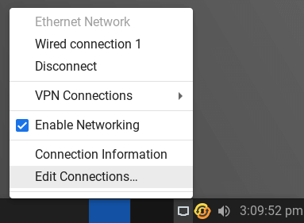

Highlight the **Wired connection** entry, and click on the **Edit** (cog) button.

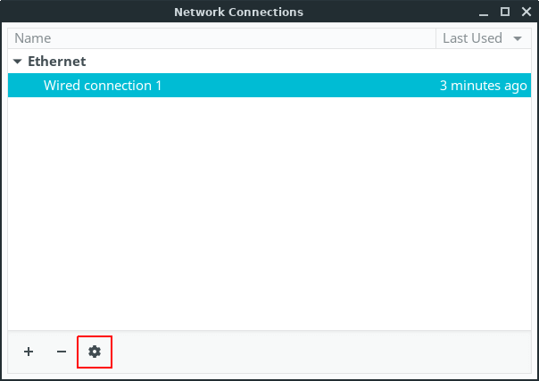

Click on the **IPv4 or IPv6** tab (consult your ISP on which one to use, IPv4 is the default) and select **Manual**.

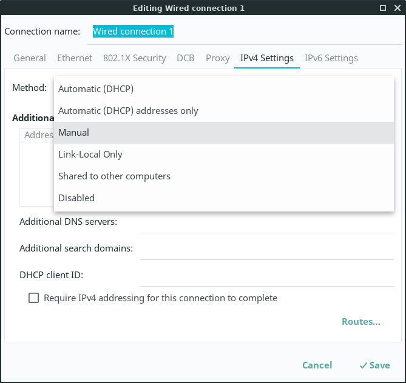

Click on the **Add** button in **Addresses** an enter in the appropriate numbers. Be sure to include the **DNS** address. This is typically the same address as your router web login address (just the 4 sets of numbers).

Example:

  

**Address:** 192.168.1.44  
**Netmask:** 24  
**Gateway:** 192.168.1.1 (this is your Router address)  
**DNS Servers:** 192.168.1.1 (this is also your Router address)  

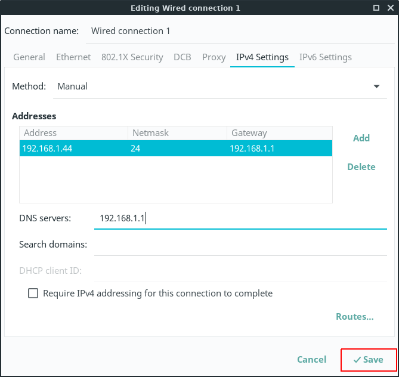

Click on **Save** to finish.

## Connecting to the Internet - Wireless

In the system tray (near the clock, bottom right hand side of your screen) if you have no connection at the moment you will see a diagonal broken line with a red cross next to it. This denotes that there is no connection currently. Left click on the icon, if your wireless is working, you should have a list of wireless networks in your area, select your network. If you cannot see any wireless networks at all, your wireless device driver may not be installed, or for example your wireless switch on your laptop is in the Off position. If after you have checked this there are still no wireless networks showing, go to **Menu, Settings, Install Drivers** and see if your wireless device is listed. If it is, install the driver for it and continue with this tutorial. (You will need to connect to the internet using a wired connection in order to download and install the wireless driver.)

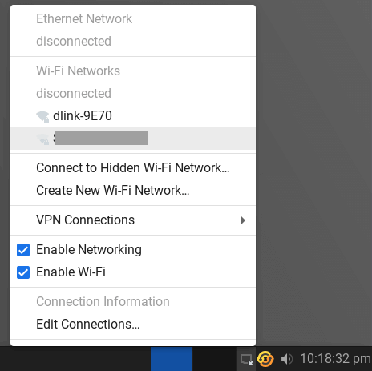

A box will pop up asking for your wireless password. If you would like to view your password while you type it, tick the '**Show password**' box to ensure that you have entered your wireless password correctly.

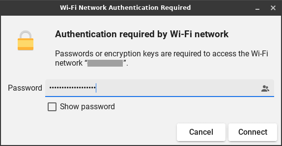

You will then receive a notification in the top right hand corner of your screen once you are connected.

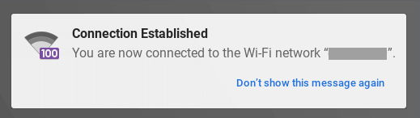

After a successful connection, you should see a tray icon like the one shown below.

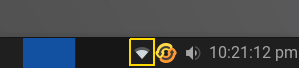

## USB Broadband Modem

If you have the **Huawei E220** then this should work out of the box. This is a very common modem and we encourage you to use this model if it is possible.

Right click on the Network Connections tray icon and select **New Mobile Broadband** connection. Configure your settings according to the details from your 3g service provider.

At this stage no other modems have been tested.

## NitroShare - Share files with Linux, Mac & Windows

NitroShare allows easy point and click sharing of files between all desktop operating systems including Linux, Mac & Windows.

**If you are going to use a Firewall:**

In Linux Lite, the Firewall (disabled by default) has been preconfigured to allow NitroShare traffic. Make sure your Firewall has been set to **home** before beginning this tutorial if you are going to use a Firewall. See [here](tutorials.html#firewall) for more information on this. If you're running Linux Lite make sure you place a tick in **nitroshare** as shown below. In the Firewall, click on **Configuration - Permanent**, place a tick in **nitroshare** as shown below, then click on **Options, Reload Firewalld**.

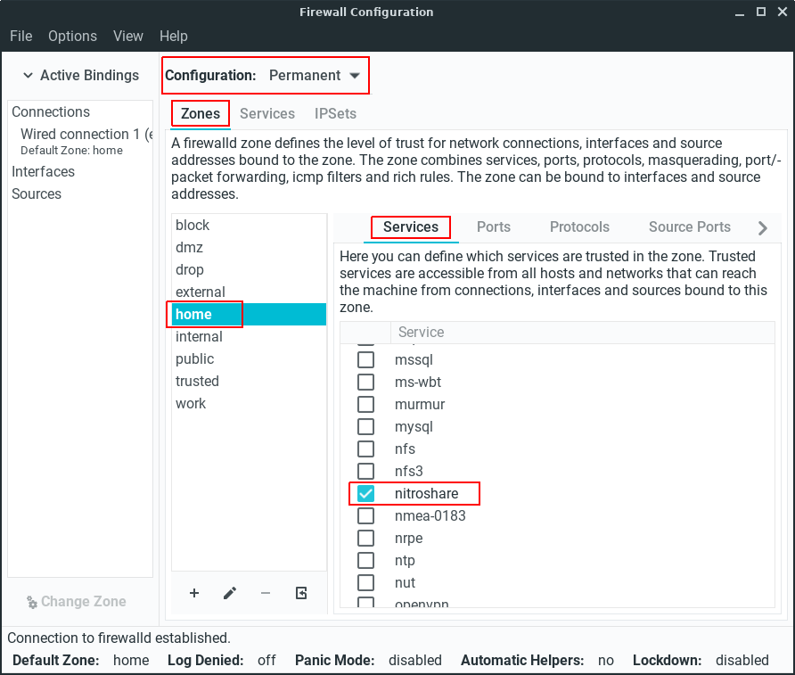

Let's install NitroShare. **Menu, Settings, Lite Software**. Enter your password and click on yes to **update sources now**.

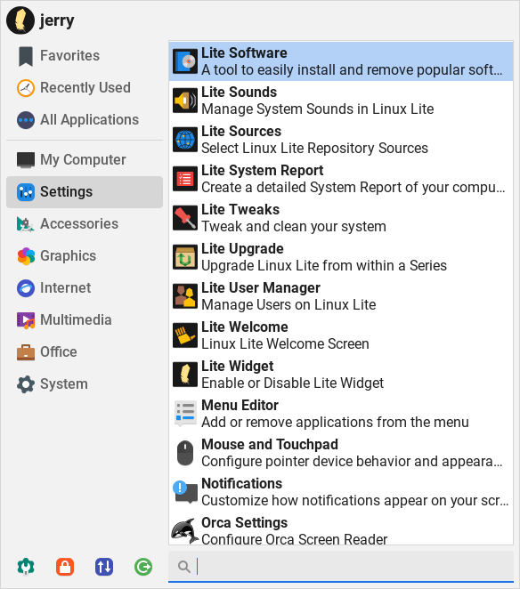

Now click on **Install Software**.

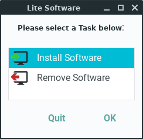

Left click on NitroShare and click on **Install** at the bottom right. Proceed with the installation. When the installation has finished, quit Lite Software.

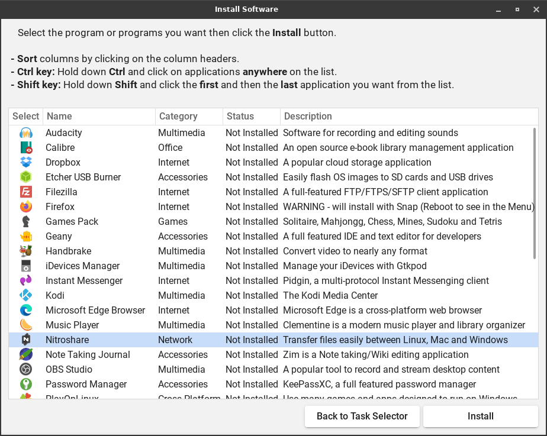

Go to **Menu, Internet, NitroShare**. Click on the **Close** button that pops up one time only, and then right click on the NitroShare tray icon and choose **Settings**.

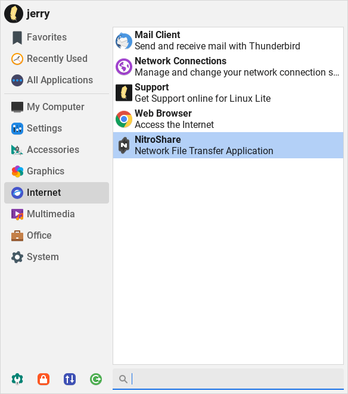

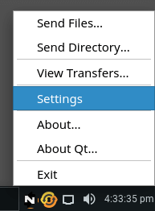

Choose the directory where you want to receive files to. Leave the other settings, unless you want to change them. Click **OK** when done.

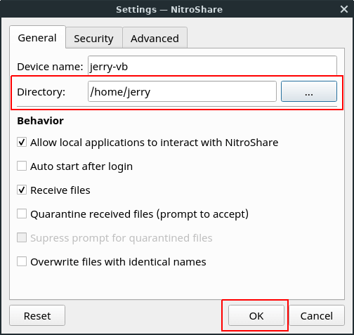

Let's send someone else on the network running NitroShare a file. Both computers MUST be on the same network, ie. connected to the same router. Right click on the NitroShare tray icon, select **Send Files**.

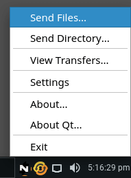

Select the file you want to send and click on **Open**.

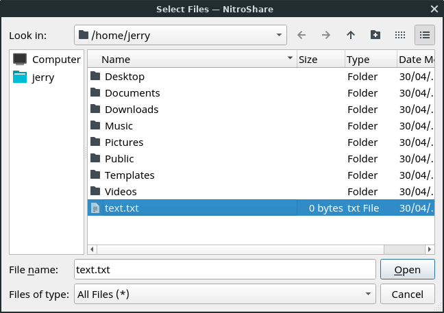

Select the computer you want to send the file to, and click on **OK**.

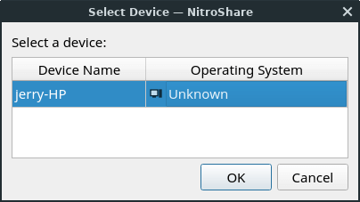

Transfer successful.

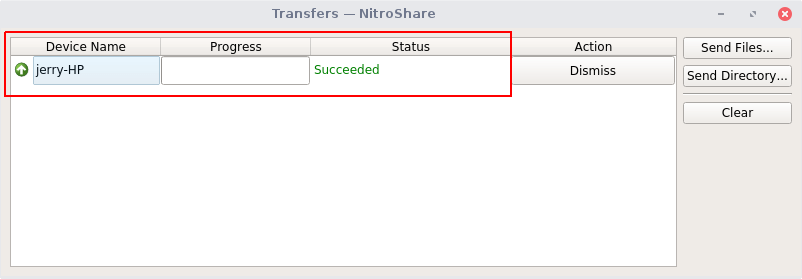

## Accessing a NAS device

Many homes now use a NAS or Network Attached Storage device. In this tutorial we'll show you how to access all your media files, then show you how to play them across your network with VLC. When this set up is complete, you'll also be able to copy and paste files between your NAS and your pc just like you did in Windows or Mac.

First thing you need to do is find the IP address of your NAS. You may know this already or your NAS manual will show you how to find this. Once you have your NAS's IP address, open up your home folder and type in the following:

**smb://192.168.1.49** where **192.168.1.49** is your NAS's IP address.

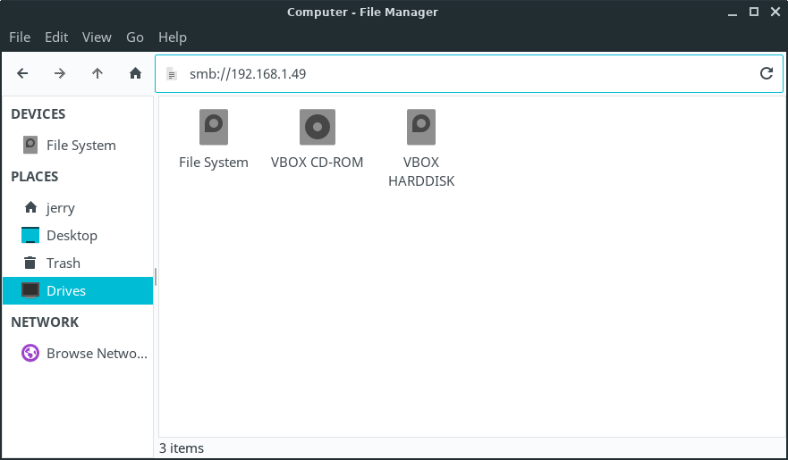

Put in the username of the NAS, in most cases it is **admin**, but again refer to your manual for the correct information. Put in the workgroup (**Domain**) name, and finally the password for your NAS. Place a dot in **Remember forever** if you want it to save your details.

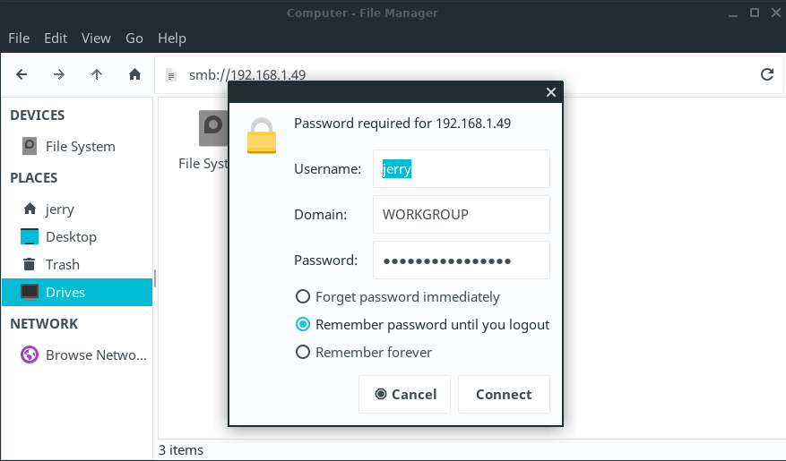

You should now see all of your NAS folders.

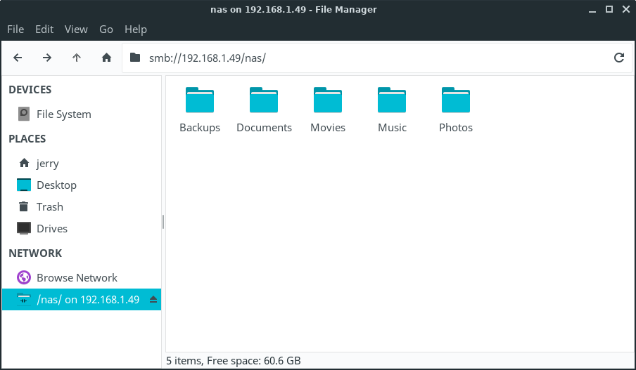

Lets look inside the **Movies** folder for this device, as you can see I have a movie file in there called **The Code Story of Linux Documentary.webm**

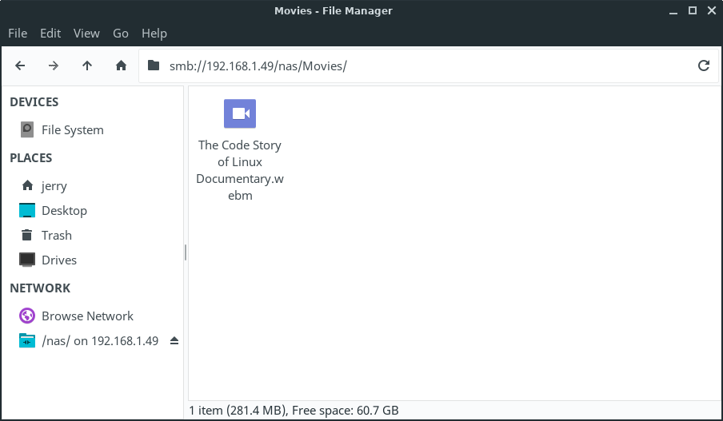

Before we can start playing media files across the network, we need to set up VLC so that it can access and play files remotely. In Linux Lite, click on **Menu, Multimedia, VLC Media Player**. With VLC open, click on **Tools, Preferences**.

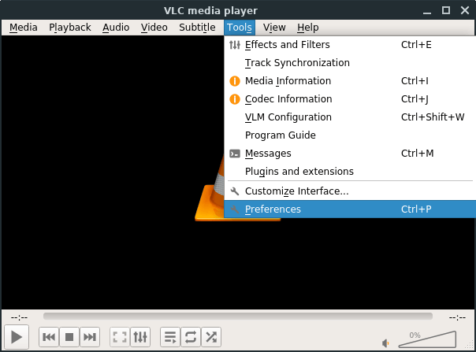

In the window that pops up, in the bottom left click on **All**. Then on the left, expand **Input / Codecs, Access modules, SMB**. Then put in your NAS's username, password and finally the **SMB domain** (Workgroup). Click on **Save** to finish and close VLC.

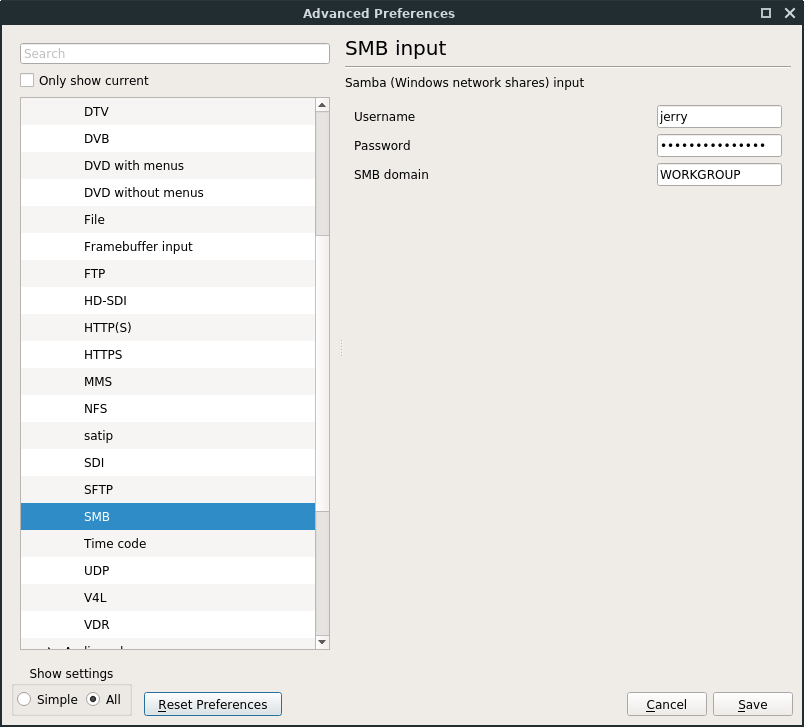

Now that we've given VLC the network credentials it needs to access your NAS, we can browse and play our files.

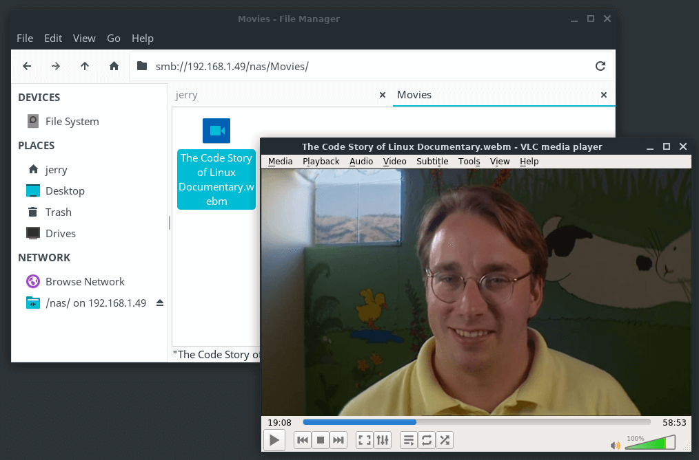

## Network Shares

A Network Share is a computer resource made available from one computer to others on a computer network such as files, folders and printers to mention the most common. These resources can be remotely accessed from another computer, typically via a local area network or intranet, transparently as if it were a resource in the local machine. Linux Lite includes the **Lite Network Shares** application to help in configuring your shares for access from other computers in your network; e.g.: a Windows machine. In Linux, the suite that provides seamless file and print services interoperability for Windows, Linux and Unix is known as **Samba**.

## Network Shares - Create Linux Lite Shares

This section will guide you on how to create your first Linux Lite share making the process as simple as it really is once you understand the basics:

Create a new folder inside your home folder by right-clicking an empty section in your home folder and selecting **Create Folder** from the context menu pop-up. In this example we will name it:

**linux\_share**

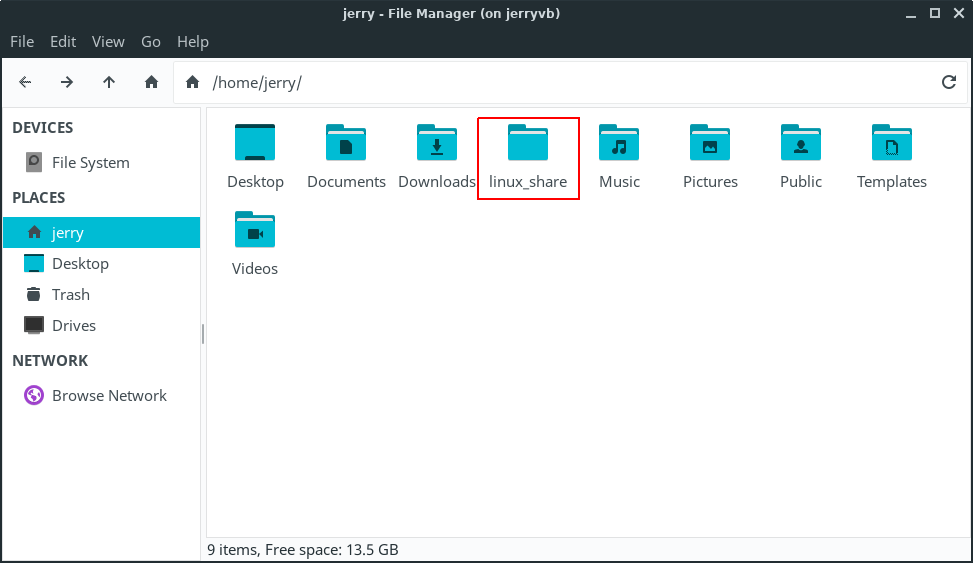

Next, we need to tell Samba (SMB) who we are going to login as to access our Linux Lite shares. Open up a terminal and type:

Terminal Command:

						`sudo smbpasswd -a name`

  

...where **name** is your Linux Lite username; in our case the username is **jerry**. For easily remembering the SMB password, you can use the same password for SMB as that in your Linux Lite user account if you wish.

You'll be asked to enter the new SMB password twice.

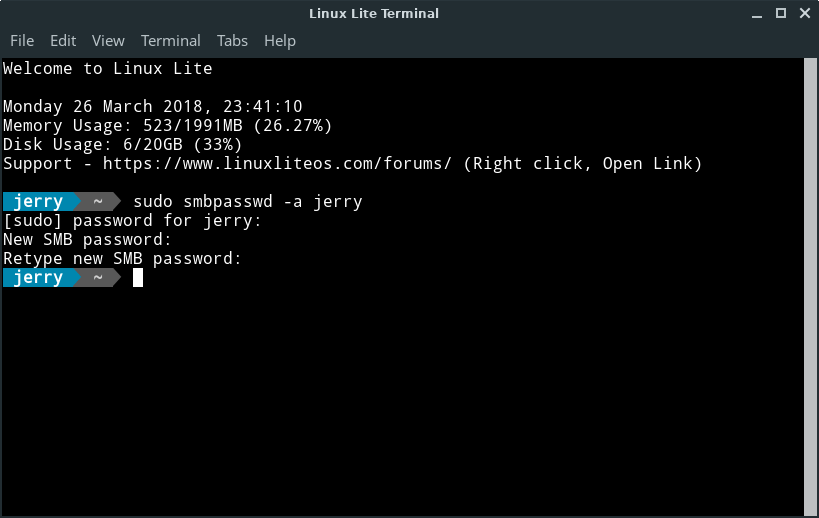

Open your home folder, navigate to the **/etc/samba/** directory, right click on the file **smbusers** and **Open as Administrator**.

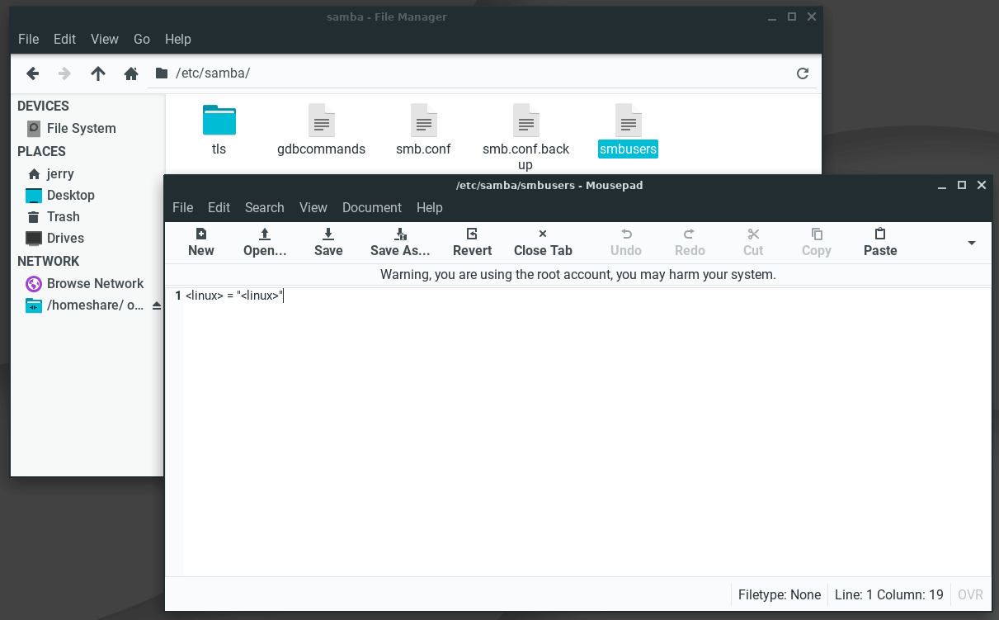

The file will open in the Text Editor. The smbusers file will contain a username map list (one per line) of your Linux Lite and SMB accounts. We will replace the default **linux = "linux"** in that file with our Linux Lite username in each of the brackets:

**username = "username"**... in our case: **jerry = "jerry"**

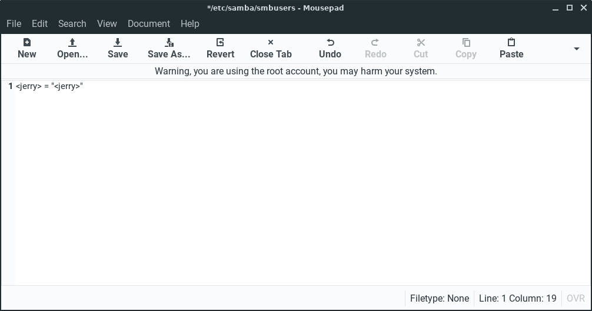

You can now **Save** and **Close** the smbusers file, and close the terminal.

Open **Menu**, **Settings**, **Lite Network Shares** and click on **Edit Share Settings**.

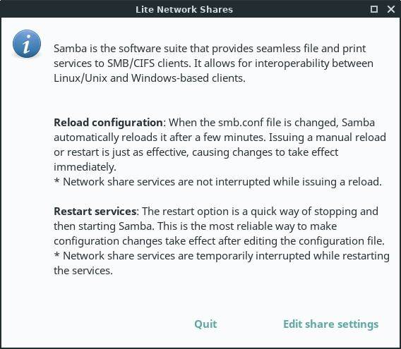

The configuration file will then open in leafpad text editor. Default settings are shown below:

  
#======================= Global Settings ====================================  
\[global\]  
workgroup = **WORKGROUP**  
server string = Linux Lite Shares  
netbios name = **linux**  
security = user  
encrypt passwords = true  
username map = /etc/samba/smbusers  
map to guest = bad user  
guest account = nobody  
dns proxy = no  
#======================= Share Definitions ===================================  
\[liteshare\]  
path = /home/%U/**linux\_share**  
available = yes  
valid users = %U %G  
write list = %U  
browsable = yes  
public = no  
writable = yes  
guest ok = no  
read only = no  
printable = no  
locking = no  
strict locking = no  
  
  

**For a first time basic setup, there is no need to change the default settings.** You likely only need to verify the following:

  
**WORKGROUP** - must be equal to the workgroup name in your network. "WORKGROUP" is usually the default.  
  
**netbios name** - must be equal to the computer name. In a terminal type in hostname to get your netbios name.  
  
**jerry@jerryvb:~$**  
  
**jerryvb** is the **netbios name** / **computer name**.  
  
**path =** the path to the folder in your home directory where shared files will be stored. **ONLY** change the folder name part; e.g.: /home/%U/linux\_share  
" **linux\_share** " is the folder name in Linux Lite you are sharing from your home folder. " **%U** " is Samba's substitution for the username; meaning same as your username. Leave the %U as it is. Change **ONLY** the word " **linux\_share** " to the name of the folder you created in the first step of this tutorial if you used a different folder name.  
  
  

**Save** and **Close** the file, then click on **Restart services**.

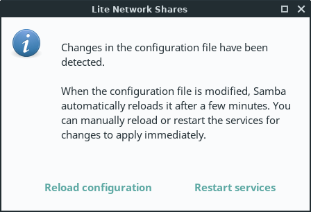

You can now access Linux Lite shares from another computer in your network.

**TIP:** Keep pressing F5 in the share folder, sometimes it takes a few seconds for the shares to appear.

If at any stage you want to add more share folders, you can simply add more blocks like in the example below:

  
#======================= Global Settings ====================================  
\[global\]  
workgroup = WORKGROUP  
server string = Linux Lite Shares  
netbios name = jerryvb  
security = user  
encrypt passwords = true  
username map = /etc/samba/smbusers  
map to guest = bad user  
guest account = nobody  
dns proxy = no  
#======================= Share Definitions ===================================  
\[liteshare\]  
path = /home/jerry/linux\_share  
available = yes  
valid users = %U %G  
write list = %U  
browsable = yes  
public = no  
writable = yes  
guest ok = no  
read only = no  
printable = no  
locking = no  
strict locking = no  
  
\[videoshare\]  
path = /home/jerry/Videos  
available = yes  
valid users = %U %G  
write list = %U  
browsable = yes  
public = no  
writable = yes  
guest ok = no  
read only = no  
printable = no  
locking = no  
strict locking = no  
  
\[dloadshare\]  
path = /home/jerry/Downloads  
available = yes  
valid users = %U %G  
write list = %U  
browsable = yes  
public = no  
writable = yes  
guest ok = no  
read only = no  
printable = no  
locking = no  
strict locking = no  
  
  

## Accessing Linux Lite shares from Windows

Go to your Windows machine, in this example we'll use Windows 10.

Open up **Network** in Windows. You should see the Linux Lite machine appear after a short while.

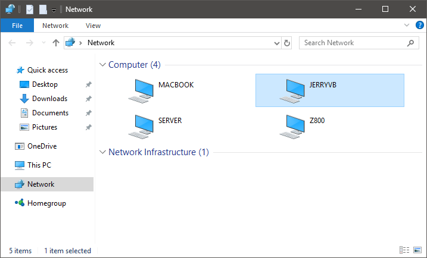

If you don't, simply type the ip address of the Linux Lite machine into the address bar with two back slashes in front eg. **\\\\192.168.1.199** To get the ip address of your Linux Lite pc, in Linux Lite open a terminal and type **ifconfig**

Look for the **inet** address.

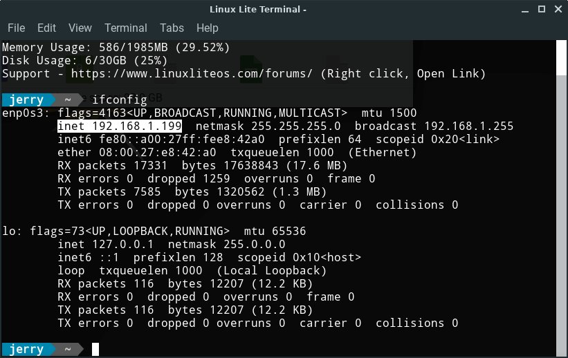

Double click on the machine name. A username and password dialogue box will pop up, enter in the user and password we created in the **Create Linux Lite Shares** tutorial above.

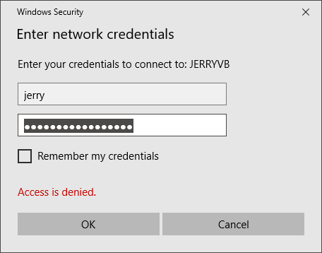

And here we see our Linux Lite computer share folder:

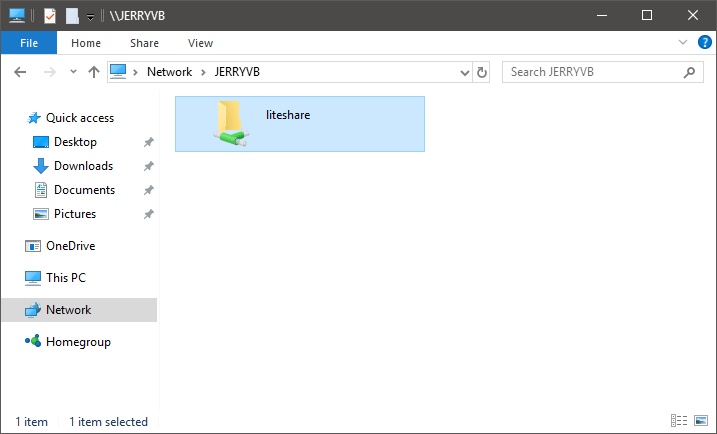

All that's left to do is to double click on the Linux Lite share and we will be inside the share folder. Now you can copy and paste files to your Linux Lite computer.

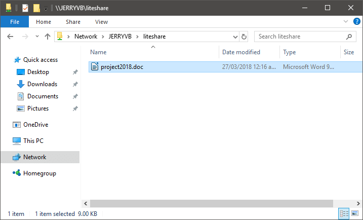

## Accessing Windows shares from Linux Lite

Go to your Windows machine and find the ip address. To do this, open a command prompt and type in: **ipconfig**

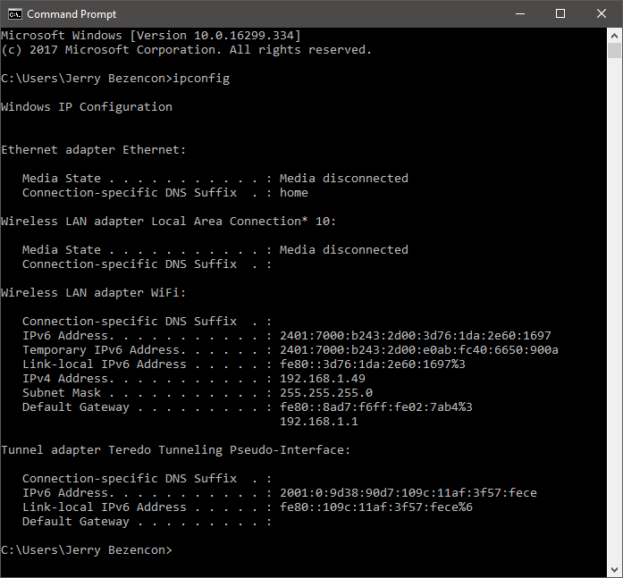

Usually the results at the top has your ip address listed. In the above example, the **IPv4 Address** is: **192.168.1.49** Make a note of this ip address.

Now go back to your Linux Lite computer, and open your home folder.

NOTE: If by the end of this Shares tutorial you are still not seeing any shares, try restarting both machines. Also note that sometimes it can take a while before the shares appear.

In the address bar, type in: **smb://ipaddressofwindowspc** where **ipaddressofwindowspc** is the actual numbered ip address of your Windows computer.

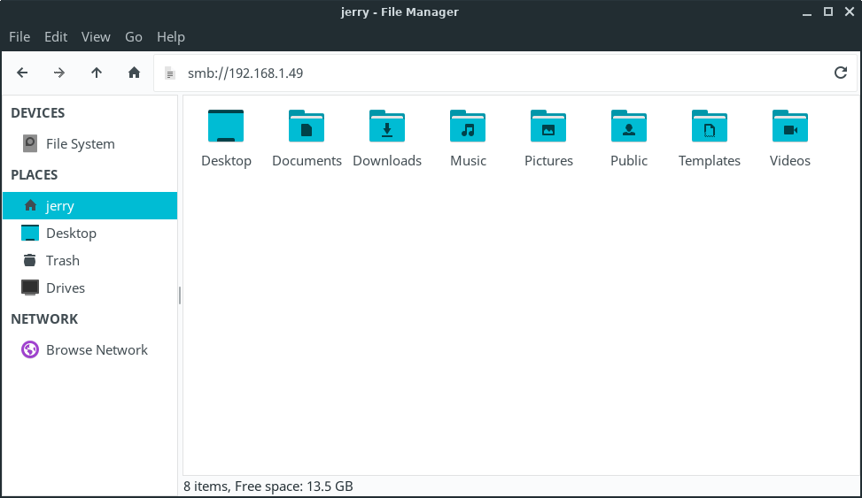

If everything went to plan, you should now be prompted for your Windows username, domain or workgroup and your Windows password.

**Windows username - Windows workgroup name - Windows password**

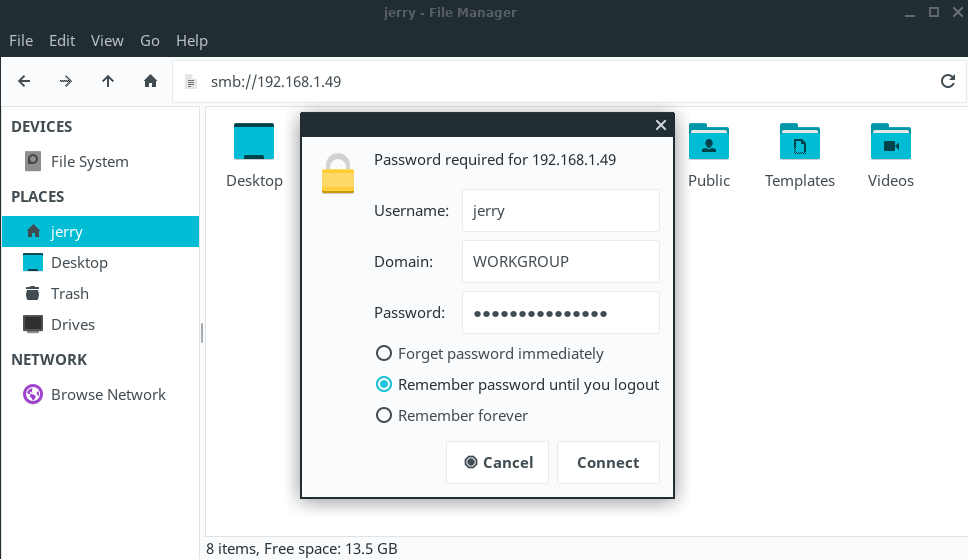

Now you can copy and paste files to your Windows computer.

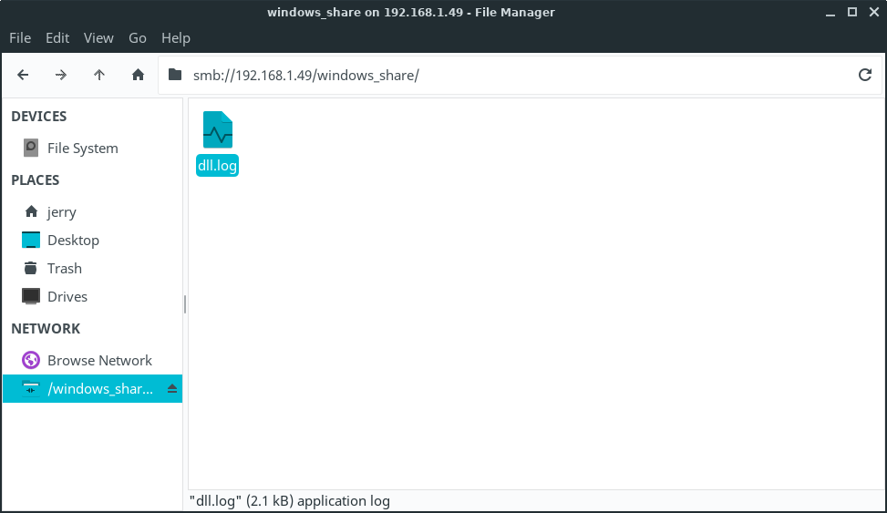

**NOTE:** If the ip address method does not work eg. **smb://192.168.1.49** try **smb://windowspc** where **windowspc** is the netbios name of the Windows computer.

**NOTE: If you are still not having any luck with either method, try [NitroShare](http://nitroshare.net/), a cross-platform network sharing application for Windows, Mac and Linux. You can view a video tutorial on it [here](http://www.youtube.com/watch?v=0QduAP4CxXI). Another method you could consider is setting up an FTP server on your Windows computer and connecting to it with Filezilla, available from Menu, Settings, Lite Software.**

## Remote Access with VNC

Here is a quick tutorial on how to configure x11vnc (VNC Server) for remote access/control to your Linux Lite PC via VNC client.

Start by installing x11vnc from Terminal with:

Terminal Command:

						`sudo apt install -y x11vnc`

  

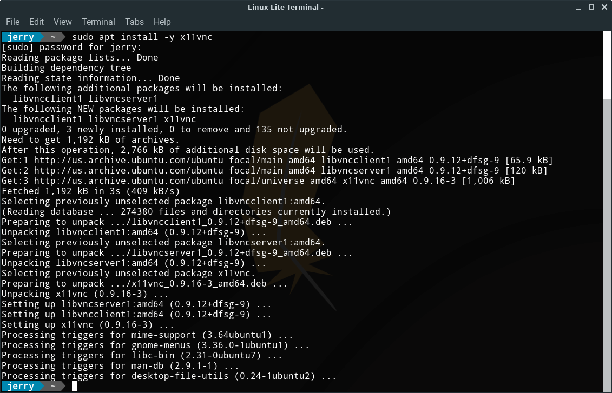

Next, let’s create a directory to store a file that will contain the password used for VNC authentication:

Terminal Command:

						`sudo mkdir /etc/x11vnc`

  

Now we'll create an encrypted password file and save it in **/etc/x11vnc/**. You will be prompted to type and verify the password:

Terminal Command:

						`sudo x11vnc --storepasswd /etc/x11vnc/vncpwd`

  

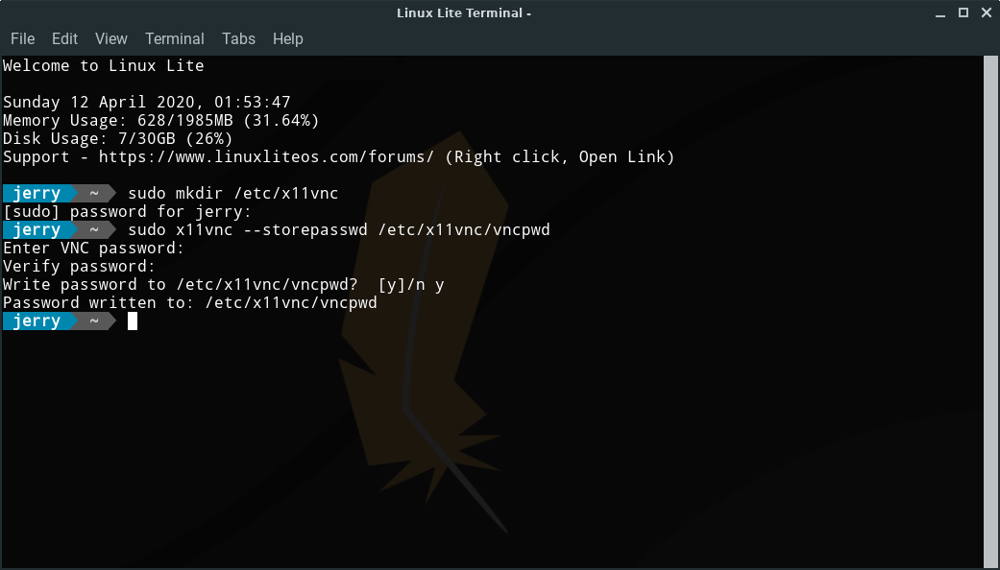

Now we will create the systemd service file for the x11vnc service:

Terminal Command:

						`pkexec mousepad /lib/systemd/system/x11vnc.service`

  

Copy & paste the code below into the Text Editor:

  
\[Unit\]  
Description=VNC Server for X11  
Requires=display-manager.service  
After=display-manager.service  
\[Service\]  
Type=forking  
ExecStart=/usr/bin/x11vnc -dontdisconnect -auth guess -forever -shared -noxdamage -repeat -rfbauth /etc/x11vnc/vncpwd -rfbport 5900 -bg -o /var/log/x11vnc.log  
ExecStop=/usr/bin/killall x11vnc  
Restart=on-failure  
Restart-sec=5  
  
\[Install\]  
WantedBy=multi-user.target  
  
  

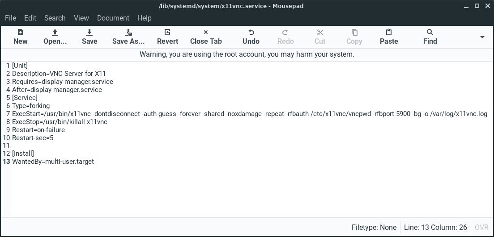

Save changes and close leafpad. Then copy **/lib/systemd/system/x11vnc.service** to **/etc/systemd/system/**

Terminal Command:

						`sudo cp /lib/systemd/system/x11vnc.service /etc/systemd/system/`

  

Next, let’s edit /lib/systemd/system/graphical.target

Terminal Command:

						`pkexec mousepad /lib/systemd/system/graphical.target`

  

Update graphical.target file content as shown below:

  
\# This file is part of systemd.  
#  
\# systemd is free software; you can redistribute it and/or modify it  
\# under the terms of the GNU Lesser General Public License as published by  
\# the Free Software Foundation; either version 2.1 of the License, or  
\# (at your option) any later version.  
\[Unit\]  
Description=Graphical Interface  
Documentation=man:systemd.special(7)  
Requires=multi-user.target  
Wants=display-manager.service x11vnc.service  
Conflicts=rescue.service rescue.target  
After=multi-user.target rescue.service rescue.target display-manager.service  
AllowIsolate=yes  
  
  

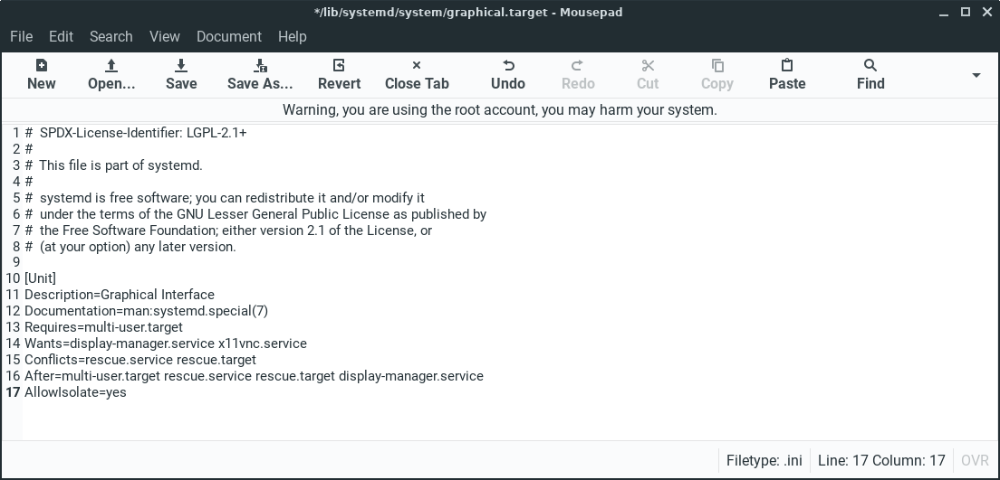

Save changes and close the Text Editor. Then copy **/lib/systemd/system/graphical.target** to **/etc/systemd/system/**

Terminal Command:

						`sudo cp /lib/systemd/system/graphical.target /etc/systemd/system/`

  

Reload services and enable the x11vnc service at boot time:

Terminal Command:

						`sudo systemctl daemon-reload`

  

Terminal Command:

						`sudo systemctl enable graphical.target`

  

Finally, either reboot Linux Lite or manually start x11vnc service:

Reboot:

Terminal Command:

						`sudo reboot now`

  

or start x11vnc without rebooting:

Terminal Command:

						`sudo systemctl start x11vnc.service`

  

## Remotely accessing/controlling Linux Lite

From a client computer in your network, using a VNC client of your choice (Remmina, Ultra VNC, TightVNC, Chicken VNC, VNC Viewer, Screen Sharing, enter the IP address of your Linux Lite box or its hostname.

## Setting the Time and Date

Go to **Menu, Settings, Time and Date**.

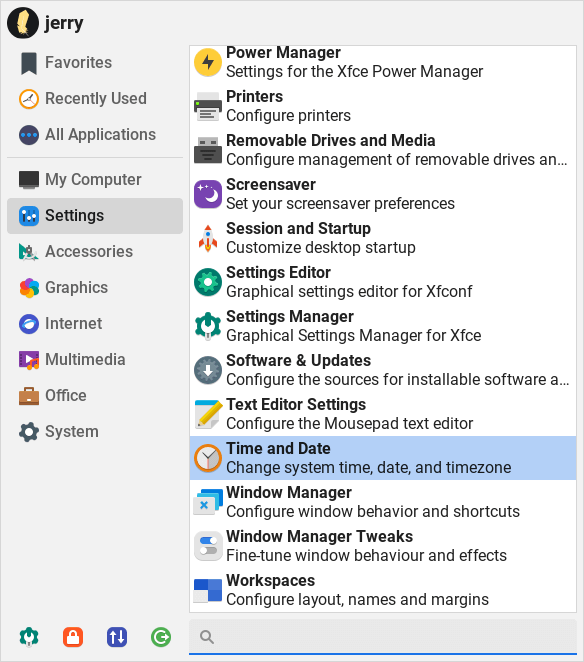

Click on the **Unlock** button and enter your password when asked.

Click inside the **Time zone** box. In the following example we have **Pacific/Auckland**.

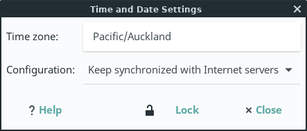

Click on one of the **red** dots in your timezone/location. Click on **Close** to finish.

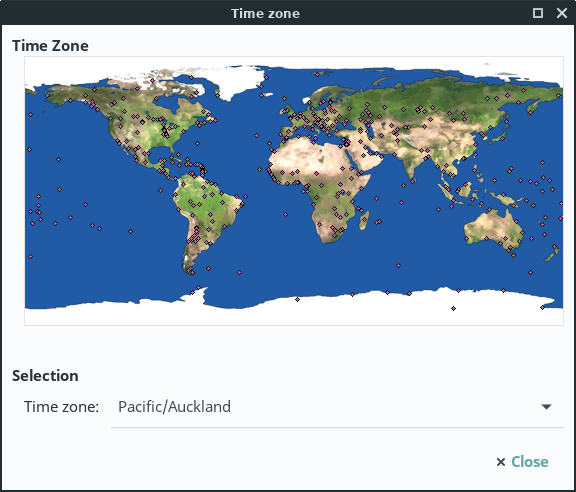
