## Software

[Changing Desktop Environments](#deskenv)  
[Change Repository Location](#literepos)  
[Creating and Extracting compressed files](#archive)  
[File Encryption](#encrypt)  
[Getting Software](#software)  
[Installing Software](#instsoftware)  
[Installing Software - From a Deb Package](#debpkg)  
[Installing Software - From a Terminal using APT](#aptterm)  
[Installing Software - From Source Code](#instsource)  
[Linux Equivalents of Windows Programs](#winprogs)  
[Lite Software - Install Software](#installsoftware)  
[Lite Software - Remove Software](#removesoftware)  
[Lite Sources](#litesources)  
[Lite Tweaks](#tweaks)  
 [- Bootup Fix](#tweaks-bootup-fix)  
 [- Clear Memory](#tweaks-clear-memory)  
 [- Default Web Browser](#tweaks-default-web-browser)  
 [- Hibernate, Suspend](#tweaks-hibernate-suspend)  
[PPA - Adding](#ppa)  
[PPA - Removing](#pparem)  
[Software Updates Country Location](#sources)  
[Uninstalling Software](#uninstsoftware)  
[Updates](#updates)  
[Updates Notifications](#updatesnotify)  
[Wine - Run Windows programs](#wine)

  

## Getting Software

Getting software on Linux is easier than on Windows. The vast majority of programs that you may want/need to install are all centrally located in what are called software repositories (repos). Rather than searching the web, downloading programs from various sites (some of which may not be reliable), running the installer, rebooting, etc., available software is all centrally located and available for installation in seconds. The packages/(programs) in the repositories are tested, approved for inclusion in the repos and securely signed to insure their validity.

There are a few common methods for installing and removing software. Linux Lite comes with **Lite Software** and **Package Manager** (Synaptic Package Manager) applications. When the program you want is not listed in Lite Software and you already know its name, **Package Manager** (Synaptic Package Manager) makes installing easy.

**IMPORTANT: Before you run Package Manager for the first time, [read this first](#sources). Then come back to here to learn how to install and remove software.**

## Installing Software

**1.** Click on **Menu**, **System**, **Package Manager** and enter your password when prompted.

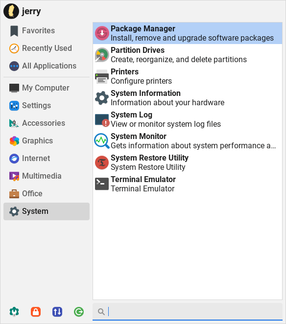

**2.** Make sure **All** is selected in the left pane and in the **Quick Filter** or spy glass:  type in your search query. In this example we will search for the '**audacious**' music player.

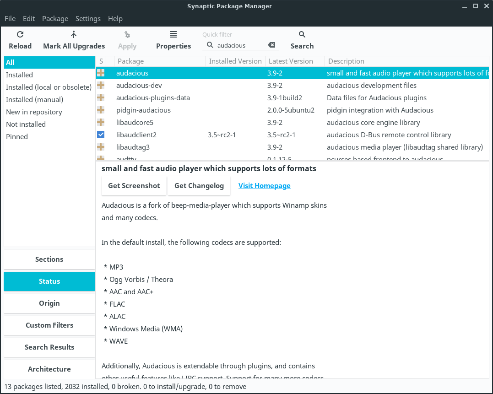

**3.** Double click on the package you want to install.

**4.** Some software will ask you to **Mark additional required changes?** These are also known as dependencies and are required for the program to function properly.

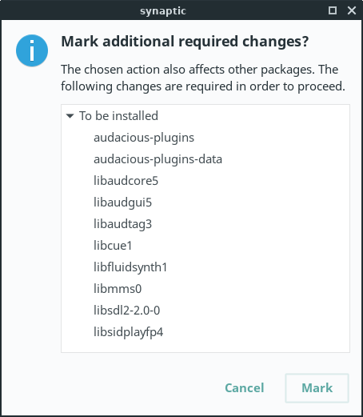

**5.** Click on **Mark**. Now hit the **Apply** button on the Synaptic toolbar. The software will install and a **Menu** entry will be created in the relevant **Menu** category. For **audacious** the **Menu** category would be **Multimedia**.

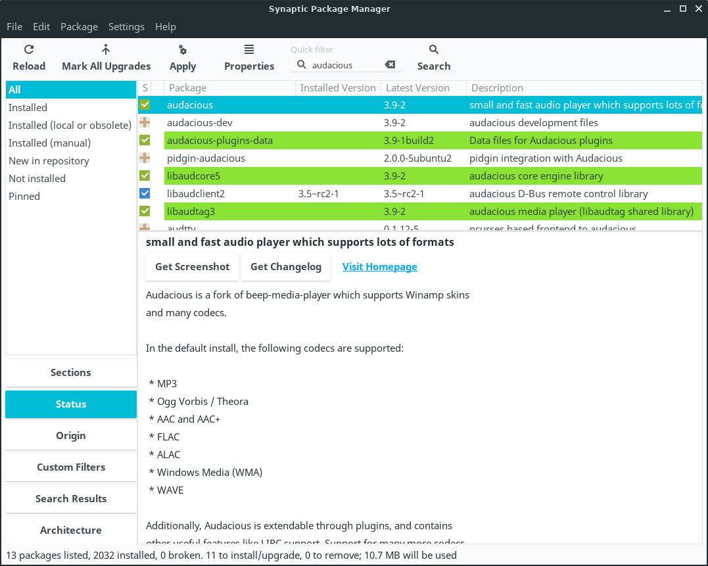

**6.** Go to the **Menu** and your new software will be there under the relative Category. An alternative way to find your new software is to click on **Menu, Accessories, Application Finder**. Type your program name in the **Search** box and the result will display on the right. Double click on the program name and it will launch for you.

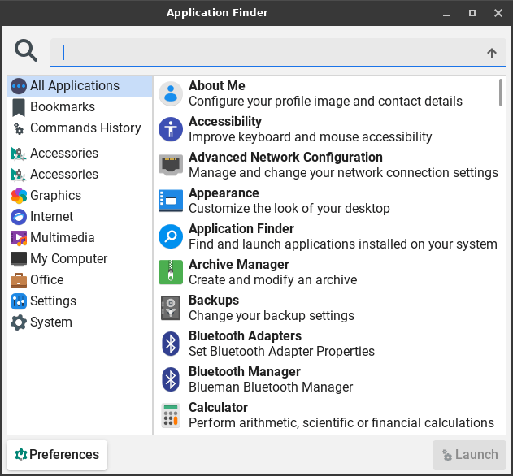

## Uninstalling Software

**1\.** Uninstalling software is the reverse process of installing software in **Package Manager** (Synaptic Package Manager). Type the name of the software into the **Quick Filter** or the spy glass box:

**2\.** Right click on the software and select **Mark for Removal**. Now hit the **Apply** button on the Synaptic toolbar and your software will uninstall. Be very careful with this process as you can inadvertently uninstall crucial system software. If you have any doubts, please search the net first to see if it is safe to uninstall the software. Synaptic is pretty good at warning you should there be any potential problems.

## Installing Software - From Source Code

There will be times when you need to compile and install an application or driver from source code. Here's what you do.

In this example, we'll install an application (Pidgin) from source code.

Most source code packages will come in a compressed archive format. Let's right click on the archive and select **Extract Here**.

We'll go into the newly extracted folder, right click, **Open Terminal Here** and enter the following command:

Terminal Command:

						`./configure`

  

It will now go through and make sure we have all the tools we need to compile this software..

As we can see from below, it needs some software called **intltool**. Lets go ahead and install that with **apt-get**.

Now that our required package is installed, we can try to **./configure** again.

**TIP: Search the error messages in Google, they should lead you to the package that you need to install**.

Keep working through the information in the Terminal until **./configure** works properly.

At last, a successful **./configure**.

Now we can compile the actual application with the **make** command.

Terminal Command:

						`make`

  

This process can take quite a while, so let it run it's course.

The **make** command has completed without errors.

Now to install the application. Here we use the **sudo make install** command. Enter your password when prompted:

Terminal Command:

						`sudo make install`

  

Once our program has installed, we can run the application command (pidgin) from the Terminal. Note that we place a space and the **&** symbol at the end. This is so that we can still run the application and close the Terminal.

Our application in action.

**To Uninstall an application from Source Code**:

Open a Terminal from inside the source code folder of the application you want to remove and enter the following command:

Terminal Command:

						`sudo make uninstall`

  

Enter your password.

Application successfully removed.

## Installing Software - From a Deb Package

There may be applications that can only be installed via a deb package. Let's show you how to do this.

In this example, we'll install Teamviewer. Once we have our deb package downloaded, right click on it and select **Open With GDebi Package Installer**.

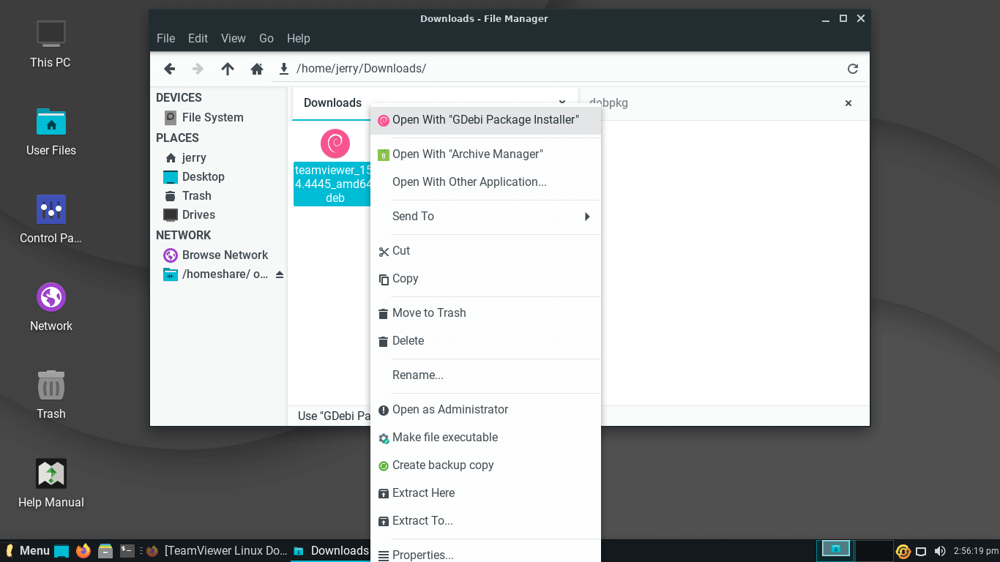

Enter your password.

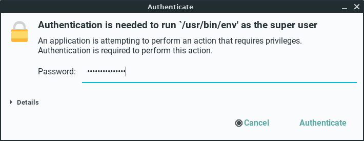

A new Package Installer window will pop up. Click on **Install Package**.

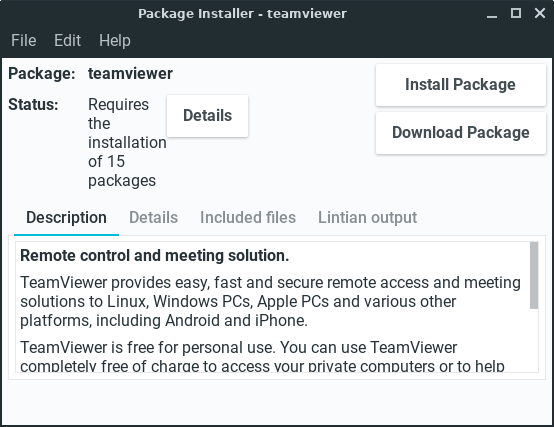

The package installer will download any dependencies that application needs and will install the application.

The deb package has been installed. Keep the original package incase you ever want to uninstall it.

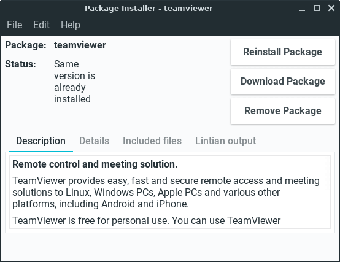

**To Uninstall an application from a Deb Package**:

Double click on the original package, enter your password.

Choose **Remove Package**.

If you don't have the package anymore, open a terminal and enter the application name with the removal command:

Terminal Command:

						`sudo dpkg -r teamviewer`

  

Enter your password. The application has been removed.

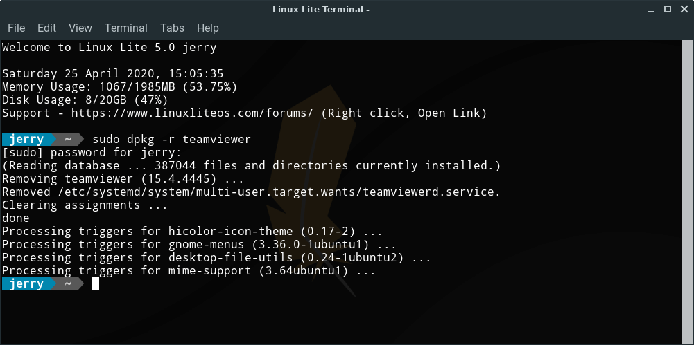

## Installing Software - From a Terminal using APT

Another way to install and remove software, is from the Terminal using the APT (Advanced Package Tool) system.

From Wikipedia - 'APT, is a free-software user interface that works with core libraries to handle the installation and removal of software on Debian, Ubuntu, and related Linux distributions.' like Linux Lite.

In the following examples, we'll use APT to install, remove, manage and get information from the software known as **Ristretto** (in most cases).

**Installing Software**.

1\. Open a Terminal and type the following, followed by your password.

Terminal Command:

						`sudo apt update`

  

This command ensures we are getting the latest versions of all software from within that repository.

2\. Now, type in the following to install Ristretto: (all package/software names are always in lower-case)

Terminal Command:

						`sudo apt install ristretto`

  

**Removing Software**.

1\. Open a Terminal and type the following, followed by your password. Then press the **Enter** key to confirm the removal process.

Terminal Command:

						`sudo apt remove ristretto`

  

Remove an installed package and all of its dependencies:

Terminal Command:

						`sudo apt autoremove ristretto`

  

**Other useful APT commands**.

Install more than one program. Leave a space in between program names:

Terminal Command:

						`sudo apt install ristretto midori`

  

Remove more than one program. Leave a space in between program names:

Terminal Command:

						`sudo apt remove ristretto midori`

  

This command will remove the program and all of its configuration files. Useful if you don't want any left over files.

Terminal Command:

						`sudo apt purge ristretto`

  

Update all of your system software from the repositories (specific to Linux Lite)::

Terminal Command:

						`sudo apt update && sudo apt dist-upgrade`

  

Whenever you install a program, its package is downloaded to a folder. Over time, this folder will grow in size, use this command to empty that folder:

Terminal Command:

						`sudo apt clean`

  

This command will also remove any unneeded packages associated with an **apt remove** command when you have removed a specific program. It will also remove unused kernels:

Terminal Command:

						`sudo apt autoremove`

  

To search for a specific piece of software and get its description:

Terminal Command:

						`apt-cache search ristretto`

  

To list all packages containing a particular name:

Terminal Command:

						`apt-cache pkgnames leaf`

  

For a more thorough explanation of a package and its details:

Terminal Command:

						`apt-cache show ristretto`

  

To list what extra packages (dependencies) are going to be installed with a piece of software:

Terminal Command:

						`apt-cache showpkg ristretto`

  

How to install a piece of software without it ever being upgraded:

Terminal Command:

						`sudo apt install ristretto --no-upgrade`

  

How to upgrade only specific pieces of software:

Terminal Command:

						`sudo apt install ristretto --only-upgrade`

  

How to download a piece of software:

Terminal Command:

						`apt download ristretto`

  

View the changes in a package since last release:

Terminal Command:

						`apt changelog ristretto`

  

## Updates

Keeping Linux Lite up to date is a simple process.

At the top of **Menu, Favorites**, you will see **Install Updates**.

We've made the update process as simple as possible. Simply click on **Install Updates** and you will be asked for your password. The program will then search for updates and if it finds any it will ask you if you want to continue.

(**Note:** The update process updates all software on the system that came from the repos. Unlike in Windows, there is no need to update individual software programs manually. When you run **Install Updates**, that will update all packages that have updates available for them.)

You can set reminders in Linux Lite to tell you when new updates are available. For more information on this, click [here](#updatesnotify).

## Change your Software Updates Country Location

To ensure that you get updates and software downloaded as fast as possible, try selecting servers from locations closer to you. In the following tutorial we will show you how to do this.

Click on **Menu** and type in **software** in the search box. The top result should be **Software & Updates**.

From the **Software & Updates** window, select **Other**.

From the drop down box, select a new repository under whichever Country you choose, then click on **Choose Server**.

Enter your password.

Click on the **Close** button.

The following window will appear. Click on the **Reload** button.

Updates are now refreshing from your new mirror.

## Lite Sources

Lite Sources is a repository selector for Linux Lite branded applications.

**NOTE: Lite Sources does not include Ubuntu repositories or software. This is only for Linux Lite created applications eg. Lite Software, Lite Upgrade, Lite Tweaks etc.**

**1.** Click on **Menu, Settings, Lite Sources**.

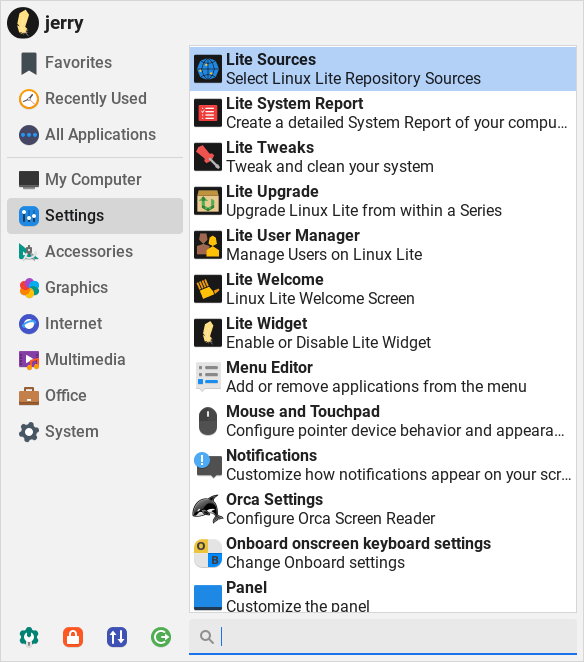

**2.** Enter your password.

**3.** Click on the **Check Repository Status** button. We need to do this first to see which mirrors are currently active.

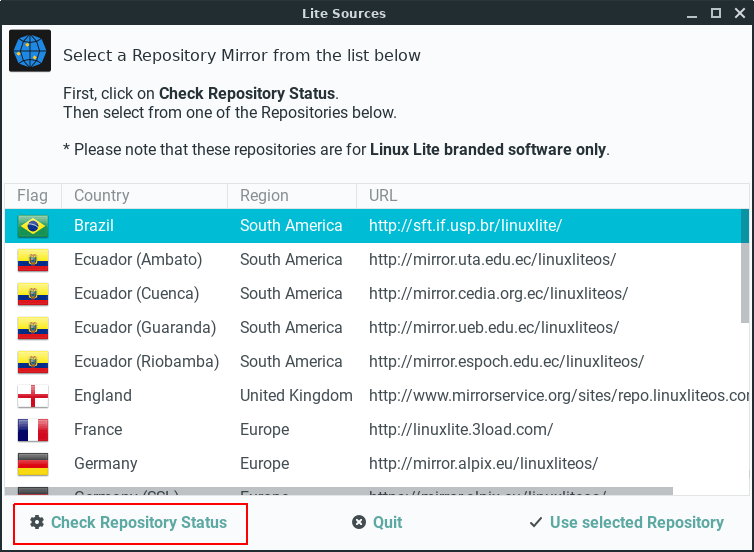

**4.** You will see the following dialogue box. Hit any key when you are ready.

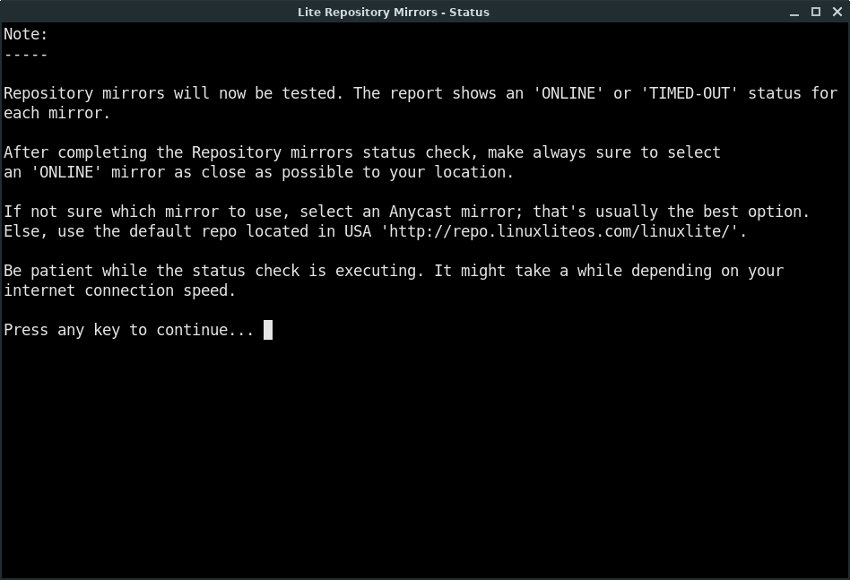

**5.** Wait for the repository check to complete.

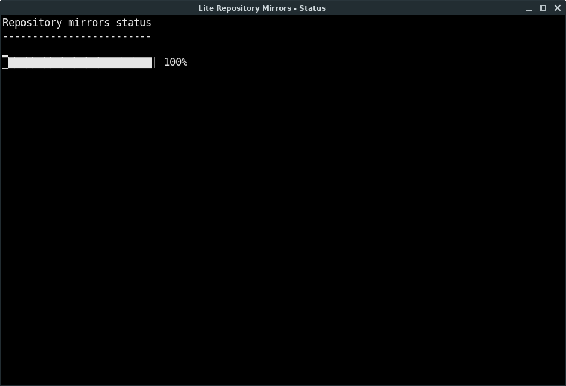

**6.** Make note of an **ONLINE** repository closest to you. Press any key when you are ready to continue.

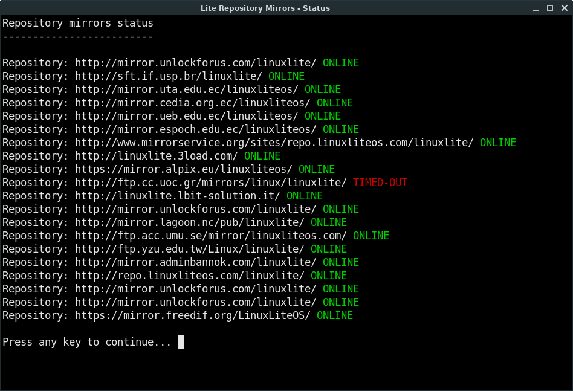

**7.** Select an **ONLINE** repository then click on **Use selected Repository**.

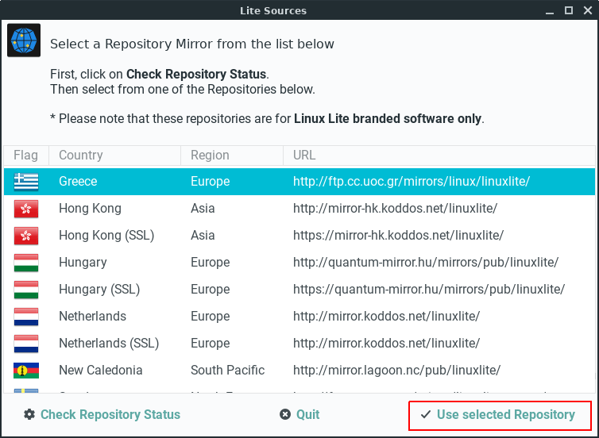

**8.** The new Repository will be added and updated.

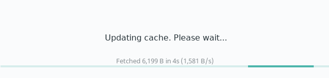

**9.** When finished, you'll get a notification..

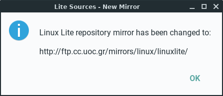

## Lite Software - Change Repository Location

Before installing new applications, although completely optional, it is recommended to change the [Software Updates Country Location](software.html#sources) and the Repository Location - the servers from which you download built-in Lite applications updates.

For a list of locations for Linux Lite Software application updates, click [here](https://www.linuxliteos.com/mirrors.php#repos) and choose a location close to you.

Open your home folder and navigate to **/etc/apt/** right click on the **sources.d** folder and **Open as Administrator**.

Double click on the file **linuxlite.list** and copy and paste the new repository link of your choice from [here](https://www.linuxliteos.com/mirrors.php#repos) replacing the existing line. Be sure to change the word **repo** (from the Mirrors web page) to the codename from that Linux Lite Series eg. replace **repo** with **fluorite**. See the notes on the Download page for Series information. Save and Close the file.

Next time you run **Menu, Favorites, Install Updates** you will get Lite Software application updates from your newly selected location.

If for some reason that new repository selection does not work, choose another location.

## Lite Software - Install Software

Lite Software is a graphic user interface (GUI) tool to easily install and remove popular software in Linux Lite. It is a convenient way to gather the most commonly used applications together and present them to the user.

The applications listed in Lite Software are not built-in with Linux Lite. Your computer must be connected to the internet in order to download and install these applications. If the application you are looking for is not listed in Lite Software, please use **Package Manager** (Synaptic Package Manager) to search for it and install it.

Installing some of the more widely popular programs on Linux Lite like Kodi, Skype and Spotify is just a few simple steps on Linux Lite.

Go to **Menu, Settings, Lite Software**.

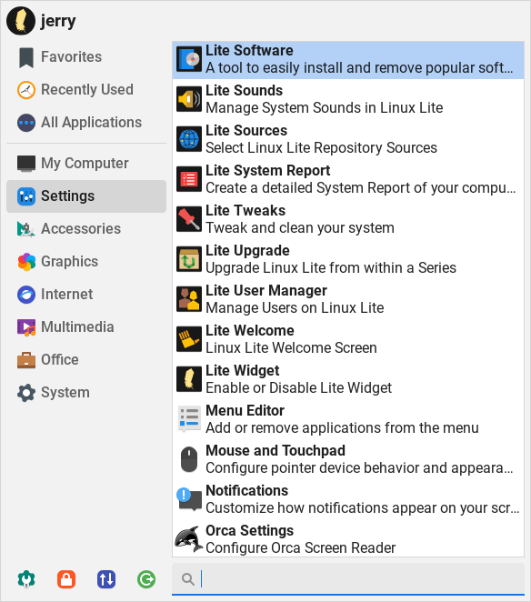

Enter your password and click **OK**.

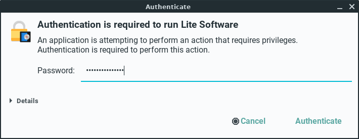

Next you will be shown the **Update Software Sources** window, click **Yes** to continue.

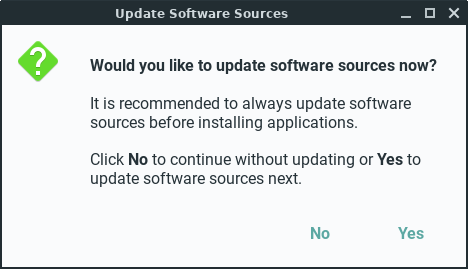

Sources will be updated:

Once the sources have been updated, the following window will appear, select **Install Software** and click **OK**.

Next, you'll see the following window pop up. Select each application by holding down the **Ctrl** key. You may choose and install more than one package at a time if you like. In this example we'll choose to install, **Games Pack, Music Player** and **Restricted Extras**. Next, click the **Install** button.

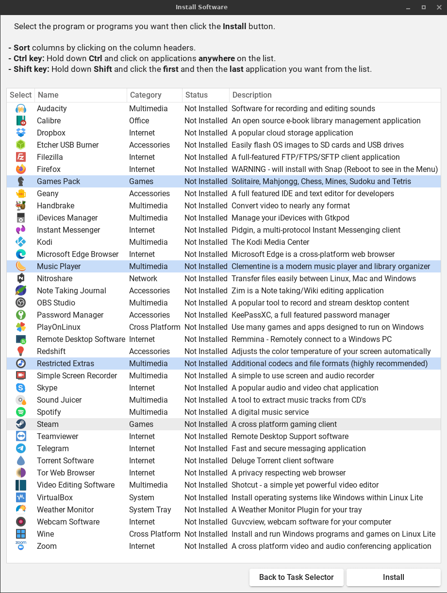

In the next dialog, you'll be shown which applications you've selected to install. Click **Yes** when ready.

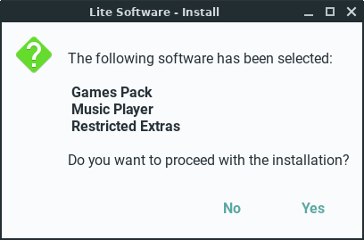

The programs will now be downloaded and installed automatically for you. This can take anywhere from a few seconds to a few minutes depending on how many applications you've selected, the size of the program/s and the speed of your internet connection.

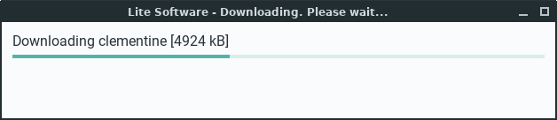

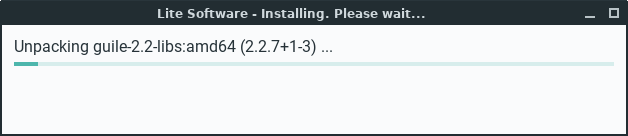

When the install is complete, you will get a confirmation like the following.

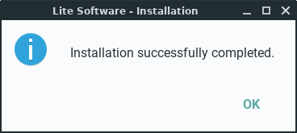

The **Lite Software** window will reappear at the end in case you want to perform another task. If you have finished, click **Quit**.

## Lite Software - Remove Software

Removing Additional Software in Linux Lite is just a few simple steps.

Click on **Menu, Settings, Lite Software**.

Enter your password and click **OK**.

Next you will be shown the **Update Software Sources** window, always answer **Yes**.

Sources will be updated:

Once the sources have been updated, the following window will appear, select **Remove Software** and click **OK**.

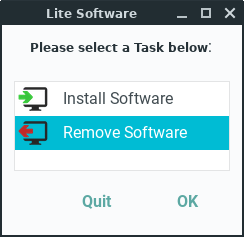

Next, you'll see the following window pop up. Select each application by holding down the **Ctrl** key. You may choose to remove more than one package at a time if you like. In this example we'll choose to remove, **Games Pack, Music Player** and **Restricted Extras**. Next, click the **Remove** button.

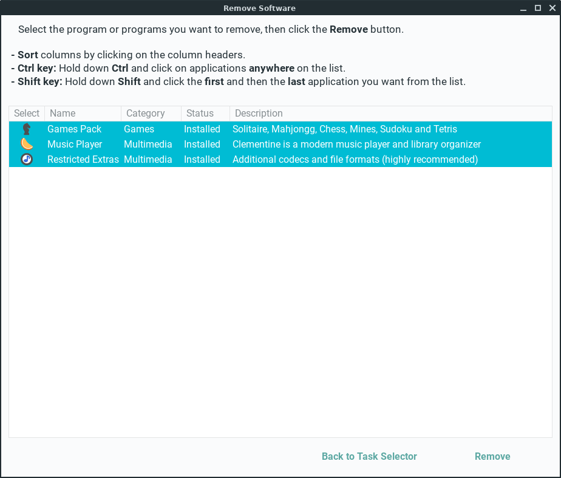

In the next dialog, you'll be shown which applications you've selected to remove. Click **Yes** when ready.

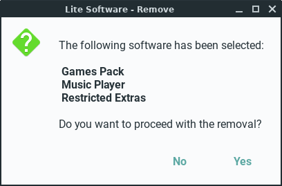

The programs will now be removed automatically for you. This can take anywhere from a few seconds to a few minutes depending on how many applications you've selected and the size of the program/s.

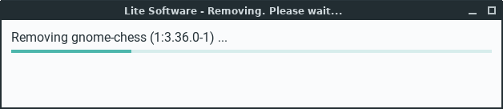

When the removal process is complete, you will get a confirmation like the following. Click **OK**.

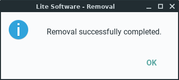

The **Lite Software** window will reappear at the end in case you want to perform another task. If you have finished, click **Quit**.

## Linux Equivalents of Windows Programs

The following is a community compiled list of Linux equivalents of Windows programs.

Most of these programs can be installed via **Menu, System, Package Manager**. In the **Linux** column, you can click on any of the links to find out more about that piece of software.

Thank you to [bitsnpcs](https://www.linuxliteos.com/forums/index.php?action=profile;u=411) and the rest of the community who contributed [here.](https://www.linuxliteos.com/forums/on-topic/linux-replacements-for-windows-programs/)

**Office & Design**

|     |     |
| --- | --- |
| Windows | Linux |
| Microsoft Office Suite | [LibreOffice,](http://www.libreoffice.org/) [OpenOffice.org,](http://www.openoffice.org/) [Siag Office,](http://siag.nu/) [Calligra,](https://www.calligra.org/) [WPS Office,](http://www.wps.com/linux/) [EuroOffice](http://www.multiracio.com/index.php?lang=en&) |
| Microsoft Word | [LibreOffice Writer,](http://www.libreoffice.org/discover/writer) [OOWriter,](http://www.openoffice.org/product/writer.html) [AbiWord](http://www.abisource.com/) |
| Microsoft Excel | [LibreOffice Calc,](http://www.libreoffice.org/discover/calc) [OOCalc,](http://www.openoffice.org/product/calc.html) [Gnumeric](http://www.gnumeric.org/) |
| Microsoft Access | [LibreOffice Base,](http://www.libreoffice.org/discover/base) [OOBase,](http://www.openoffice.org/product/base.html) [Kexi](http://www.kexi-project.org/) |
| Microsoft Powerpoint | [LibreOffice Impress,](http://www.libreoffice.org/discover/impress) [OOImpress,](http://www.openoffice.org/product/impress.html) [Impressive](http://sourceforge.net/projects/impressive/) |
| Microsoft Project | [OpenProj,](http://sourceforge.net/projects/openproj/) [Planner,](https://wiki.gnome.org/Apps/Planner/Screenshots) [Gantt,](http://www.ganttproject.biz/) [MOOS Project Viewer](http://www.moosprojectviewer.com/) |
| Microsoft Publisher, Quark | [Scribus](http://www.scribus.net/) |
| Microsoft Visio | [gliffy,](http://www.gliffy.com/) [LibreOffice Draw,](http://www.libreoffice.org/discover/draw) [OODraw,](http://www.openoffice.org/product/draw.html) [DIA,](http://dia-installer.de/index.html.en) [yEd Graph Editor](http://www.yworks.com/en/products/yfiles/yed/) |
| Notepad, Wordpad | [gedit,](https://wiki.gnome.org/Apps/Gedit) [Kate,](http://www.kde.org/applications/utilities/kate/) [KWrite,](http://kate-editor.org/about-kate/) [Geany,](http://www.geany.org/) [XPad,](https://launchpad.net/xpad) [notepadqq,](http://notepadqq.altervista.org/wp/) [Leafpad,](http://tarot.freeshell.org/leafpad/) [Sublime text,](http://www.sublimetext.com/) [Nedit,](http://sourceforge.net/projects/nedit/) [Atom](https://atom.io/) |
| Business Card Designer Pro | [gLabels](http://glabels.sourceforge.net/) |
| Adobe Acrobat Viewer | [Evince,](https://wiki.gnome.org/Apps/Evince) [Xpdf,](http://www.foolabs.com/xpdf/) [Okular,](http://okular.kde.org/) [Master PDF Editor](http://code-industry.net/free-pdf-editor.php) |
| Adobe Acrobat Distiller | [CUPS-PDF](http://www.cups-pdf.de/) |
| Adobe Acrobat PDF Editor | [pdfedit,](http://pdfedit.cz/en/index.html) [pdftk,](https://www.pdflabs.com/tools/pdftk-the-pdf-toolkit/) [pdfjam](http://freecode.com/projects/pdfjam/) |
| Microsoft Money, Quicken | [GnuCash,](http://www.gnucash.org/) [KMyMoney,](http://kmymoney2.sourceforge.net/index-home.html) [grisbi,](http://www.grisbi.org/) [Homebank](http://homebank.free.fr/) |
| Microsoft FrontPage, Dreamweaver | [BlueGriffon,](http://bluegriffon.org/) [KompoZer,](http://www.kompozer.net/) [Amaya,](http://www.w3.org/Amaya/) [Bluefish](http://bluefish.openoffice.nl/index.html) |
| Autodesk AutoCAD | [Bricscad,](http://www.bricsys.com/en_INTL/bricscad/index.jsp) [FreeCAD](http://freecadweb.org/) |
| Evernote | [Everpad,](https://github.com/nvbn/everpad/wiki/how-to-install) [RedNotebook,](http://rednotebook.sourceforge.net/) [NixNote,](http://sourceforge.net/projects/nevernote/) [Springseed,](https://github.com/byhestia/springseed) [Cherrytree,](http://www.giuspen.com/cherrytree/) [TagSpaces](http://www.tagspaces.org/downloads/) |
| Mealmaster | [Gourmet Recipe Manager](http://thinkle.github.io/gourmet/) |

  

**Internet Applications**

|     |     |
| --- | --- |
| Windows | Linux |
| Internet Explorer | [Firefox,](https://www.mozilla.org/en-US/firefox/new/) [Chrome,](https://www.google.com/chrome/browser/) [Opera,](http://www.opera.com/) [Konqueror,](http://www.konqueror.org/) [Midori](http://midori-browser.org/) |
| videoGET | [Minitube](http://flavio.tordini.org/minitube) |
| Microsoft Outlook | [Thunderbird](https://www.mozilla.org/en-US/thunderbird/) [Kontact,](https://userbase.kde.org/Kontact) [Zimbra Desktop,](http://www.zimbra.com/downloads/zimbra-desktop) [Evolution](https://wiki.gnome.org/Apps/Evolution) |
| MSN Messenger | [Pidgin,](http://www.pidgin.im/) [aMSN,](http://www.amsn-project.net/) [Kopete,](http://kopete.kde.org/) [Emesene,](http://blog.emesene.org/) [Gabber,](http://gabber.sourceforge.net/) [Psi](http://psi-im.org/) |
| Microsoft Netmeeting | [Ekiga](http://ekiga.org/) |
| eMule | [aMule](http://sourceforge.net/projects/amule/) |
| uTorrent, Azureus | [Transmission,](https://www.transmissionbt.com/) [Ktorrent,](http://www.kde.org/applications/internet/ktorrent/) [Vuze,](http://www.vuze.com/) [Deluge,](http://deluge-torrent.org/) [qBittorrent,](http://www.qbittorrent.org/) [uGet](http://ugetdm.com/) |
| Skype (VoIP) | [Skype,](http://www.skype.com/en/) [Ekiga,](http://ekiga.org/) [Jitsi,](https://jitsi.org/) [Google Hangouts](http://www.google.com/hangouts/) |
| CuteFTP, WS FTP | [FileZilla,](https://filezilla-project.org/) [KFTPgrabber,](http://www.kftp.org/) [FireFTP](http://fireftp.net/) |
| mIRC | [Xchat,](http://xchat.org/) [Pidgin,](http://www.pidgin.im/) [Konversation](http://konversation.kde.org/) |
| UltraVNC, Remote Desktop | [rdesktop,](http://www.rdesktop.org/) [NX,](https://www.nomachine.com/) [TightVNC,](http://www.tightvnc.com/) [x11vnc,](http://www.karlrunge.com/x11vnc/) [SSH,](http://www.openssh.com/) [Synergy,](http://synergy-project.org/) [Vinagre](https://wiki.gnome.org/Apps/Vinagre) |
| Forte Agent | [Pan](http://pan.rebelbase.com/) |

  

**Multimedia Applications**

|     |     |
| --- | --- |
| Windows | Linux |
| Adobe Photoshop | [GIMP,](http://www.gimp.org/) [GIMPshop,](http://www.gimpshop.com/) [Krita](https://krita.org/) |
| Adobe Photoshop Elements | [F-Spot,](http://f-spot.org/) [KPhotoAlbum,](http://www.kphotoalbum.org/) [gThumb,](https://wiki.gnome.org/action/show/Apps/gthumb?action=show&redirect=gthumb) [Gwenview,](http://gwenview.sourceforge.net/) [digiKam](https://www.digikam.org/) |
| Corel Draw, Adobe Illustrator | [Inkscape,](http://www.inkscape.org/en/) [Xara Xtreme](http://www.xaraxtreme.org/) |
| Microsoft Paint | [Tux Paint,](http://www.tuxpaint.org/) [KolourPaint](http://www.kolourpaint.org/) |
| ACDSee, Irfanview | [XnView,](http://www.xnview.com/en/) [Mirage,](http://sourceforge.net/projects/mirageiv.berlios/) [gThumb,](https://wiki.gnome.org/action/show/Apps/gthumb?action=show&redirect=gthumb) [GQview,](http://gqview.sourceforge.net/) [Gwenview,](http://gwenview.sourceforge.net/) [Ristretto,](http://linux.softpedia.com/get/Multimedia/Graphics/Ristretto-Xfce-30156.shtml) [nomacs](http://www.teejeetech.in/p/Timeshift.html) |
| 3D Studio MAX, Maya | [Blender,](http://www.blender.org/) [K-3D,](http://www.k-3d.org/) [Softimage,](http://www.autodesk.com/products/softimage/overview) [Maya](http://www.autodesk.com/products/maya/overview) |
| Windows Movie Maker, Adobe Premiere | [Kdenlive,](http://sourceforge.net/projects/kdenlive/) [Cinellera,](http://cinelerra.org/1/) [Kino,](http://kinodv.org/) [LiVES,](http://lives.sourceforge.net/) [AviDemux,](http://www.avidemux.org/) [PiTiVi,](http://www.pitivi.org/?go=download) [OpenShot](http://openshot.org/) |
| TMPGEnc DVD Author, ConvertXtoDVD | [DeVeDe,](http://www.rastersoft.com/programas/devede.html) [Bombono,](http://www.bombono.org/cgi-bin/wiki/) [Handbrake,](https://handbrake.fr/) [Q DVD Author](http://qdvdauthor.sourceforge.net/) |
| Videora | [Thin Liquid Film](http://thinliquidfilm.org/) |
| Windows Media Player | [VLC,](http://www.videolan.org/vlc/) [Totem,](https://wiki.gnome.org/Apps/Videos) [Kaffeine,](https://projects.kde.org/projects/extragear/multimedia/kaffeine) [xine,](http://www.xine-project.org/home) [MPlayer,](http://www.mplayerhq.hu/design7/news.html) [QMPlay2,](http://qt-apps.org/content/show.php/QMPlay2?content=153339) [Rhythmbox](https://wiki.gnome.org/Apps/Rhythmbox/) |
| Winamp, iTunes | [Rhythmbox,](https://wiki.gnome.org/Apps/Rhythmbox/) [Amarok,](https://amarok.kde.org/en/) [Banshee,](http://banshee.fm/) [Audacious,](http://audacious-media-player.org/) [aTunes](http://www.atunes.org/) |
| Cubase, CoolEdit, Cakewalk | [Ardour,](http://ardour.org/) [Audacity,](http://audacity.sourceforge.net/) [Beast,](https://testbit.eu/wiki/Beast_Home) [GNUsound,](http://www.gnu.org/software/gnusound/) [Rosegarden](http://www.rosegardenmusic.com/) |
| NoteWorthy Composer | [MuseScore,](http://musescore.org/) [LilyPond](http://lilypond.org/) |
| Guitar Pro | [TuxGuitar,](http://www.tuxguitar.com.ar/) [MuseScore](http://musescore.org/) |
| MP3Tag | [EasyTAG,](https://wiki.gnome.org/Apps/EasyTAG) [Puddletag](http://puddletag.sourceforge.net/) |

  

**CD/DVD Recording**

|     |     |
| --- | --- |
| Windows | Linux |
| Nero Burning ROM, Alcohol 120% | [Brasero,](https://wiki.gnome.org/Apps/Brasero) [K3b,](http://www.k3b.org/) [X-CD-Roast,](http://www.xcdroast.org/) [Xfburn](http://goodies.xfce.org/projects/applications/xfburn) |
| UltraISO, PowerISO | [ISO Master,](http://www.littlesvr.ca/isomaster/) [AcetoneISO,](http://sourceforge.net/projects/acetoneiso/) [CDemu](http://cdemu.sourceforge.net/) |
| Daemon Tools | [CDemu](http://cdemu.sourceforge.net/) |

  

**Server & Networking Applications**

|     |     |
| --- | --- |
| Windows | Linux |
| Microsoft IIS | [Apache,](http://www.apache.org/) [lighttpd,](http://www.lighttpd.net/) [Zope,](http://www.zope.org/) [thttpd,](http://www.acme.com/software/thttpd/) [Yaws,](http://yaws.hyber.org/) [nginx](http://wiki.nginx.org/Main) |
| Serv-U FTP Server, Filezilla FTP Server | [vsftpd,](https://security.appspot.com/vsftpd.html) [Pure-FTPd,](http://www.pureftpd.org/project/pure-ftpd) [ProFTPD](http://www.proftpd.org/) |
| File/Printer Sharing | [Samba](https://www.samba.org/) |
| Microsoft Exchange | [Zimbra,](http://www.zimbra.com/) [Open-Xchange,](http://www.open-xchange.com/home) [Citadel](http://www.citadel.org/doku.php) |
| Microsoft Sharepoint | [KnowledgeTree,](http://www.knowledgetree.com/) [Open-Xchange](http://www.open-xchange.com/home) |
| Small Business Server | [ClearOS,](http://www.clearfoundation.com/Software/overview.html) [Zentyal,](http://www.zentyal.com/) [SME Server](http://wiki.contribs.org/Main_Page) |
| NetLimiter | [L7-filter,](http://l7-filter.clearfoundation.com/) [MasterShaper,](https://www.mastershaper.org/) [trickle,](https://wiki.archlinux.org/index.php/Trickle) [Bandwidth Arbitrator](http://www.bandwidtharbitrator.com/) |
| PA Server Monitor | [ZenOSS,](http://www.zenoss.com/) [Nagios,](http://www.nagios.org/) [Zabbix](http://www.zabbix.com/) |
| Inssider | [LinSSID](http://sourceforge.net/projects/linssid/) |
| Norton AntiVirus, McAfee | [ClamAV,](http://www.clamav.net/index.html) [Avira,](http://www.avira.com/en/downloads) [AVG,](http://free.avg.com/gb-en/free-antivirus-download) [Avast](https://www.avast.com/index) |
| ZoneAlarm, Sygate Firewall | [Firestarter,](http://www.fs-security.com/) [FireHOL,](http://firehol.org/) [Guarddog,](http://www.simonzone.com/software/guarddog/) [Gufw,](http://gufw.org/) [KMyFirewall](http://www.kmyfirewall.org/) |

  

**Utilities**

|     |     |
| --- | --- |
| Windows | Linux |
| Norton Partition Magic | [Gparted,](http://gparted.sourceforge.net/) [Qtparted,](http://qtparted.sourceforge.net/) [Parted Magic](http://partedmagic.com/) |
| Norton Ghost | [Clonezilla,](http://clonezilla.org/) [Partimage,](http://www.partimage.org/Main_Page) [g4u,](http://www.feyrer.de/g4u/) [dd,](http://en.wikipedia.org/wiki/Dd_%28Unix%29) [Redo Backup,](http://redobackup.org/) [qt4-fsarchiver,](http://sourceforge.net/projects/qt4-fsarchiver/) [Timeshift](http://www.teejeetech.in/p/Timeshift.html) |
| Winzip, WinRAR, 7-zip | [File Roller,](http://fileroller.sourceforge.net/) [Ark,](https://utils.kde.org/projects/ark/) [Karchiver,](http://kde-apps.org/content/show.php/KArchiver?content=10316) [7-Zip,](http://www.7-zip.org/) [Xarchiver](http://xarchiver.sourceforge.net/) |
| Capsa Network Analyzer | [Wireshark,](https://www.wireshark.org/) [Ethereal](http://www.aos5.com/cloud) |
| Bitvise Tunnelier | [Gnome SSH Tunnel Manager,](http://sourceforge.net/projects/gstm/) [HotSSH](https://wiki.gnome.org/Apps/HotSSH) |
| FreeFile Sync | [FreeFile Sync,](http://sourceforge.net/projects/freefilesync/) [rsync,](http://en.wikipedia.org/wiki/Rsync) [rsnapshot,](http://www.rsnapshot.org/) [duplicity,](http://duplicity.nongnu.org/) [ZBackup,](http://zbackup.org/) [Back In Time](http://backintime.le-web.org/) |
| Dragon Naturally Speaking | [Simon](https://simon.kde.org/) |

  

Please report any dead links from above [here](mailto:valtam@linuxliteos.com?subject=Windows Equivalents Dead Link Report).

## Wine - Run Windows programs

Wine application is a compatibility layer capable of running many Windows programs in Linux.

Software programs are designed for different operating systems, and most won't work on systems that they weren't designed for.

Windows programs won't natively run in Linux because they contain instructions that the system can't understand until they're translated by the Windows environment. In that same way, Linux programs won't run under the Windows operating system because Windows is unable to interpret all of their instructions.

Through Wine's compatibility layer, when a Windows program tries to perform a function that Linux doesn't normally understand, Wine will translate that program's instruction into one supported by Linux.

More information can be found here - [https://www.winehq.org/](https://www.winehq.org/).

Credit to [ralphy](https://www.linuxliteos.com/forums/suggestions-and-feedback/help-manual-suggestions-wanted/msg27546/#msg27546) for this article.

## Lite Tweaks

**Lite Tweaks** is a program to customize, optimize and clean up your system. Used periodically it can do things like clean out various cached files, empty the trash, remove old kernels from the system if new ones are installed, remove old dependency packages no longer needed and more, freeing up additional space in your hard drive.

**NOTE: For the duration that you have Lite Tweaks open, you will be asked for your password only once when you perform Administrative tasks**.

Lite Tweaks can be found under **Menu, Settings, Lite Tweaks**.

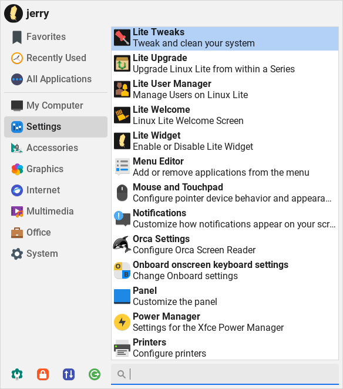

Once opened, the **Lite Tweaks** window features multiple tasks, alphabetically organized by their **Name** by default. The **Description** column provides information related to the task(s) to be performed. Users can select either a single or multiple tasks for execution. They will be executed in sequential order until every selected task has been completed.

Simply select the tasks you want to complete and click on **Begin**.

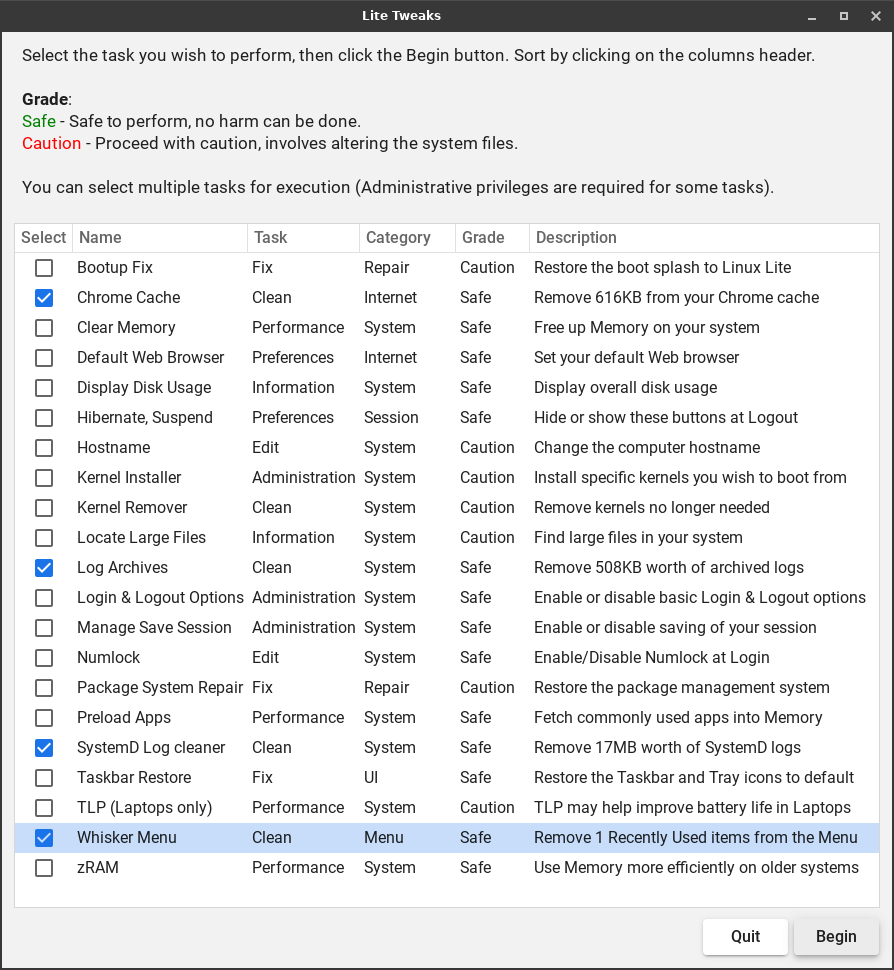

Some of the tasks in Lite Tweaks require administrative privileges for execution, hence you will be prompted for your password when needed.

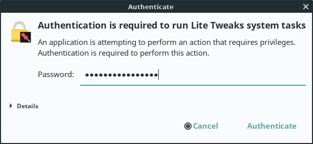

Another example, let's use Lite Tweaks kernel cleaner to remove an old linux kernel. Select **Kernel Removal**, then click on **Begin**.

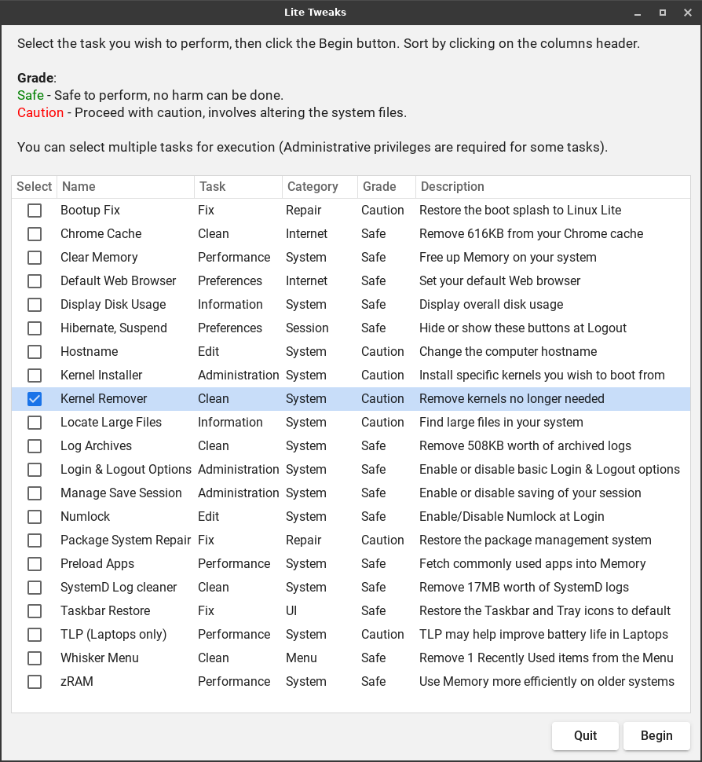

Enter your password if requested to.

The kernel cleaner will only display the kernels that are not currently in use. To remove a kernel, make sure to select the "image" and "header" files that correspond to the version number of the kernel, then click **Remove**.

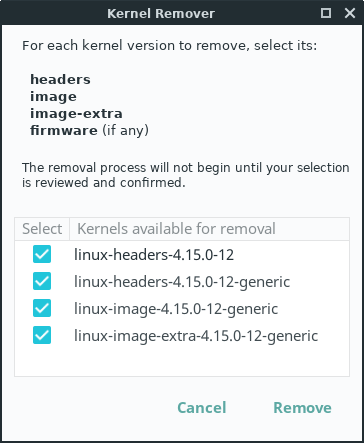

A confirmation box will pop-up. Click **Yes** if you are sure you want to proceed with the kernel removal.

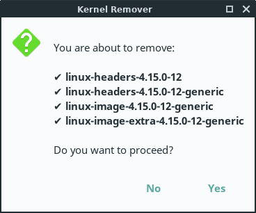

Your kernel(s) will then be removed. (This may take a few minutes.)

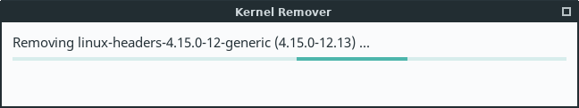

Upon completion, click **OK** to close the window.

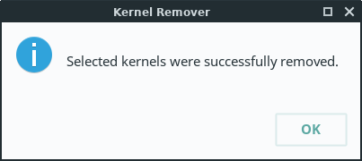

When selected tasks have completed, you'll be returned to the Lite Tweaks main window.

## Lite Tweaks - Bootup Fix

Bootup Fix is used to restore the Linux Lite splash screen (screen shown while booting up Linux Lite) if it ever gets overwritten with the Ubuntu splash by a system update or otherwise. This task requires administrative privileges for execution.

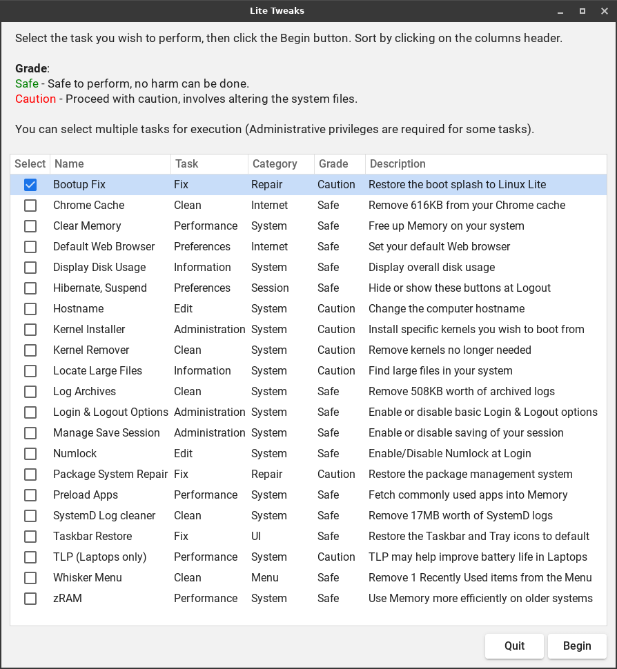

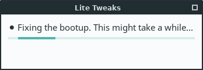

## Lite Tweaks - Clear Memory

Clear Memory will clear the PageCache, dentries and inodes in your system. The Linux Kernel uses some of your system memory for caching and buffering. Linux is designed in such a way that it looks into the cache before looking onto the hard disk. If it finds the resource in the cache, then the request doesn’t reach the disk, which in turn helps speeding things up. When you clean the cache, the disk cache will be less useful as the operating system will look for the requested resource in the hard drive.

Moreover, it will also slow the system for a few seconds while the cache is cleaned and every resource required by the OS is loaded again as needed. You should not need to manually clear memory in your system as a general rule; but Lite Tweaks provides an easy way to do so without having to reboot the computer.

## Lite Tweaks - Default Web Browser

Default Web Browser is a user preference tweak used to, as its name implies, set the user preferred web browser in Linux Lite. Currently, it recognizes and offers support for the following browsers:

While XFCE provides a way to set the preferred application for various services (see **Menu**, **Settings**, **Preferred Applications**), not all applications will follow the default browser setting when multiple browsers are installed in the system and not all browsers are recognized by the Preferred Applications program. Therefore, Lite Tweaks provides the means to overcome this inconvenience ensuring that all internet links will be handled by the user defined browser when **Default Web Browser** tweak is used.

To set your default browser, open **Menu**, **Settings**, **Lite Tweaks**, select **Default Web Browser** from the list and click on **Begin**. If you have more than one browser installed in your system and notice that not all applications are following your default browser preference setting, Default Web Browser tweak will help you address it.

## Lite Tweaks - Hibernate, Suspend

Hibernate, Suspend is a user preference tweak used to show or hide the **Hibernate, Suspend, Hybrid Sleep and Switch User** buttons on the Logout screen.

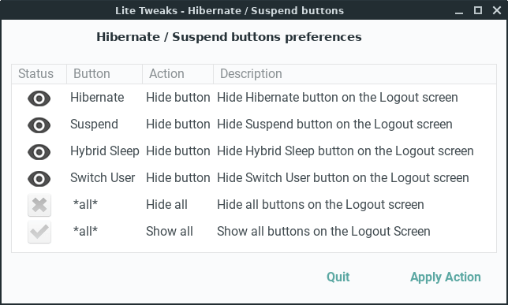

By default, all Log Out options are displayed in Linux Lite's Logout screen.

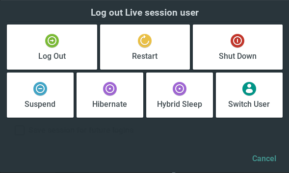

Some PCs do not properly support Hibernate or Suspend in Linux and a user could unintentionally click one of these Logout options while on the Logout screen. It could otherwise be just a personal preference; users who do not hibernate or suspend the computer may not want these buttons on the logout screen. Lite Tweaks provides a way to hide them if desired.

Select an option, then click on the **Apply Action** button..

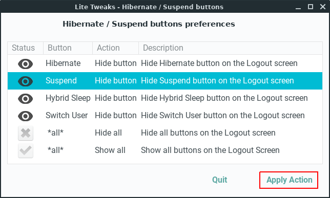

You will need to reboot your computer for the changes to take affect.

**Hibernate** and **Suspend** buttons disabled.

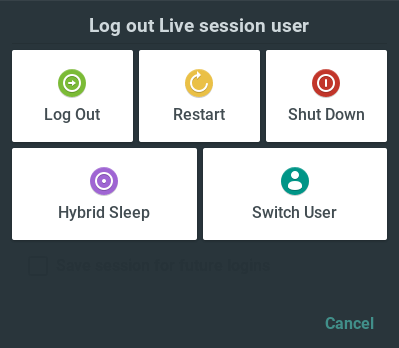

**Hibernate, Suspend, Hybrid Sleep and Switch User** buttons disabled.

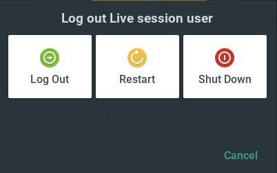

  

## Updates Notifications

Updates Notifications can be set to a variety of suitable intervals. An updates check will run in the background and display an onscreen notification when there are updates available for your computer.

To begin, right click on the updates icon in your tray and select **Preferences**.

Select your preferred updates frequency. The default is **twice a day**. Click on **Close**.

To **disable** updates notifications, click on **Menu, Settings, Session and Startup, Application Autostart** tab and untick **Package Update Indicator**.

To **enable** updates notifications, click on **Menu, Settings, Session and Startup, Application Autostart** tab and place a tick in **Package Update Indicator**.

Updates Notifications will check for new updates on schedule as defined by the user. If no new updates are available since the last time updates were installed in the system, there will be no new notifications until new updates become available.

## Adding a PPA

A PPA is a repository containing one or more applications. These are often set up for new software programs or updated versions of some applications. To add a new PPA to your system, follow the guide below.

**NOTE: You must ensure that the PPA you are adding, is currently supported by the version of Linux Lite you are using.**

**Only** use the following PPAs in Linux Lite. If the following PPAs are not displayed, then you cannot use them. If you try to use PPAs that are not supported, you will not be able to receive important system Updates.

\- **Noble**: Linux Lite **7.x** Series (galena)

\- **Jammy**: Linux Lite **6.x** Series (fluorite)

\- **Focal**: Linux Lite **5.x** Series (emerald)

\- **Bionic**: Linux Lite **4.x** Series (diamond)

\- **Xenial**: Linux Lite **3.x** Series (citrine)

\- **Trusty**: Linux Lite **2.x** Series (beryl)

Click on Menu and type in **software** in the search box. The top result should be **Software & Updates**.

**Example**: For this PPA, **Trusty, Xenial, Bionic** and **Focal** are supported, therefore this PPA is compatible with Linux Lite versions: 2x, 3x. 4x and 5x. If **Trusty, Xenial, Bionic** and **Focal** were not listed, you would **not** be able to use this PPA.

In the following example, we are going to add the **Simple Screen Recorder** PPA.

With **Software & Updates** open, click on the **Add** button and copy and paste from the web page, the ppa address of: **ppa:maarten-baert/simplescreenrecorder**.

Now click on the **Add Source** button.

To finish, click on **Close**.

You'll be prompted to put in your password. Click on the **Reload** button, the new source will be added to updates, and your new PPA will be loaded.

Now got to **Menu, System, Package Manager** and search for your application in the **Search** box, in this example **simplescreenrecorder**. Now double click on it to install the program. Click on the **Apply** button at the top of the window, and follow the on screen instructions.

Your new PPA application is now installed.

## Removing a PPA

If for some reason we want to remove a PPA, here's how to do it.

Your removing a PPA because you no longer need or wish to run a particular piece of software, so be sure to uninstall that software **before** removing the PPA that is associated with it. Instructions on uninstalling software can be found [here](software.html#uninstsoftware).

**1.** Click on the Menu, and type in **software**. Click on **Software & Updates**.

**2.** Click on the **Other Software** tab. Select the PPA you wish to remove, be sure to select the PPA that has the ticked box next to it **only**, then click on the **Remove** button. Enter your password.

**3.** Click on the **Close** button in the next dialogue box and you'll then be asked to reload your sources. Enter your password if requested to. Click on **Reload**.

**4.** The PPA removal process is now complete.

## File Encryption

In todays world, security of your personal files is important. Whether your transporting documents on a USB drive or emailing sensitive information to a friend, colleague or company, encryption is a necessary security measure.

**1.** First we need to install the encryption software, in this example we'll use [mcrypt](https://en.wikipedia.org/wiki/Mcrypt). Encryption algorithms include DES, Blowfish, ARCFOUR, Enigma, GOST, LOKI97, RC2, Serpent, Threeway, Twofish, WAKE, and XTEA.

Open a terminal and type:

Terminal Command:

						`sudo apt-get install mcrypt -y`

  

**2.** Once mcrypt is installed, we'll set a custom right click action in our file manager to make encryption of files super easy. Open up your home folder, click on **Edit, Configure custom actions**.

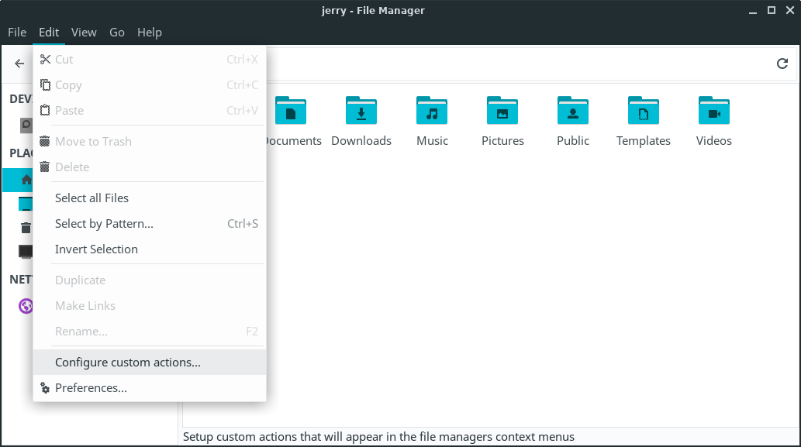

**3.** Click the plus + button on the right and enter in the following information, in the **Command** box type in: **x-terminal-emulator -t "Encrypt file..." -e "mcrypt %f"**

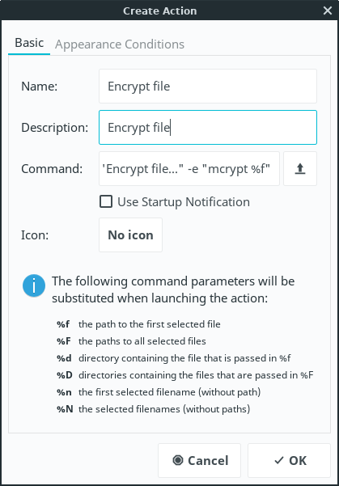

Click on **Appearance Conditions** tab and tick every box except **Directories**.

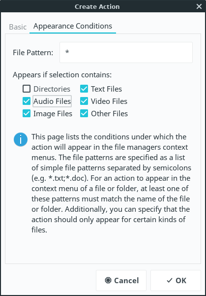

**4.** Go back to the **Basic** tab and click on the **No icon** button and browse to **Status Icons**, and select the **changes-prevent-symbolic** icon and click on **Ok**, then **Ok** on the next box.

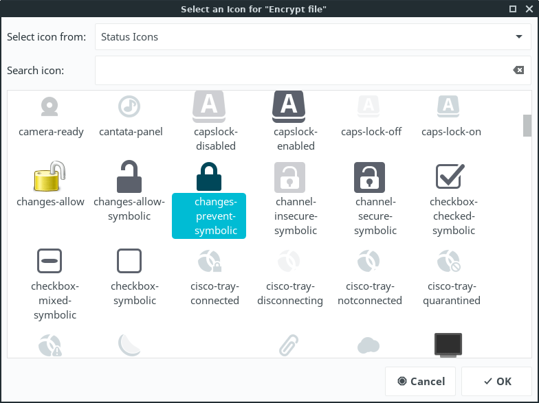

Your **Custom Actions** box should now look like this:


**5.** Now we need to set up the **Decrypt** option. Repeat step 3 only this time enter in the following information, in the **Command** box type in: **x-terminal-emulator -t "Decrypt file..." -e "mcrypt -d %f"**


Click on **Appearance Conditions** tab and **only** tick the **Other Files** box, leave the rest unticked.


**6.** Repeat step 4 only this time select the **changes-allow-symbolic** icon. The click on **Ok**, then **Ok** on the next box.


**7.** Your **Custom Actions** box should now look like this:


**8.** Click on the **Close** button on the **Custom Actions** box.

Now we're ready to encrypt a file (only files can be encrypted with this method, not folders)

**9.** Right click on a file and select **Encrypt file**.


**10.** A window will pop up asking you to type in a password, it will then ask you to enter the same password again. Choose a good strong password, a mixture of letters, numbers and characters that you can easily remember.


You can now delete the unencrypted file permanently. Here you will see we have a new file with the letters '**.nc**' attached to the end of it signifying that the file is now encrypted.


**11.** To decrypt the file later, right click on the file and select **Decrypt file**.


**12.** A window will pop up asking you to type in a password. Enter the password you created in step 10.


As you can see our file is decrypted and ready to view.


If you make any changes to the decrypted file, you need to delete the existing encrypted file and re-encypt the changed file.

## Creating and Extracting compressed files

Sometimes we may have a collection of pictures to send someone over email. Good practice is to compress these files so that the overall size is much less. The following is an example of how to compress files.

Linux Lite supports creation and extraction of these archive file types using the **Archive Manager** program: **.zip .rar .tar .tar.gz .tar.bz2 .7z**

Archive files can be created/extracted through the right-click menu in the file manager, or by going to **Menu, Accessories, Archive Manager** and selecting files to archive or extract from there.

**Creating a compressed file**

From within the file manager, right-click on any file or folder and select **Create Archive**. The following example will use a file named **example.txt**


A new window will pop up. From here, type in the **Filename**, eg. **example**. Use the drop-down box next to the filename to select the **.tar.gz** extension as the archive type. Choose a location to save the file in, then click on the **Create** button.

We now have a file called **example.tar.gz**


**Compressing multiple files**

Best practice here is to place all the files you want to compress into a folder. In this example we have a folder called **example** and inside 3 files.


Go back to your home folder and right click on the folder containing the files you wish to compress. Right click the folder and select **Create Archive**.


A new window will pop up. From here, type in the **Filename** of the file (eg. **example**) and select **zip** for the archive type extension. Choose a location for the file, then click the **Create** button.


We now have a zip file called **example.tar.gz**


**Extracting compressed files**

Right click on the compressed file and select **Extract Here**


We how have a folder called **example**, with our 3 files inside of it.


**Using Archive Manager from the Menu to create a compressed file.**

Go to **Menu, Accessories, Archive Manager**.


Drag and drop from your file manager into **Archive Manager** the folder or files you want to compress. Now click on the **Create Archive** button.


Give the compressed file a name eg. **example** then click on the **Save** button.


Here is our newly created zip file in **Archive Manager**. Close that window.


Here is our newly created **zip** file.


## Changing Desktop Environments

This distro is a heavily modified version of the XFCE desktop environment. However, being GNU/Linux based allows people the freedom to modify their system as they see fit. There are numerous desktop environments in GNU/Linux. Including but not limited to:

*   Budgie
*   Cinnamon
*   Enlightenment
*   Gnome
*   KDE
*   Lumina
*   LXDE
*   LXQT
*   Mate
*   Pantheon
*   Razor-qt
*   Trinity

  

If you desire to install another desktop environment, we cannot provide specific instructions on how to do this. There are far too many variables involved and much can go wrong. This kind of system modification is best left to experienced Linux users. The whole philosophy behind Linux Lite is to provide new users to a Linux based operating system, an easy to use, functional desktop experience. Our support time is better spent dedicated to helping existing Linux Lite users on the XFCE desktop.
